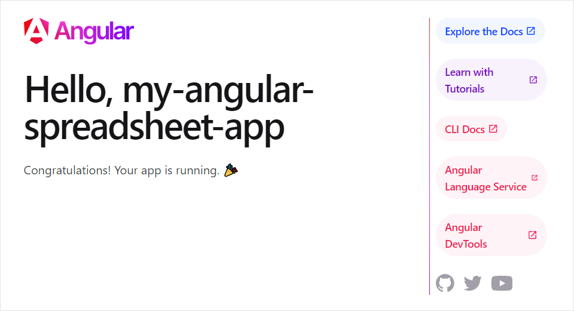

# Integration with Angular

You can use DHTMLX Spreadsheet in an application created with the [Angular](https://angular.io/) framework. 

:::tip 
[Check the demo on CodeSandbox](https://codesandbox.io/p/devbox/dhtmlx-spreadsheet-angular-7xnzr9).
:::

## Preparations

You will need [Angular CLI](https://angular.io/cli) and [Node.js](https://nodejs.org/en/) to create a project, so you should install them, if haven't done it before.

## Creating a project

Create a new Angular project called **my-angular-spreadsheet-app** using Angular CLI. Run the following command for this purpose:

~~~
ng new my-angular-spreadsheet-app
~~~

The above command will install all the necessary tools and dependencies, so you don't need any additional commands. 

### Installation of dependencies

After that, go to the app directory by running: 

~~~
cd my-angular-spreadsheet-app
~~~

Then you need to install dependencies and run the app. For this, you need to make use of a package manager:

- if you use [yarn](https://yarnpkg.com/), you need to call the following commands:

~~~
yarn install
yarn dev
~~~

- if you use [npm](https://www.npmjs.com/), you need to call the following commands:

~~~
npm install
npm run dev
~~~ 

After the above steps are complete, the app should run on `http://localhost:4200`.

 

## Creating Spreadsheet

Now we should get the DHTMLX Spreadsheet code. First of all, we need to stop the app by pressing **Ctrl+C** in the command line. Then we can proceed with installing the Spreadsheet package.

### Step 1. Package installation

There are two options available: you can install the **Pro** package from a local folder or install the **trial** version using `npm` or `yarn`.

#### Installing the package from a local folder

1. Copy the Spreadsheet package into some local directory.
2. In the project directory run the command below replacing *spreadsheet-local-package-path* with the actual path, e.g.:

~~~
npm install ./spreadsheet_5.1.0_enterprise

//or
yarn add "./spreadsheet_5.1.0_enterprise"
~~~

#### Installing the trial version via a package manager

You can install the **trial** version of Spreadsheet using **npm** or **yarn** commands:

~~~js {2,3,6,7}
// npm
npm config set @dhx:registry https://npm.dhtmlx.com
npm i @dhx/trial-spreadsheet

//yarn
yarn config set @dhx:registry https://npm.dhtmlx.com
yarn add @dhx/trial-spreadsheet
~~~

To get Spreadsheet under the proprietary license, refer to the [Support Center](https://dhtmlx.com/docs/technical-support.shtml?_gl=1*18ffotg*_ga*MTA3MDMxMTAxNi4xNzAwNTcxNzU4*_ga_N87XPB4GSG*MTcwMTQzMjczMS4yOS4xLjE3MDE0MzI3OTUuNTYuMC4w&_ga=2.77564829.902258312.1701098802-1070311016.1700571758)!
  
### Step 2. Component creation

Now we should create a component, to add a Spreadsheet into the application. Let's create a new file in the **src/app/spreadsheet/** and call it **spreadsheet.component.ts**. Then complete the steps below:

#### Importing source files

Open the file and import Spreadsheet source files. Note that:

- if you've [installed the Spreadsheet package from a local folder](#installing-the-package-from-a-local-folder), your import paths will look like this:

~~~
import { Spreadsheet } from 'dhx-spreadsheet-package';
import from 'dhx-spreadsheet-package/codebase/spreadsheet.css';
~~~

- if you've chosen to [install the trial version](#installing-the-trial-version-via-a-package-manager), the import paths should be as in:

~~~
import { Spreadsheet } from '@dhx/trial-spreadsheet';
import '@dhx/trial-spreadsheet/codebase/spreadsheet.min.css';
~~~

In this tutorial we will use the trial version of Spreadsheet.

#### Setting the container and adding Spreadsheet

To display Spreadsheet on the page, we need to set the container to render the component inside. Use the code below:

~~~js title="spreadsheet.component.ts"
import { Component, ElementRef, ViewChild} from '@angular/core';
import 'dhx-spreadsheet-package/codebase/spreadsheet.css';
import { Spreadsheet } from 'dhx-spreadsheet-package';

@Component({
  selector: 'spreadsheet',
  template: '

',
})
export class SpreadsheetComponent implements OnInit {
  @ViewChild('spreadsheetContainer', { static: true }) spreadsheetContainer!: ElementRef;

  private spreadsheet!: Spreadsheet;
}
~~~

Then we need to render our Spreadsheet in the container. To do that, use the `ngOnInit()` method of Svelte:

~~~js title="spreadsheet.component.ts"
import { Component, ElementRef, OnInit, ViewChild } from '@angular/core';
import 'dhx-spreadsheet-package/codebase/spreadsheet.css';
import { Spreadsheet } from 'dhx-spreadsheet-package';

@Component({
  selector: 'spreadsheet',
  template: '

',
})
export class SpreadsheetComponent implements OnInit {
  @ViewChild('spreadsheetContainer', { static: true }) spreadsheetContainer!: ElementRef;

  private spreadsheet!: Spreadsheet;

  ngOnInit() {
    this.spreadsheet = new Spreadsheet(this.spreadsheetContainer.nativeElement,{});
  }

  ngOnDestroy() {
    this.spreadsheet?.destructor();
  }
}
~~~

In the above code we've also specified the `ngOnDestroy()` method that contains the `spreadsheet.destructor()` call to clear the component when it is no longer needed.

#### Loading data

To add data into the Spreadsheet, we need to provide a data set. Let's create the **data.js** file in the **src/app/spreadsheet/** directory and add some data into it:

~~~js title="data.js"
export function getData() {
  return {
    sheets: [
      {
        name: "Boolean",
        data: [
          {
            cell: "A1",
            css: "header",
            format: "common",
            value: "Formula name",
          },
          {
            cell: "B1",
            css: "header",
            format: "common",
            value: "Formula example",
          },
          {
            cell: "C1",
            css: "header",
            format: "common",
            value: "Data for formula",
          },
          {
            cell: "A3",
            css: "highlighting",
            format: "common",
            value: "Equal to",
          },
          {
            cell: "B3",
            format: "common",
            value: "=C3=D3",
          },
          {
            cell: "C3",
            format: "number",
            value: 5,
          },
          {
            cell: "A4",
            css: "highlighting",
            format: "common",
            value: "Greater than",
          },
          {
            cell: "B4",
            format: "common",
            value: "=C4>D4",
          },
          {
            cell: "C4",
            format: "number",
            value: 7,
          },
          // more cells
        ],
        cols: [
          {
            width: 180,
          },
        ],
        rows: [],
      }
    ]
  }
}
~~~

Then open the **spreadsheet.component.ts** file and add the `spreadsheet.parse(getData());` line into the `ngOnInit()` method, as shown below. It will reload data on each applied change.

~~~js {3} title="spreadsheet.component.ts"
ngOnInit() {
  this.spreadsheet = new Spreadsheet(this.spreadsheetContainer.nativeElement,{});
  this.spreadsheet.parse(getData());
}
~~~

Now the Spreadsheet component is ready. When the element will be added to the page, it will initialize the Spreadsheet object with data. You can provide necessary configuration settings as well. Visit our [Spreadsheet API docs](spreadsheet/api/overview/properties_overview.md) to check the full list of available properties.

#### Handling events

When a user makes some action in the Spreadsheet, it invokes an event. You can use these events to detect the action and run the desired code for it. See the [full list of events](spreadsheet/api/overview/events_overview.md).

Open the **spreadsheet.component.ts** file and complete the `ngOnInit()` method as in:

~~~js {5-7} title="spreadsheet.component.ts"
ngOnInit() {
  this.spreadsheet = new Spreadsheet(this.spreadsheetContainer.nativeElement,{});

  this.spreadsheet.parse(getData());
  this.spreadsheet.events.on('ActionName', () => {
    // do something
  });
}
~~~

Replace `'ActionName'` with the actual name of the event you want to handle, and implement the corresponding code inside the callback function. Get more information about the work with events in the [Event Handling](spreadsheet/handling_events.md) article.

### Step 3. Adding Spreadsheet into the app

Now it's time to add the component into our app. Open **src/app/app.component.ts** and use *SpreadsheetComponent* instead of the default content by inserting the code below:

~~~js title="app.component.ts"
import { Component } from "@angular/core";

@Component({
  selector: "app-root",
  template: `<spreadsheet></spreadsheet>`,
})
export class AppComponent {
  name = "";
}
~~~

Then create the **app.module.ts** file in the **src/app/** directory and insert the Spreadsheet component as provided below:

~~~js title="app.module.ts"
import { NgModule } from "@angular/core";
import { BrowserModule } from "@angular/platform-browser";

import { AppComponent } from "./app.component";
import { SpreadsheetComponent } from "./spreadsheet/spreadsheet.component";

@NgModule({
  declarations: [AppComponent, SpreadsheetComponent],
  imports: [BrowserModule],
  providers: [],
  bootstrap: [AppComponent],
})
export class AppModule {}
~~~

For our app to work properly, we need to *remove some unnecessary files* from the **src/app/** directory, they are:

- app.component.config
- app.component.html

The last step is to open the **src/main.ts** file and replace the existing code with the following one:

~~~js title="main.ts"
import { platformBrowserDynamic } from "@angular/platform-browser-dynamic";
import { AppModule } from "./app/app.module";
platformBrowserDynamic()
  .bootstrapModule(AppModule)
  .catch((err) => console.error(err));
~~~

After that, when we start the app, we should see Spreadsheet loaded with data on a page.

 

Now you should have a basic setup for integrating DHTMLX Spreadsheet with Angular using Angular CLI. You can customize the code according to your specific requirements.

