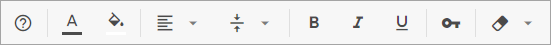

# Configuration

You can adjust the desired settings of DHTMLX Spreadsheet to meet your needs. The available configuration options allow you to limit the number of rows and columns, change the toolbar appearance and control the visibility of the menu and the editing bar. You can also initialize Spreadsheet in the readonly mode, if needed.

## Toolbar

The toolbar of the Spreadsheet consists of several blocks of controls that can be changed according to your needs. By default, there are the following blocks of controls in the toolbar: "undo","colors","decoration","align","format","help". You can add more blocks from the list: "lock", "clear", "rows", "columns", "file".

<iframe src="https://snippet.dhtmlx.com/b1btvnyo?mode=js" frameborder="0" class="snippet_iframe" width="100%" height="400"></iframe>

The structure of toolbar can be adjusted via the  configuration option of the component, which is an array with strings presenting the names of controls.

You can also specify your own structure of the toolbar by enumerating necessary elements in the **toolbarBlocks** array in the desired order, for example: "help","colors", "align", "decoration", "lock", "clear".

Toolbar is [highly customizable](customization.md). You can add new controls, change the icons of controls and apply the desired icon pack.

## Editing bar

Since the structure of Spreadsheet is flexible, you can switch on/off the editing bar to get the desired look and feel of the component. Use the  configuration option to hide/show
the editing bar.

<iframe src="https://snippet.dhtmlx.com/unem2jkh?mode=js" frameborder="0" class="snippet_iframe" width="100%" height="200"></iframe>

## Number of rows and columns

When Spreadsheet is initialized, it has the initial configuration of grid which consists of 1000 columns and 25 rows. However, when this limit runs out, additional rows and columns are rendered automatically, so you don't need to add them. Nevertheless, you can specify the exact number of rows and columns in the grid, if you want to limit them. Use the  and  options for this purpose.  

<iframe src="https://snippet.dhtmlx.com/vc3mstsw?mode=js" frameborder="0" class="snippet_iframe" width="100%" height="200"></iframe>

## Frozen columns

Starting from v4.0, it is possible to fix (or "freeze") columns on the left side of the spreadsheet, so that they will become static, while the rest of columns remain movable. To do that, just set the number of columns you want to freeze as a value of the [leftSplit](api/spreadsheet_leftsplit_config.md) property.

<iframe src="https://snippet.dhtmlx.com/iazmc27w?mode=js" frameborder="0" class="snippet_iframe" width="100%" height="200"></iframe>

## Menu

The menu of the Spreadsheet is hidden by default. You can switch it on/off via the corresponding configuration option :

<iframe src="https://snippet.dhtmlx.com/uulux27v?mode=js" frameborder="0" class="snippet_iframe" width="100%" height="200"></iframe>

## Read-only mode

It is also possible to enable the read-only mode to prevent editing of Spreadsheet cells via the  configuration option.

<iframe src="https://snippet.dhtmlx.com/2w959gx2?mode=js" frameborder="0" class="snippet_iframe" width="100%" height="200"></iframe>

You can also [customize the readonly behavior of Spreadsheet](customization.md#custom-read-only-mode).

## Custom number formats for cells

There are 5 default formats that can be applied to the values of cells: "Common", "Number", "Percent", "Currency", "Text".

<iframe src="https://snippet.dhtmlx.com/2w959gx2?mode=js" frameborder="0" class="snippet_iframe" width="100%" height="200"></iframe>

You can redefine configuration of default formats or specify your own number format via the  config option. Check the details in the [Number Formatting](number_formatting.md) article.

## Path to export/import modules

DHTMLX Spreadsheet provides the possibility to import/export data in the Excel format. The component uses WebAssembly-based libraries: [Excel2Json](https://github.com/dhtmlx/excel2json) and [JSON2Excel](https://github.com/dhtmlx/json2excel) for import/export of data.

After installing the necessary library, you need to set path to the **worker.js** file (either local or at CDN)
via the corresponding configuration option -  or .

~~~js
var spreadsheet = new dhx.Spreadsheet(document.body, {  
	importModulePath: "../libs/excel2json/1.0/worker.js"
	exportModulePath: "../libs/json2excel/1.0/worker.js"
});
~~~

All the details are given in the [Data Loading and Export](loading_data.md) article.

---------------

## Toolbar

The toolbar of the SpreadSheet consists of several blocks of controls that can be changed according to your needs. By default, there are the following blocks of controls in the toolbar: "undo","colors","decoration","align","format","help":

You can add more blocks from the list: "lock", "clear", "rows", "columns", "file".

The structure of toolbar can be adjusted via the  configuration option of the component, which is an array with strings presenting the names of controls.

~~~js
var spreadsheet = new dhx.Spreadsheet(document.body, {
	// full toolbar
    toolbarBlocks: [
    	"undo", "colors", "decoration", "align", "lock", "clear", 
        "rows", "columns", "help", "format", "file"
    ]
});
~~~

**Related sample**: [Spreadsheet. Full Toolbar](https://snippet.dhtmlx.com/kpm017nx)

You can also specify your own structure of the toolbar by enumerating necessary elements in the **toolbarBlocks** array in the desired order, for example:

~~~js
var spreadsheet = new dhx.Spreadsheet("cont", {
	toolbarBlocks: ["help","colors", "align", "decoration", "lock", "clear"]
});
~~~

Toolbar is [highly customizable](customization.md). You can add new controls, change the icons of controls and apply the desired icon pack.

## Editing bar

Since the structure of Spreadsheet is flexible, you can switch on/off the editing bar to get the desired look and feel of the component. Use the  configuration option to hide/show
the editing bar:

~~~js
var spreadsheet = new dhx.Spreadsheet(document.body, {
    editLine: true
});
~~~

**Related sample**: [Spreadsheet. Disabled Line](https://snippet.dhtmlx.com/unem2jkh)

## Number of rows and columns

When Spreadsheet is initialized, it has the initial configuration of grid which consists of 1000 columns and 25 rows. However, when this limit runs out, additional rows and columns are rendered automatically, so you don't need to add them. Nevertheless, you can specify the exact number of rows and columns in the grid, if you want to limit them. Use the  and  options for this purpose:  

~~~js
var spreadsheet = new dhx.Spreadsheet(document.body, {          
    colsCount: 10,
    rowsCount: 10
});
~~~

**Related sample**: [Spreadsheet. Custom Cells Count](https://snippet.dhtmlx.com/vc3mstsw)

## Frozen columns

Starting from v4.0, it is possible to fix (or "freeze") columns on the left side of the spreadsheet, so that they will become static, while the rest of columns remain movable. To do that, just set the number of columns you want to freeze as a value of the [leftSplit](api/spreadsheet_leftsplit_config.md) property:

~~~js
var spreadsheet = new dhx.Spreadsheet(document.body, {          
    leftSplit:3 
});
~~~

**Related sample**: [Spreadsheet. Frozen columns](https://snippet.dhtmlx.com/iazmc27w)

## Menu

The menu of the Spreadsheet is hidden by default. You can switch it on/off via the corresponding configuration option :

~~~js
var spreadsheet = new dhx.Spreadsheet(document.body, {
	menu: false
});
~~~

**Related sample**: [Spreadsheet. Menu](https://snippet.dhtmlx.com/uulux27v)

## Read-only mode

It is also possible to enable the read-only mode to prevent editing of Spreadsheet cells via the  configuration option:

~~~js
var spreadsheet = new dhx.Spreadsheet("cont", {
	readonly: true
});
~~~

**Related sample**: [Spreadsheet. Readonly](https://snippet.dhtmlx.com/2w959gx2)

You can also [customize the readonly behavior of Spreadsheet](customization.md#custom-read-only-mode).

## Custom number formats for cells

There are 5 default formats that can be applied to the values of cells:

~~~js
defaultFormats = [
	{ name: "Common", id: "common", mask: "", example: "2702.31" },
	{ name: "Number", id: "number", mask: "#,##0.00", example: "2702.31" },
	{ name: "Percent", id: "percent", mask: "#,##0.00%", example: "27.0231%" },
	{ name: "Currency", id: "currency", mask: "$#,##0.00", example: "$2702.31" },
	{ name: "Text", id: "text", mask: "abc", example: "'2702.31'" }
];
~~~

You can redefine configuration of default formats or specify your own number format via the  config option:

~~~js
var spreadsheet = new dhx.Spreadsheet(document.body, {          
    formats: [
    	{
    		name: "U.S. Dollar",
    		id: "currency",
    		mask: "$#,##0.00"
    	},
    	{
    		name: "Euro",
    		id: "euro",
    		mask: "[$€]#.##0,00",
    		example: "1000.50"
    	},
    	{
    		name: "Swiss franc",
    		id: "franc",
    		mask: "[$CHF ]#.##0,00"
    	}
    ]
});
~~~

**Related sample**: [Spreadsheet. Custom Formats](https://snippet.dhtmlx.com/4c0c0zm7)

Check the details in the [Number Formatting](number_formatting.md) article.

## Path to export/import modules

DHTMLX Spreadsheet provides the possibility to import/export data in the Excel format. The component uses WebAssembly-based libraries: [Excel2Json](https://github.com/dhtmlx/excel2json) and [JSON2Excel](https://github.com/dhtmlx/json2excel) for import/export of data.

After installing the necessary library, you need to set path to the **worker.js** file (either local or at CDN)
via the corresponding configuration option -  or :

~~~js
var spreadsheet = new dhx.Spreadsheet(document.body, {  
	importModulePath: "../libs/excel2json/1.0/worker.js"
	exportModulePath: "../libs/json2excel/1.0/worker.js"
});
~~~

All the details are given in the [Data Loading and Export](loading_data.md) article.

@todo: 
add list with toolbar blocks descr 
update images
