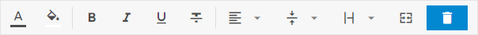
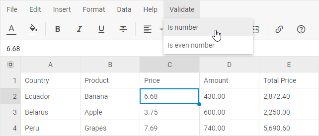
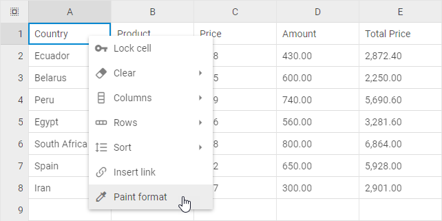

# Customization

You can customize the appearance, structure and functionality of toolbar, menu and context menu and define custom read-only behavior for Spreadsheet. 

## Default and custom icons

DHTMLX Spreadsheet uses the [Material Design](https://pictogrammers.com/library/mdi/?welcome)-based icons by default. However, you can use any other icon font pack, if necessary. For this, you need to include the desired icon font on a page and apply icons in any possible part of the spreadsheet: in Toolbar controls, Menu and Context menu items.

For example, you can use the [Font Awesome](https://fontawesome.com/) icon pack by including [link to its CDN](https://fontawesome.com/how-to-use/on-the-web/setup/getting-started?using=web-fonts-with-css) after the source files of DHTMLX Spreadsheet as follows:

~~~html

<link rel="stylesheet" href="../../codebase/spreadsheet.css">

<link rel="stylesheet" href="https://use.fontawesome.com/releases/v5.3.1/css/all.css" 
  integrity="sha384-mzrmE5qonljUremFsqc01SB46JvROS7bZs3IO2EmfFsd15uHvIt+Y8vEf7N7fWAU"  
  crossorigin="anonymous">
~~~

Then you can use the name of the icon as the value of the **icon** property in the object with the control parameters for toolbar, menu or context menu. See details below.

## Controls types and operations

### Types

There are the following types of controls you can add: *button*, *menuItem*, *separator* and *spacer*.

The **button** object has the following properties:

- **type** - the type of a button, set it to "button"
- **id** - the id of a button
- **icon** - the name of an icon from the used icon font
- **hotkey** - the name of the hot key for a button
- **value** - the value of a button
- **tooltip** - the tooltip of a button
- **twoState** -  the flag that defines whether a button can be used in two states
- **active** - the state of a button: *true* - active, *false* - inactive

The **menuItem** object has the properties below:

- **type** - the type of a menu item, set it to "menuItem"
- **id** - the id of a menu item
- **icon** - the name of an icon from the used icon font
- **hotkey** - the name of the hot key for a menu item
- **value** - the value of a menu item
- **childs** - an array of children controls (note that all the children should have the type **menuItem**)

The data collection API of the **toolbar**, **menu** and **context menu** allows you to manipulate the controls, namely to add custom controls, remove the controls you don't need, or update the controls,
e.g. change their icons.

### Adding controls

To add a new control, apply the `spreadsheet.{name}.data.add()` method. It takes the parameters below:

- **config** - (*object*) an object with the control config
- **index** - (*number*) the index of the position to place the control into
- **parent** - (*string*) the id of a parent control (for the *menuItem* type)

For a button:

~~~jsx 
// spreadsheet.menu.data.add / spreadsheet.contextMenu.data.add
spreadsheet.toolbar.data.add({
    type: "button", // "menuItem"
    id: "button-id",
    tooltip: "Some tooltip",
    icon: "icon-name"
}, 2);
~~~

For a menuItem:

~~~jsx
// spreadsheet.menu.data.add / spreadsheet.contextMenu.data.add
spreadsheet.toolbar.data.add({
    type: "menuItem",
    id: "menuitem-id", 
    value: "Some value",
}, -1, "parent-id");
~~~

### Updating controls

You can change the icon of the control and its other config options via the `spreadsheet.{name}.data.update()` method. It takes two parameters:

- the id of the control
- an object with new configuration of the control

~~~jsx
// spreadsheet.menu.data.update / spreadsheet.contextMenu.data.update
spreadsheet.toolbar.data.update("add", { 
    icon: "icon_name" 
});
~~~

### Deleting controls

To remove a control, make use of the `spreadsheet.{name}.data.remove()` method. Pass the id of the control that should be removed to the method:

~~~jsx
// spreadsheet.menu.data.remove / spreadsheet.contextMenu.data.remove
spreadsheet.toolbar.data.remove("control-id");
~~~

## Toolbar

### Default controls

The [default toolbar](/#toolbar) contains the following blocks of controls:

- the **Undo** block
  - the *Undo* button (id: "undo")
  - the *Redo* button (id: "redo")
- the **Colors** block
  - the *Text color* button (id: "color")
  - the *Background color* button (id: "background")
- the **Decoration** block
  - the *Bold* button (id: "font-weight-bold")
  - the *Italic* button (id: "font-style-italic")
  - the *Underline* button (id: "text-decoration-underline")
  - the *Strikethrough* button (id: "text-decoration-line-through")
- the **Align** block
  - the **Horizontal align** sub-block
    - the *Left* button (id: "halign-left")
    - the *Center* button (id: "halign-center")
    - the *Right* button (id: "halign-right")
  - the **Vertical align** sub-block
    - the *Top* button (id: "valign-top")
    - the *Center* button (id: "valign-center")
    - the *Bottom* button (id: "valign-bottom")
  - the **Text wrapping** sub-block
    - the *Clip* button (id: "multiline-clip")
    - the *Wrap* button (id: "multiline-wrap")
- the **Cell** block
  - the *Border* button (id: "border")
  - the *Merge/Unmerge* button (id: "merge")
- the **Format** block
  - the *Format* menuItem (id: "format")
- the **Actions** block
  - the *Filter* button (id: "filter")
  - the *Insert link* button (id: "link")

It is also possible to add the blocks enumerated below:

- the **Lock** block
    - the *Lock* button (id: "lock")
- the **Clear** block
  - the *Clear group* menuItem (id: "clear-group")
    - the *Clear value* menuItem (id: "clear-value")
    - the *Clear styles* menuItem (id: "clear-styles")
    - the *Clear all* menuItem (id: "clear-all")
- the **Rows** block
  - the *Add row* button (id: "add-row")
  - the *Remove row* button (id: "remove-row")
  - the *Unfreeze rows* button (id: "unfreeze-rows")
  - the *Freeze up to row [id]* (id: "freeze-rows")
  - the *Hide row(s) [id]* (id: "hide-rows")
- the **Columns** block
  - the *Add column* button (id: "add-col")
  - the *Remove column* button (id: "remove-col")
  - the *Unfreeze columns* button (id: "unfreeze-cols")
  - the *Freeze up to column [id]* (id: "freeze-cols")
  - the *Hide column(s) [id]* (id: "hide-cols")
- the **File** block
  - the *Export* menuItem (id: "export")
    - the *"Microsoft Excel(.xlsx)"* menuItem (id: "export-xlsx")
  - the *Import* menuItem (id: "import")
    - the *"Microsoft Excel(.xlsx)"* menuItem (id: "import-xlsx")
- the **Help** block
  - the *Help* button (id: "help")

### Adding controls

In the example below a new button is added into the toolbar:

~~~jsx
spreadsheet.toolbar.data.add({
    type: "button",
    icon: "dxi dxi-delete",
    tooltip: "Remove all",
    id: "remove-all"
});
~~~

**Related sample**: [Spreadsheet. Toolbar Buttons](https://snippet.dhtmlx.com/qopk6lta)

In the example below a new menuItem option is added into the "clear-group" control:

~~~jsx
spreadsheet.toolbar.data.add({
    type: "menuItem",
    id: "clear-value2", 
    value: "Clear value2"
}, -1, "clear-group");
~~~

There is a simplified notation for adding a menuItem, in case the exact position of the new item is not required:

~~~jsx
spreadsheet.toolbar.data.add({
    type: "menuItem",
    id: "clear-value2", 
    value: "Clear value2", 
    parent: "clear-group"   
});
~~~

### Updating controls

In the example below the default icons of the toolbar Undo/Redo buttons are changed to Font Awesome ones:

~~~jsx
spreadsheet.toolbar.data.update("undo", { icon: "fa fa-undo" });
spreadsheet.toolbar.data.update("redo", { icon: "fa fa-redo" });
~~~

**Related sample**: [Spreadsheet. Toolbar Icons](https://snippet.dhtmlx.com/mvnx43o0)

### Deleting controls

In the example below the Undo button is removed from the toolbar:

~~~jsx
spreadsheet.toolbar.data.remove("undo");
~~~

## Menu

### Default controls

The [default menu](/#menu) has the following structure:

- the **File** menuItem (id: "edit")
  - the *Import as...* menuItem (id: "import")
    - the *"Microsoft Excel(.xlsx)"* menuItem (id: "import-xlsx")
  - the *Download as...* menuItem (id: "download")
    - the *"Microsoft Excel(.xlsx)"* menuItem (id: "export-xlsx")
- the **Edit** menuItem (id: "edit")
  - the *Undo* menuItem (id: "undo")
  - the *Redo* menuItem (id: "redo")
  - the separator
  - the *Freeze* menuItem (id: "freeze")
    - the *Unfreeze columns* menuItem (id: "unfreeze-cols")
    - the *Freeze up to column [id]* (id: "freeze-cols")
    - the separator (id: "freeze-sep")
    - the *Unfreeze rows* menuItem (id: "unfreeze-rows")
    - the *Freeze up to row [id]* (id: "freeze-rows")
  - the *Lock* menuItem (id: "lock")
  - the separator
  - the *Clear* menuItem (id: "clear")
    - the *Clear value* menuItem (id: "clear-value")
    - the *Clear styles* menuItem (id: "clear-styles")
    - the *Clear all* menuItem (id: "clear-all")
- the **Insert** menuItem (id: "insert")
  - the *Columns* menuItem (id: "columns")
    - the *Add column* menuItem (id: "add-col")
    - the *Remove column* menuItem (id: "remove-col")
  - the *Rows* menuItem (id: "rows")
    - the *Add row* menuItem (id: "add-row")
    - the *Remove row* menuItem (id: "remove-row")
  - the *Insert link* menuItem (id: "link")
- the **Format** menuItem (id: "configuration")
  - the *Bold* menuItem (id: "font-weight-bold")
  - the *Italic* menuItem (id: "font-style-italic")
  - the *Underline* menuItem (id: "text-decoration-underline")
  - the *Strikethrough* menuItem (id: "text-decoration-line-through")
  - the separator
  - the *Horizontal align* menuItem (id: "halign")
    - the *Left* menuItem (id: "halign-left")
    - the *Center* menuItem (id: "halign-center")
    - the *Right* menuItem (id: "halign-right")
  - the *Vertical align* menuItem (id: "valign")
    - the *Top* menuItem (id: "valign-top")
    - the *Center* menuItem (id: "valign-center")
    - the *Bottom* menuItem (id: "valign-bottom")
  - the *Text wrapping* menuItem (id: "multiline")
    - the *Clip* menuItem (id: "multiline-clip")
    - the *Wrap* menuItem (id: "multiline-wrap")
  - the *Format* menuItem (id: "format")
  - the *Merge/Unmerge* menuItem (id: "merge")
- the **Data** menuItem (id: "data")
  - the *Data validation* menuItem (id: "validation")
  - the *Search* menuItem (id: "search")
  - the *Filter* menuItem (id: "filter")
  - the *Sort* menuItem (id: "sort")
    - the *Sort A to Z* menuItem (id: "asc-sort")
    - the *Sort Z to A* menuItem (id: "desc-sort")
- the **Help** menuItem (id: "help")

### Adding controls

In the example below a new menuItem is added into the menu:

~~~jsx
spreadsheet.menu.data.add({
    id: "validate",
    value: "Validate",
    childs: [
        {
            id: "isNumber",
            value: "Is number"
        },
        {
            id: "isEven",
            value: "Is even number"
        }
    ]
});
~~~

**Related sample**: [Spreadsheet. Menu data](https://snippet.dhtmlx.com/2mlv2qaz)

### Updating controls

In the example below the default icons of the Undo/Redo menuItems are changed to Font Awesome ones:

~~~jsx
spreadsheet.menu.data.update("undo", { icon: "fa fa-undo" });
spreadsheet.menu.data.update("redo", { icon: "fa fa-redo" });
~~~

### Deleting controls

In the example below the Undo menuItem is removed from the menu:

~~~jsx
spreadsheet.menu.data.remove("undo");
~~~

## Context menu

### Default controls

The [default context menu](/#context-menu) has the following structure:

- the **Lock** menuItem (id: "lock")
- the **Clear** menuItem (id: "clear")
  - the *Clear value* menuItem (id: "clear-value")
  - the *Clear styles* menuItem (id: "clear-styles")
  - the *Clear all* menuItem (id: "clear-all")
- the **Columns** menuItem (id: "columns")
  - the *Add column* menuItem (id: "add-col")
  - the *Remove column* menuItem (id: "remove-col")
  - the *Fit to data* menuItem (id: "fit-col")
  - the separator
  - the *Unfreeze columns* menuItem (id: "unfreeze-cols")
  - the *Freeze up to column [id]* menuItem (id: "freeze-cols")
  - the *Show columns* menuItem (id: "show-cols")
  - the *Hide column(s) [id]* menuItem (id: "hide-cols")
- the **Rows** menuItem (id: "rows")
  - the *Add row* menuItem (id: "add-row")
  - the *Remove row* menuItem (id: "remove-row")
  - the separator
  - the *Unfreeze rows* menuItem (id: "unfreeze-rows")
  - the *Freeze up to row [id]* menuItem (id: "freeze-rows")
  - the *Show rows* menuItem (id: "show-rows")
  - the *Hide row(s) [id]* menuItem (id: "hide-rows")
- the **Sort** menuItem (id: "sort")
  - the *Sort A to Z* menuItem (id: "asc-sort")
  - the *Sort Z to A* menuItem (id: "desc-sort")
- the **Insert link** menuItem (id: "link")

### Adding controls

In the example below a new menuItem is added into the context menu:

~~~jsx
spreadsheet.contextMenu.data.add({
    icon: "mdi mdi-eyedropper-variant",
    value: "Paint format",
    id: "paint-format"
});
~~~

**Related sample**: [Spreadsheet. Context Menu](https://snippet.dhtmlx.com/atl9gd4h)

### Updating controls

In the example below the default icons of the Lock menuItem is changed to the Font Awesome one:

~~~jsx
spreadsheet.contextMenu.data.update("lock", { icon: "fa fa-key" });
~~~

### Deleting controls

In the example below the Undo menuItem is removed from the context menu:

~~~jsx
spreadsheet.contextMenu.data.remove("lock");
~~~

## Custom read-only mode

Besides applying the [read-only mode](configuration.md#read-only-mode) to the whole Spreadsheet, you can block certain operations via the events the name of which starts with **before**, e.g.:

- 
- 
- 

~~~jsx
var spreadsheet = new dhx.Spreadsheet("cont");

spreadsheet.events.on("beforeEditStart", function(){
    return false;
});

spreadsheet.events.on("beforeValueChange", function(){
    return false;
});

spreadsheet.events.on("beforeStyleChange", function(){
    return false;
});

spreadsheet.parse(data);
~~~

**Related sample**: [Spreadsheet. Custom Readonly](https://snippet.dhtmlx.com/8xcursbe)
