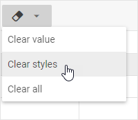

# Data formatting

## Color and style

The toolbar of DHTMLX Spreadsheet contains several sections with buttons for modifying the style of data in a cell.

What you can do:

- change the color of a text and its background via color picker linked to the **Text color** button
- change the color of text background via color picker linked to the **Background color** button
- apply *Bold*, *Italic* and *Underline* styles to a text

## Alignment

You can use the corresponding toolbar controls to align data in a cell horizontally or (and) vertically.

Click the "Horizontal align" button to align data along the left/right edges of a cell, or in its center.

Click the "Vertical align" button to align data at the top/center/bottom of a cell.

## Removing styles and values

To clear styles applied to data in a cell, or values entered into cells, or remove both data and formatting, you can choose one of the two ways:

1\. via the toolbar button:

- Choose necessary cell/cells.
- Use the **Clear** button in the toolbar.
- Choose the desired option in the drop-down list:

2\. via the context menu of a cell:

- Choose necessary cell/cells.
- Right-click the selection to call the context menu.
- Choose the **Clear** option and then select one of the options in the drop-down list:

