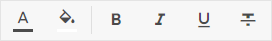
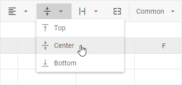
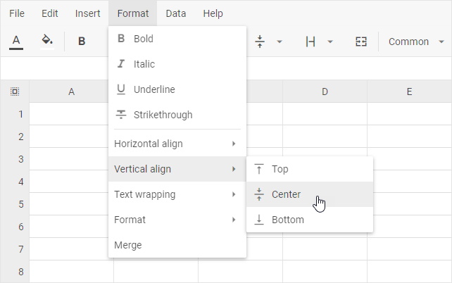
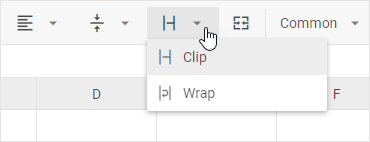
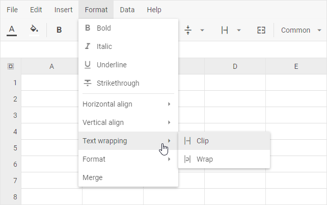
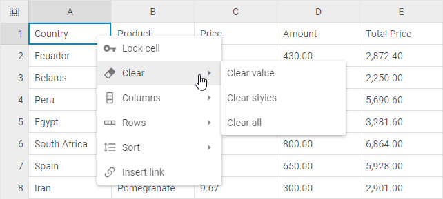

# Data formatting

## Color and style

The toolbar of DHTMLX Spreadsheet contains several sections with buttons for modifying the style of data in a cell.



What you can do:

- change the color of a text and its background via color picker linked to the **Text color** button
- change the color of text background via color picker linked to the **Background color** button
- apply *Bold*, *Italic* and *Underline* styles to a text

## Alignment

### Horizontal alignment

To align data in a cell horizontally, take the following steps:

1\. Select a cell or cells to align

2\. Choose one of the actions:

- Click the "Horizontal align" button in the toolbar and pick *Left*, *Center*, or *Right*


- Or go to: *Format* -> *Horizontal align* -> Pick *Left*, *Center*, or *Right* in the menu


### Vertical alignment

To align data in a cell vertically, take the following steps:

1\. Select a cell or cells to align

2\. Choose one of the actions:

- Click the "Vertical align" button in the toolbar and pick *Top*, *Center*, or *Bottom* 



- Or go to: *Format* -> *Vertical align* -> Pick *Top*, *Center*, or *Bottom* in the menu
 


### Wrap text in a cell

You can wrap text in cells in the following way:

1\. Select a cell or cells that you want to format

2\. Choose one of the actions:

- Click the "Text wrapping" button in the toolbar and pick *Clip* or *Wrap*



- Or go to: *Format* -> *Text wrapping* -> Pick *Clip* or *Wrap* in the menu



:::tip
When you change the width of the column, text wrapping adjusts automatically.
:::

## Removing styles and values

To clear styles applied to data in a cell, or values entered into cells, or remove both data and formatting, you can choose one of the two ways:

1\. via the toolbar button:

- Choose necessary cell/cells.
- Use the **Clear** button in the toolbar.
- Choose the desired option in the drop-down list:


2\. via the context menu of a cell:

- Choose necessary cell/cells.
- Right-click the selection to call the context menu.
- Choose the **Clear** option and then select one of the options in the drop-down list:



## Merge and unmerge cells

```todo
```
