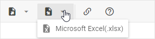
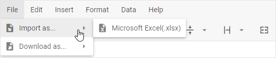

# Excel import/export

## Import from Excel

You can load data from an Excel file into Spreadsheet. There is quite a simple way to do this:

1\.  Click the **Import** button in the toolbar and select *Microsoft Excel (.xlsx)*

or:

Go to: *File -> Import As... -> Microsoft Excel (.xlsx)* in the menu  

2\. Select an Excel file on your computer and its content will be imported into an opened sheet.

## Export to Excel

The data you've entered into Spreadsheet can be exported to an Excel file. Complete the steps below:

1\. Click the **Export** button in the toolbar:

or:

Go to: *File -> Download As... -> Microsoft Excel (.xlsx)* in the menu  

2\. Check the directory with downloaded files on your computer to find a downloaded Excel file with data from Spreadsheet.
