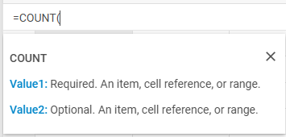

# Formulas and functions

Starting from v4.0, the package of DHTMLX Spreadsheet includes a set of predefined formulas that can be used for different types of calculations of strings and numbers. The formulas are compatible with Excel and Google Sheets.

:::note
Lowercase letters in formulas are automatically converted to upper case.
:::

<iframe src="https://snippet.dhtmlx.com/wux2b35b?mode=result" frameborder="0" class="snippet_iframe" width="100%" height="600"></iframe>

## Functions

Here's a list of all the available functions with detailed descriptions.

### Boolean operators

You can compare two values via using logical expressions that in any given case will only return either TRUE or FALSE.

| Operator | Example       | Description                                                                                              |
| :------- | :------------ | :------------------------------------------------------------------------------------------------------- |
| =        | =A1=B1        | Returns TRUE if the value in cell A1 is equal to the value in cell B1; otherwise, FALSE.                 |
| &lt;&gt; | =A1&lt;&gt;B1 | Returns TRUE if the value in cell A1 is not equal to the value in cell B1; otherwise, FALSE.             |
| &gt;     | =A1&gt;B1     | Returns TRUE if the value in cell A1 is greater than the value in cell B1; otherwise, FALSE.             |
| &lt;     | =A1&lt;B1     | Returns TRUE if the value in cell A1 is less than the value in cell B1; otherwise, FALSE.                |
| &gt;=    | =A1&gt;=B1    | Returns TRUE if the value in cell A1 is greater than or equal to the value in cell B1; otherwise, FALSE. |
| &lt;=    | =A1&lt;=B1    | Returns TRUE if the value in cell A1 is less than or equal to the value in cell B1; otherwise, FALSE.    |

Check the example in our [snippet tool](https://snippet.dhtmlx.com/wux2b35b).

### Date functions

<table>
    <tbody>
        <tr>
            <td><b>Function</b></td>
            <td><b>Formula</b></td>
            <td><b>Description</b></td>
        </tr>
        <tr>
            <td><b>DATE</b></td>
            <td>=DATE(year,month,day)</td>
            <td>Combines three separate values (year, month, and day) and returns a date.</td>
        </tr>
        <tr>
            <td><b>DATEDIF</b></td>
            <td>=DATEDIF(start_date,end_date,unit)</td>
            <td>Returns the number of days, months, or years between two dates.  The <a href="https://support.microsoft.com/en-us/office/datedif-function-25dba1a4-2812-480b-84dd-8b32a451b35c">unit</a> argument is used to define which type of information you want returned.</td>
        </tr>
        <tr>
            <td><b>DATEVALUE</b></td>
            <td>=DATEVALUE(date_text)</td>
            <td>Converts a date that is stored as text to a serial number.</td>
        </tr>
        <tr>
            <td><b>DAY</b></td>
            <td>=DAY(date)</td>
            <td>Returns the day of the month as a number between 1 to 31 from a specified date.</td>
        </tr>
        <tr>
            <td><b>DAYS</b></td>
            <td>=DAYS(end_date, start_date)</td>
            <td>Returns the number of days between two dates.</td>
        </tr>
        <tr>
            <td><b>DAYS360</b></td>
            <td>=DAYS360(start_date,end_date,[method]])</td>
            <td>Returns the number of days between 2 dates, based on a 360-day year (twelve 30-days months).</td>
        </tr>
        <tr>
            <td><b>EDATE</b></td>
            <td>=EDATE(start_date, months)</td>
            <td>Returns the date on the same date of the month, n months in the past or future.</td>
        </tr>
        <tr>
            <td><b>EOMONTH</b></td>
            <td>=EOMONTH(start_date, months)</td>
            <td>Returns the date for the last day of the month, n months before or after the specified start date.</td>
        </tr>
        <tr>
            <td><b>ISOWEEKNUM</b></td>
            <td>=ISOWEEKNUM(date)</td>
            <td>Returns the number of the ISO week number of the year for the specified date.</td>
        </tr>
        <tr>
            <td><b>MONTH</b></td>
            <td>=MONTH(date)</td>
            <td>Returns the month of the year of the specified date.</td>
        </tr>
        <tr>
            <td><b>NETWORKDAYS</b></td>
            <td>=NETWORKDAYS(start_date, end_date, [holidays])</td>
            <td>Returns the number of whole working days between two dates. Working days exclude weekends and any dates specified in <i>holidays</i>.</td>
        </tr>
        <tr>
            <td><b>NETWORKDAYSINTL</b></td>
            <td>=NETWORKDAYSINTL(start_date, end_date, [weekend], [holidays])</td>
            <td>Returns the number of whole working days between two dates.  The optional <a href="https://support.microsoft.com/en-us/office/networkdays-intl-function-a9b26239-4f20-46a1-9ab8-4e925bfd5e28">weekend</a> parameter is used to specify which days of the week are considered weekends.  <i>Weekend days</i> and <i>holidays</i> are not considered as workdays.</td>
        </tr>
        <tr>
            <td><b>NOW</b></td>
            <td>=NOW()</td>
            <td>Returns the current date.</td>
        </tr>
        <tr>
            <td><b>TIMEVALUE</b> added in v4.3</td>
            <td>=TIMEVALUE(time_text)</td>
            <td>Returns the decimal number of the time represented by a text string</td>
        </tr>
        <tr>
            <td><b>WEEKDAY</b></td>
            <td>=WEEKDAY(date,[return_type])</td>
            <td>Returns the day of the week for the specified date.  The <a href="https://support.microsoft.com/en-us/office/weekday-function-60e44483-2ed1-439f-8bd0-e404c190949a">return_type</a> argument is used to define which day of the week is considered the first day.</td>
        </tr>
        <tr>
            <td><b>WEEKNUM</b></td>
            <td>=WEEKNUM(date,[return_type])</td>
            <td>Returns the week number for the specified date.  The <a href="https://support.microsoft.com/en-us/office/weeknum-function-e5c43a03-b4ab-426c-b411-b18c13c75340">return_type</a> argument is used to define which day of the week is considered the first day.</td>
        </tr>
        <tr>
            <td><b>WORKDAY</b></td>
            <td>=WORKDAY(start_date, days, [holidays])</td>
            <td>Returns the date of the nearest working day n days in the future or past. Working days exclude weekends and any dates specified in <i>holidays</i>.</td>
        </tr>
        <tr>
            <td><b>WORKDAYINTL</b></td>
            <td>=WORKDAYINTL(start_date, days, [weekend], [holidays])</td>
            <td>Returns the date of the nearest working day n days in the future or past.  The optional <a href="https://support.microsoft.com/en-us/office/workday-intl-function-a378391c-9ba7-4678-8a39-39611a9bf81d">weekend</a> parameter is used to specify which days of the week are considered weekends.  <i>Weekend days</i> and <i>holidays</i> are not considered as workdays.</td>
        </tr>
        <tr>
            <td><b>YEAR</b></td>
            <td>=YEAR(date)</td>
            <td>Returns the year of the specified date.</td>
        </tr>
        <tr>
            <td><b>YEARFRAC</b></td>
            <td>=YEARFRAC(start_date, end_date, [basis])</td>
            <td>Returns the year of the specified date.  The optional <a href="https://support.microsoft.com/en-us/office/yearfrac-function-3844141e-c76d-4143-82b6-208454ddc6a8">basis</a> argument is used to define the type of day count basis.</td>
        </tr>
    </tbody>
</table>
 

Check the example in our [snippet tool](https://snippet.dhtmlx.com/wux2b35b).

### Financial functions

<table>
    <tbody>
        <tr>
            <td><b>Function</b></td>
            <td><b>Formula</b></td>
            <td><b>Description</b></td>
        </tr>
        <tr>
            <td><b>ACCRINT</b></td>
            <td> =ACCRINT(issue, id, sd, rate, par, frequency, [basis], [calc_method]),    where: <ul> <li><i>issue</i> - the issue date of the security;</li> <li><i>id</i> - the security's first interest date;</li> <li><i>sd</i> - the security's settlement date;</li> <li><i>rate</i> - the security's annual coupon rate;</li> <li><i>par</i> - the security's par value, $1,000 by default;</li> <li><i>frequency</i> - the number of coupon payments per year (1 for annual payments); </li> <li><i>basis</i> - optional, the type of day count basis to use;</li> <li><i>calc_method</i> - optional, the way to calculate the total accrued interest when the date of settlement is later than the date of first interest (<a href="https://support.microsoft.com/en-us/office/accrint-function-fe45d089-6722-4fb3-9379-e1f911d8dc74">0 or 1(default)</a>).</li></ul></td>
            <td>Returns the accrued interest for a security that pays periodic interest.</td>
        </tr>
        <tr>
            <td><b>BINOM.DIST</b> added in v4.3</td>
            <td>=BINOM.DIST(number_s, trials, probability_s, cumulative),    where: <ul> <li><i>number_s</i> - the number of successes in trials;</li> <li><i>trials</i> - the number of independent trials;</li> <li><i>probability_s</i> - the probability of success on each trial;</li> <li><i>cumulative</i> - if TRUE, then BINOM.DIST returns the cumulative distribution function; if FALSE (use 0), it returns the probability mass function.</li> </ul></td>
            <td>Returns the individual term binomial distribution probability.</td>
        </tr>
        <tr>
            <td><b>BINOM.DIST.RANGE</b> added in v4.3</td>
            <td>=BINOM.DIST.RANGE(trials, probability_s, number_s, [number_s2]),    where: <ul> <li><i>trials</i> - the number of independent trials (must be ≥ 0);</li> <li><i>probability_s</i> - the probability of success in each trial (must be ≥ 0 and ≤ 1);</li> <li><i>number_s</i> - the number of successes in trials (must be ≥ 0 and ≤ <i>trials)</i>;</li> <li><i>number_s2</i> - optional. If provided, returns the probability that the number of successful trials will fall between <i>number_s</i> and <i>number_s2</i>  ([number_s2] must be ≥ <i>number_s</i> and ≤ <i>trials</i>).</li> </ul></td>
            <td>Returns the probability of a trial result using a binomial distribution.</td>
        </tr>
        <tr>
            <td><b>BINOM.INV</b> added in v4.3</td>
            <td>=BINOM.INV(trials, probability_s, alpha),    where: <ul> <li><i>trials</i> - the number of Bernoulli trials;</li> <li><i>probability_s</i> - the probability of success in each trial (must be ≥ 0 and ≤ 1);</li> <li><i>alpha</i> - the criterion value (must be ≥ 0 and ≤ <i>1)</i>;</li> </ul></td>
            <td>Returns the smallest value for which the cumulative binomial distribution is greater than or equal to a criterion value.</td>
        </tr>
        <tr>
            <td><b>BITLSHIFT</b> added in v4.3</td>
            <td>=BITLSHIFT(number, shift_amount),    where: <ul> <li><i>number</i> - the number to be shifted (must be an integer greater than or equal to 0 </li> <li><i>shift_amount</i> - the amount of bits to shift, if negative, shifts bits to the right instead</li> </ul></td>
            <td>Returns a number shifted left by the specified number of bits.</td>
        </tr>
        <tr>
            <td><b>BITOR</b> added in v4.3</td>
            <td>=BITOR(number1, number2),    where: <ul> <li><i>number1</i> - a decimal number (must be greater than or equal to 0 and no larger than 2^48 - 1);</li> <li><i>number2</i> - a decimal number (must be greater than or equal to 0 and no larger than 2^48 - 1);</li> </ul></td>
            <td>Returns a decimal number representing the bitwise OR of two numbers.</td>
        </tr>
        <tr>
            <td><b>BITRSHIFT</b> added in v4.3</td>
            <td>=BITRSHIFT(number, shift_amount),    where: <ul> <li><i>number</i> - the number to be shifted (must be an integer greater than or equal to 0);</li> <li><i>shift_amount</i> - the amount of bits to shift, if negative shifts bits to the left instead;</li> </ul></td>
            <td>Returns a number shifted right by the specified number of bits.</td>
        </tr>
        <tr>
            <td><b>BITXOR</b> added in v4.3</td>
            <td>=BITXOR(number1, number2),    where: <ul> <li><i>number1</i> - a decimal number (must be greater than or equal to 0 and no larger than 2^48 - 1);</li> <li><i>number2</i> - a decimal number (must be greater than or equal to 0 and no larger than 2^48 - 1);</li> </ul></td>
            <td>Returns a decimal number representing the bitwise XOR of two numbers.</td>
        </tr>
        <tr>
            <td><b>COMPLEX</b> added in v4.3</td>
            <td>=COMPLEX(real_num, i_num, [suffix]),    where: <ul> <li><i>real_num</i> - the real coefficient of the complex number;</li> <li><i>i_num</i> - the imaginary coefficient of the complex number;</li> <li><i>suffix</i> - optional ("i" by default) - the suffix for the imaginary component of the complex number;  (must be lowercase "i" or "j") .</li> </ul></td>
            <td>Converts real and imaginary coefficients into a complex number of the form x + yi or x + yj.</td>
        </tr>
        <tr>
            <td><b>CORREL</b> added in v4.3</td>
            <td>=CORREL(array1, array2),    where: <ul> <li><i>array1</i> - a range of cell values;</li> <li><i>array2</i> - a second range of cell values;</li> Text, logical values, or empty cells are ignored. Cells with zero values are included. The arrays must have equal number of data points. </ul></td>
            <td>Returns the correlation coefficient of two cell ranges.</td>
        </tr>
        <tr>
            <td><b>COVAR</b> added in v4.3</td>
            <td>=COVAR(array1, array2),    where: <ul> <li><i>array1</i> - The first cell range of integers;</li> <li><i>array2</i> - The second cell range of integers;</li> Text, logical values, or empty cells are ignored. Cells with zero values are included. The arrays must have equal number of data points. </ul></td>
            <td>Returns covariance, the average of the products of deviations for each data point pair in two data sets.</td>
        </tr>
        <tr>
            <td><b>COVARIANCE.P</b> added in v4.3</td>
            <td>=COVARIANCE.P(array1, array2),    where: <ul> <li><i>array1</i> - The first cell range of integers;</li> <li><i>array2</i> - The second cell range of integers;</li> Text, logical values, or empty cells are ignored. Cells with zero values are included. The arrays must have equal number of data points. </ul></td>
            <td>Returns population covariance, the average of the products of deviations for each data point pair in two data sets.</td>
        </tr>
        <tr>
            <td><b>COVARIANCE.S</b> added in v4.3</td>
            <td>=COVARIANCE.S(array1, array2),    where: <ul> <li><i>array1</i> - The first cell range of integers;</li> <li><i>array2</i> - The second cell range of integers;</li> Text, logical values, or empty cells are ignored. Cells with zero values are included. The arrays must have equal number of data points. </ul></td>
            <td>Returns the sample covariance, the average of the products of deviations for each data point pair in two data sets.</td>
        </tr>
        <tr>
            <td><b>DB</b></td>
            <td>=DB(cost, salvage, life, period, [month]),    where: <ul> <li><i>cost</i> - the initial cost of the asset;</li> <li><i>salvage</i> - the value of the asset at the end of the depreciation;</li> <li><i>life</i> - the number of periods over which the asset is being depreciated;</li> <li><i>period</i> - the period to calculate depreciation for;</li> <li><i>month</i> - optional, the number of months in the first year, 12 by default.</li> </ul></td>
            <td>Calculates the depreciation of an asset for a specified period using the fixed-declining balance method.</td>
        </tr>
        <tr>
            <td><b>DDB</b></td>
            <td>=DDB(cost, salvage, life, period, [factor]),    where: <ul> <li><i>cost</i> - the initial cost of the asset;</li> <li><i>salvage</i> - the value of the asset at the end of the depreciation;</li> <li><i>life</i> - the number of periods over which the asset is being depreciated;</li> <li><i>period</i> - the period to calculate depreciation for;</li> <li><i>factor</i> - optional, the rate at which the balance declines, 2 (the double-declining balance method) by default</li> </ul></td>
            <td>Calculates the depreciation of an asset for a specified period using the double-declining balance method or another method you specify.</td>
        </tr>
        <tr>
            <td><b>DEC2BIN</b> added in v4.3</td>
            <td>=DEC2BIN(number),    where: <ul> <li><i>number</i> - the decimal integer you want to convert (must be greater than -512 but less than 511);</li> </ul></td>
            <td>Converts a decimal number to binary.</td>
        </tr>
        <tr>
            <td><b>DEC2HEX</b> added in v4.3</td>
            <td>=DEC2HEX(number),    where: <ul> <li><i>number</i> - the decimal integer you want to convert (must be greater than -549755813888 but less than 549755813887);</li> </ul></td>
            <td>Converts a decimal number to hexadecimal.</td>
        </tr>
        <tr>
            <td><b>DEC2OCT</b> added in v4.3</td>
            <td>=DEC2OCT(number),    where: <ul> <li><i>number</i> - the decimal integer you want to convert (must be greater than -536870912 but less than 536870911);</li> </ul></td>
            <td>Converts a decimal number to octal.</td>
        </tr>
        <tr>
            <td><b>DELTA</b> added in v4.3</td>
            <td>=DELTA(number1, [number2]),    where: <ul> <li><i>number1</i> - the first number;</li> <li><i>number2</i> - optional, the second number. If omitted, number2 is assumed to be zero.</li> </ul></td>
            <td>Tests two numbers for equality. Returns 1 if number1 = number2; returns 0 otherwise.</td>
        </tr>
        <tr>
            <td><b>DEVSQ</b> added in v4.3</td>
            <td>=DEVSQ(number1, [number2], ...),    where: <ul> <li><i>number1, number2,...</i> - from 1 to 255 arguments for which you want to calculate the sum of squared deviations;</li> Text, logical values, or empty cells are ignored. Cells with zero values are included. </ul></td>
            <td>Returns the sum of squares of deviations of data points from their sample mean.</td>
        </tr>
        <tr>
            <td><b>DOLLARDE</b></td>
            <td>=DOLLARDE(fractional_dollar, fraction)</td>
            <td>Converts a dollar price specified as an integer part and a fraction part into a dollar price displayed as a decimal number.</td>
        </tr>
        <tr>
            <td><b>DOLLARFR</b></td>
            <td>=DOLLARFR(decimal_dollar, fraction)</td>
            <td>Converts a decimal number into fractional dollar number.</td>
        </tr>
        <tr>
            <td><b>EFFECT</b></td>
            <td>=EFFECT(nominal_rate, npery)   <i>nominal_rate</i> must be >= 0, <i>npery</i> must be > 1.</td>
            <td>Returns the effective annual interest rate on the base of the nominal annual interest rate and the number of compounding periods per year you specify.  Works with numeric values. </td>
        </tr>
        <tr>
            <td><b>ERF</b> added in v4.3</td>
            <td>=ERF(lower_limit, [upper_limit]),    where: <ul> <li><i>lower_limit</i> - the lower bound for integrating ERF; </li> <li><i>upper_limit</i> - the upper bound for integrating ERF. If omitted, ERF integrates between 0 and lower_limit. </li> </ul> </td>
            <td>Returns the error function integrated between lower_limit and upper_limit.</td>
        </tr>
        <tr>
            <td><b>ERFC</b> added in v4.3</td>
            <td>=ERFC(x),    where: <ul> <li><i>x</i> - the lower bound for integrating ERFC </li> </ul></td>
            <td>Returns the complementary ERF function integrated between x and infinity.</td>
        </tr>
        <tr>
            <td><b>EXP</b> added in v4.3</td>
            <td>=EXP(number),    where: <ul> <li><i>number</i> - the power that e is raised to </li> </ul></td>
            <td>Returns the result of the constant e (which equals 2.71828182845904) raised to the power of a number.</td>
        </tr>
        <tr>
            <td><b>FISHER</b> added in v4.3</td>
            <td>=FISHER(x),    where: <ul> <li><i>x</i> - the value for which you want to calculate the transformation </li> </ul></td>
            <td>Calculates the Fisher transformation for a supplied value.</td>
        </tr>
        <tr>
            <td><b>FISHERINV</b> added in v4.3</td>
            <td>=FISHERINV(y),    where: <ul> <li><i>y</i> - the value for which you want to perform the inverse of the transformation </li> </ul></td>
            <td>Calculates the inverse of the Fisher transformation and returns a value between -1 and +1.</td>
        </tr>
        <tr>
            <td><b>FV</b></td>
            <td>=FV(rate, nper, pmt, [pv], [type]),    where: <ul> <li><i>rate</i> - the interest rate per period. For monthly payments, <i>rate</i>  =  rate/12;</li> <li><i>nper</i> - the total number of payment periods in an annuity. For monthly payments, <i>nper</i>=nper*12;</li> <li><i>pmt</i> - the payment made each period;</li> <li><i>pv</i> - optional, the present value, or the lump-sum amount that a series of future payments is worth right now, 0 by default;</li> <li><i>type</i> - optional, 0(default) - the payments are due at the end of the period, 1 - at the beginning of the period.</li> </ul></td>
            <td>Calculates the future value of an investment. </td>
        </tr>
        <tr>
            <td><b>FVSCHEDULE</b></td>
            <td>=FVSCHEDULE(principal, schedule),    where: <ul> <li><i>principal</i> - the present value;</li> <li><i>schedule</i> - an array of interest rates to apply. The values in the array can be numbers or blank cells; any other value produces the error value. Blank cells are taken as zeros.</li> </ul></td>
            <td>Returns the future value of an initial principal (=present value) after applying a series of compound interest rates.</td>
        </tr>
        <tr>
            <td><b>GAMMA</b> added in v4.3</td>
            <td>=GAMMA(number)   
            If Number is a negative integer or 0, GAMMA returns the #Error value.</td>
            <td>Returns the gamma function value.</td>
        </tr>
        <tr>
            <td><b>GEOMEAN</b> added in v4.3</td>
            <td>=GEOMEAN(number1, [number2], ...)   where: <ul> <li><i>number1, number2,...</i> - from 1 to 255 arguments for which you want to calculate the mean;</li> Text, logical values, or empty cells are ignored. Cells with zero values are included. </ul></td>
            <td>Returns the geometric mean of an array or range of positive data.</td>
        </tr>
        <tr>
            <td><b>GESTEP</b> added in v4.3</td>
            <td>=GESTEP(number, [step])   where: <ul> <li><i>number</i> - the value to test against step;</li> <li><i>step</i> - optional, the threshold value. If you omit a value for step, GESTEP uses zero;</li> </ul></td>
            <td>Returns 1 if number ≥ step; returns 0 (zero) otherwise.</td>
        </tr>
        <tr>
            <td><b>HARMEAN</b> added in v4.3</td>
            <td>=HARMEAN(number1, [number2], ...)   where: <ul> <li><i>number1, number2,...</i> - from 1 to 255 arguments for which you want to calculate the mean;</li> Text, logical values, or empty cells are ignored. Cells with zero values are included. </ul></td>
            <td>Returns the harmonic mean of a data set.</td>
        </tr>
        <tr>
            <td><b>HEX2BIN</b> added in v4.3</td>
            <td>=HEX2BIN(number)   where: <ul> <li><i>number</i> - the hexadecimal number you want to convert. Number can't contain more than 10 characters;</li> </ul></td>
            <td>Converts a hexadecimal number to binary.</td>
        </tr>
        <tr>
            <td><b>HEX2DEC</b> added in v4.3</td>
            <td>=HEX2DEC(number)   where: <ul> <li><i>number</i> - the hexadecimal number you want to convert. Number can't contain more than 10 characters;</li> </ul></td>
            <td>Converts a hexadecimal number to decimal.</td>
        </tr>
        <tr>
            <td><b>HEX2OCT</b> added in v4.3</td>
            <td>=HEX2OCT(number)   where: <ul> <li><i>number</i> - the hexadecimal number you want to convert. Number can't contain more than 10 characters;</li> </ul></td>
            <td>Converts a hexadecimal number to octal.</td>
        </tr>
        <tr>
            <td><b>IMABS</b> added in v4.3</td>
            <td>=IMABS(inumber)   where: <ul> <li><i>inumber</i> - a complex number</li> </ul></td>
            <td>Returns the absolute value of a complex number in the format x + yi or x + yj.</td>
        </tr>
        <tr>
            <td><b>IMAGINARY</b> added in v4.3</td>
            <td>=IMAGINARY(inumber)   where: <ul> <li><i>inumber</i> - a complex number</li> </ul></td>
            <td>Returns the imaginary coefficient of a complex number given in the format x + yi or x + yj.</td>
        </tr>
        <tr>
            <td><b>IMCONJUGATE</b> added in v4.3</td>
            <td>=IMCONJUGATE(inumber)   where: <ul> <li><i>inumber</i> - a complex number</li> </ul></td>
            <td>Returns the complex conjugate of a complex number given in the format x + yi or x + yj.</td>
        </tr>
        <tr>
            <td><b>IMCOS</b> added in v4.3</td>
            <td>=IMCOS(inumber)   where: <ul> <li><i>inumber</i> - a complex number</li> </ul></td>
            <td>Returns the cosine of a complex number given in the format x + yi or x + yj.</td>
        </tr>
        <tr>
            <td><b>IMCOSH</b> added in v4.3</td>
            <td>=IMCOSH(inumber)   where: <ul> <li><i>inumber</i> - a complex number</li> </ul></td>
            <td>Returns the hyperbolic cosine of a complex number given in the format x + yi or x + yj.</td>
        </tr>
        <tr>
            <td><b>IMCOT</b> added in v4.3</td>
            <td>=IMCOT(inumber)   where: <ul> <li><i>inumber</i> - a complex number</li> </ul></td>
            <td>Returns the cotangent of a complex number given in the format x + yi or x + yj.</td>
        </tr>
        <tr>
            <td><b>IMCSC</b> added in v4.3</td>
            <td>=IMCSC(inumber)   where: <ul> <li><i>inumber</i> - a complex number</li> </ul></td>
            <td>Returns the cosecant of a complex number given in the format x + yi or x + yj.</td>
        </tr>
        <tr>
            <td><b>IMCSCH</b> added in v4.3</td>
            <td>=IMCSCH(inumber)   where: <ul> <li><i>inumber</i> - a complex number</li> </ul></td>
            <td>Returns the hyperbolic cosecant of a complex number given in the format x + yi or x + yj.</td>
        </tr>
        <tr>
            <td><b>IMDIV</b> added in v4.3</td>
            <td>=IMDIV(inumber1, inumber2)   where: <ul> <li><i>inumber1</i> - the complex numerator or dividend</li> <li><i>inumber2</i> - the complex denominator or divisor</li> </ul></td>
            <td>Returns the quotient of two complex numbers given in the format x + yi or x + yj.</td>
        </tr>
        <tr>
            <td><b>IMEXP</b> added in v4.3</td>
            <td>=IMEXP(inumber)   where: <ul> <li><i>inumber</i> - a complex number</li> </ul></td>
            <td>Returns the exponential of a complex number given in the format x + yi or x + yj.</td>
        </tr>
        <tr>
            <td><b>IMLN</b> added in v4.3</td>
            <td>=IMLN(inumber)   where: <ul> <li><i>inumber</i> - a complex number</li> </ul></td>
            <td>Returns the natural logarithm of a complex number given in the format x + yi or x + yj.</td>
        </tr>
        <tr>
            <td><b>IMPOWER</b> added in v4.3</td>
            <td>=IMPOWER(inumber, number)   where: <ul> <li><i>inumber</i> - a complex number</li> <li><i>number</i> - the power to which you want to raise the complex number</li> </ul></td>
            <td>Returns a complex number in x + yi or x + yj text format raised to a power.</td>
        </tr>
        <tr>
            <td><b>IMPRODUCT</b> added in v4.3</td>
            <td>=IMPRODUCT(inumber1, [inumber2], ...)   where: <ul> <li><i>inumber1, inumber2,...</i> - from 1 to 255 complex numbers to multiply</li> </ul></td>
            <td>Returns the product of 1 to 255 complex numbers given in the format x + yi or x + yj.</td>
        </tr>
        <tr>
            <td><b>IMREAL</b> added in v4.3</td>
            <td>=IMREAL(inumber)   where: <ul> <li><i>inumber</i> - a complex number</li> </ul></td>
            <td>Returns the real coefficient of a complex number given in the format x + yi or x + yj.</td>
        </tr>
        <tr>
            <td><b>IMSEC</b> added in v4.3</td>
            <td>=IMSEC(inumber)   where: <ul> <li><i>inumber</i> - a complex number</li> </ul></td>
            <td>Returns the secant of a complex number given in the format x + yi or x + yj.</td>
        </tr>
        <tr>
            <td><b>IMSECH</b> added in v4.3</td>
            <td>=IMSECH(inumber)   where: <ul> <li><i>inumber</i> - a complex number</li> </ul></td>
            <td>Returns the hyperbolic secant of a complex number given in the format x + yi or x + yj.</td>
        </tr>
        <tr>
            <td><b>IMSIN</b> added in v4.3</td>
            <td>=IMSIN(inumber)   where: <ul> <li><i>inumber</i> - a complex number</li> </ul></td>
            <td>Returns the sine of a complex number given in the format x + yi or x + yj.</td>
        </tr>
        <tr>
            <td><b>IMSINH</b> added in v4.3</td>
            <td>=IMSINH(inumber)   where: <ul> <li><i>inumber</i> - a complex number</li> </ul></td>
            <td>Returns the hyperbolic sine of a complex number given in the format x + yi or x + yj.</td>
        </tr>
        <tr>
            <td><b>IMSQRT</b> added in v4.3</td>
            <td>=IMSQRT(inumber)   where: <ul> <li><i>inumber</i> - a complex number</li> </ul></td>
            <td>Returns the square root of a complex number given in the format x + yi or x + yj.</td>
        </tr>
        <tr>
            <td><b>IMSUB</b> added in v4.3</td>
            <td>=IMSUB(inumber1, inumber2)   where: <ul> <li><i>inumber1</i> - a complex number from which to subtract inumber2;</li> <li><i>inumber2</i> - the complex number to subtract from inumber1</li> </ul></td>
            <td>Returns the difference of two complex numbers given in the format x + yi or x + yj.</td>
        </tr>
        <tr>
            <td><b>IMSUM</b> added in v4.3</td>
            <td>=IMSUB(inumber1, [inumber2], ...)   where: <ul> <li><i>inumber1, inumber2,...</i> - from 1 to 255 complex numbers to add</li> </ul></td>
            <td>Returns the sum of two or more complex numbers given in the format x + yi or x + yj.</td>
        </tr>
        <tr>
            <td><b>IMTAN</b> added in v4.3</td>
            <td>=IMTAN(inumber)   where: <ul> <li><i>inumber</i> - a complex number</li> </ul></td>
            <td>Returns the tangent of a complex number given in the format x + yi or x + yj.</td>
        </tr>
        <tr>
            <td><b>IPMT</b></td>
            <td>=IPMT(rate, per, nper, pv, [fv], [type]),    where: <ul> <li><i>rate</i> - the interest rate per period. For monthly payments, <i>rate</i>  =  rate/12;</li> <li><i>per</i> - the period for which you want to find the interest and must be in the range between 1 and nper;</li> <li><i>nper</i> - the total number of payment periods in an annuity. For monthly payments, <i>nper</i>=nper*12;</li> <li><i>pv</i> - the present value, or the lump-sum amount that a series of future payments is worth right now;</li> <li><i>fv</i> - optional, the future value, 0 by default;</li> <li><i>type</i> - optional, 0(default) - the payments are due at the end of the period, 1 - at the beginning of the period.</li> </ul></td>
            <td>Returns the interest payment for a given period for an investment based on periodic, constant payments and a constant interest rate.</td>
        </tr>
        <tr>
            <td><b>IRR</b></td>
            <td>=IRR(values, [guess]),    where: <ul> <li><i>values</i> - an array or reference to cells that contain values. The array must contain at least one positive value and one negative value;</li> <li><i>guess</i> - optional, an estimate for expected IRR, .1 (=10%) by default.</li> </ul></td>
            <td>Returns the internal rate of return (IRR) for a series of cash flows that occur at regular intervals.</td>
        </tr>
        <tr>
            <td><b>ISPMT</b></td>
            <td>=ISPMT(rate, per, nper, pv),    where: <ul> <li><i>rate</i> - the interest rate for the investment. For monthly payments, <i>rate</i>  =  rate/12;</li> <li><i>per</i> - the period for which you want to find the interest and must be in the range between 1 and nper;</li> <li><i>nper</i> - the total number of payment periods for the investment. For monthly payments, <i>nper</i>=nper*12;</li> <li><i>pv</i> - the present value of the investment. For a loan, pv is the loan amount.</li> </ul></td>
            <td>Calculates the interest paid (or received) for the specified period of a loan (or investment) with even principal payments.</td>
        </tr>
        <tr>
            <td><b>LARGE</b> added in v4.3</td>
            <td>=LARGE(array, k),    where: <ul> <li><i>array</i> - the array or range of data for which you want to determine the k-th largest value;</li> <li><i>k</i> - the position (from the largest) in the array or cell range of data to return.</li> </ul></td>
            <td>Returns the k-th largest value in an array.</td>
        </tr>
        <tr>
            <td><b>MEDIAN</b> added in v4.3</td>
            <td>=MEDIAN(number1, [number2], ...),    where: <ul> <li><i>number1, number2,...</i> - from 1 to 255 numbers for which you want to calculate the median;</li> </ul></td>
            <td>Returns the median of the given numbers.</td>
        </tr>
        <tr>
            <td><b>NOMINAL</b></td>
            <td>=NOMINAL(effect_rate, npery),   <i>effect_rate</i> must be >= 0, <i>npery</i> must be > 1. </td>
            <td>Returns the nominal annual interest rate on the base of the effective rate and the number of compounding periods per year you specify.</td>
        </tr>
        <tr>
            <td><b>NPER</b></td>
            <td>=NPER(rate,pmt,pv,[fv],[type]),   where: <ul> <li><i>rate</i> - the interest rate per period. For monthly payments, <i>rate</i>  =  rate/12;</li> <li><i>pmt</i> - the payment made each period;</li> <li><i>pv</i> - the present value, or the lump-sum amount that a series of future payments is worth right now;</li> <li><i>fv</i> - optional, the future value, 0 by default;</li> <li><i>type</i> - optional, 0(default) - the payments are due at the end of the period, 1 - at the beginning of the period.</li> </ul></td>
            <td>Returns the number of periods for an investment based on periodic, constant payments and a constant interest rate. </td>
        </tr>
        <tr>
            <td><b>NPV</b></td>
            <td>=NPV(rate,value1,[value2],...),    where: <ul> <li><i>rate</i> - the rate of discount over one year;</li> <li><i>value1, value2,...</i> - from 1 to 254 values representing cash flows (future payments and income). Empty cells, logical values, text, or error values are ignored.</li> </ul></td>
            <td>Calculates the net present value of an investment by using a discount rate and a series of future payments (negative values) and income (positive values).</td>
        </tr>
        <tr>
            <td><b>OCT2BIN</b> added in v4.3</td>
            <td>=OCT2BIN(number),    where: <ul> <li><i>number</i> - the octal number you want to convert. It can't contain more than 10 characters;</li></ul></td>
            <td>Converts an octal number to binary.</td>
        </tr>
        <tr>
            <td><b>OCT2DEC</b> added in v4.3</td>
            <td>=OCT2DEC(number),    where: <ul> <li><i>number</i> - the octal number you want to convert. Number may not contain more than 10 octal characters (30 bits)</li> </ul></td>
            <td>Converts an octal number to decimal.</td>
        </tr>
        <tr>
            <td><b>OCT2HEX</b> added in v4.3</td>
            <td>=OCT2HEX(number),    where: <ul> <li><i>number</i> - the octal number you want to convert. Number may not contain more than 10 octal characters (30 bits)</li> </ul></td>
            <td>Converts an octal number to hexadecimal.</td>
        </tr>
        <tr>
            <td><b>PDURATION</b></td>
            <td>=PDURATION(rate, pv, fv),   where: <ul> <li><i>rate</i> - the interest rate per period. For monthly payments, <i>rate</i>  =  rate/12;</li> <li><i>pv</i> - the present value of the investment;</li> <li><i>fv</i> - the desired future value of the investment.</li> </ul>  All arguments must be positive values.</td>
            <td>Returns the number of periods required by an investment to reach a specified value. </td>
        </tr>
        <tr>
            <td><b>PERCENTILE</b> added in v4.3</td>
            <td>=PERCENTILE(array, k),    where: <ul> <li><i>array</i> - an array of data values;</li> <li><i>k</i> - the percentile value between 0 and 1, inclusive.</li> </ul></td>
            <td>Returns the k-th percentile of values in a range.</td>
        </tr>
        <tr>
            <td><b>PERCENTILE.EXC</b> added in v4.3</td>
            <td>=PERCENTILE.EXC(array, k),    where: <ul> <li><i>array</i> - an array of data values;</li> <li><i>k</i> - the percentile value between 0 and 1, exclusive.</li> </ul></td>
            <td>Returns the k-th percentile of values in a range.</td>
        </tr>
        <tr>
            <td><b>PERCENTILE.INC</b> added in v4.3</td>
            <td>=PERCENTILE.INC(array, k),    where: <ul> <li><i>array</i> - an array of data values;</li> <li><i>k</i> - the percentile value between 0 and 1, inclusive.</li> </ul></td>
            <td>Returns the k-th percentile of values in a range.</td>
        </tr>
        <tr>
            <td><b>PERMUT</b> added in v4.3</td>
            <td>=PERMUT(number, number_chosen),    where: <ul> <li><i>number</i> - the total number of items;</li> <li><i>number_chosen</i> - the number of items in each combination.</li> </ul></td>
            <td>Returns the number of permutations for a given number of items.</td>
        </tr>
        <tr>
            <td><b>PMT</b></td>
            <td>=PMT(rate, nper, pv, [fv], [type]),    where: <ul> <li><i>rate</i> - the interest rate for the loan. For monthly payments, <i>rate</i>  =  rate/12;</li> <li><i>nper</i> - the total number of months of payments for the loan. For monthly payments, <i>nper</i>=nper*12;</li> <li><i>pv</i> - the present value (or the current total amount of loan);</li> <li><i>fv</i> - optional, the future value, 0 by default;</li> <li><i>type</i> - optional, 0(default) - the payments are due at the end of the period, 1 - at the beginning of the period.</li> </ul></td>
            <td>Calculates the monthly payment for a loan based on constant payments and a constant interest rate.</td>
        </tr>
        <tr>
            <td><b>PPMT</b></td>
            <td>=PPMT(rate, per, nper, pv, [fv], [type]),   where: <ul><li><i>rate</i> - the interest rate per period. For monthly payments, <i>rate</i>  =  rate/12;</li> <li><i>per</i> - the period for which you want to find the interest and must be in the range between 1 and nper;</li> <li><i>nper</i> - the total number of payment years in an annuity. For monthly payments, <i>nper</i>=nper*12;</li> <li><i>pv</i> - the present value - the total amount that a series of future payments is worth now;</li> <li><i>fv</i> - the desired future value or a cash balance.</li> <li><i>type</i> - optional, 0(default) - the payments are due at the end of the period, 1 - at the beginning of the period.</li> </ul></td>
            <td>Returns the payment on the principal for a specified period for an investment based on periodic, constant payments and a constant interest rate.  </td>
        </tr>
        <tr>
            <td><b>PV</b></td>
            <td>=PV(rate, nper, pmt, [fv], [type]),   where: <ul> <li><i>rate</i> - the interest rate per period. For monthly payments, <i>rate</i>  =  rate/12;</li> <li><i>nper</i> - the total number of payment years in an annuity. For monthly payments, <i>nper</i>=nper*12;</li> <li><i>pmt</i> - the payment made each period. If <i>pmt</i> is omitted, you must include the <i>fv</i> argument;</li> <li><i>fv</i> - optional, the desired future value or a cash balance.</li> <li><i>type</i> - optional, 0(default) - the payments are due at the end of the period, 1 - at the beginning of the period.</li> </ul></td>
            <td>Returns the present value of a loan or an investment, based on a constant interest rate. </td>
        </tr>
        <tr>
            <td><b>QUARTILE</b> added in v4.3</td>
            <td>=QUARTILE(array, quart),    where: <ul> <li><i>array</i> - the array or cell range of numeric values;</li> <li><i>quart</i> - indicates which value to return (<a href="https://support.microsoft.com/en-us/office/quartile-function-93cf8f62-60cd-4fdb-8a92-8451041e1a2a">0-4</a>).</li> </ul></td>
            <td>Returns the quartile of a data set.</td>
        </tr>
        <tr>
            <td><b>QUARTILE.EXC</b> added in v4.3</td>
            <td>=QUARTILE(array, quart),    where: <ul> <li><i>array</i> - the array or cell range of numeric values;</li> <li><i>quart</i> - indicates which value to return (1-3).</li> </ul></td>
            <td>Returns the quartile of the data set, based on percentile values from 0..1, exclusive.</td>
        </tr>
        <tr>
            <td><b>QUARTILE.INC</b> added in v4.3</td>
            <td>=QUARTILE.INC(array, quart),    where: <ul> <li><i>array</i> - the array or cell range of numeric values;</li> <li><i>quart</i> - indicates which value to return (0-4).</li> </ul></td>
            <td>Returns the quartile of a data set, based on percentile values from 0..1, inclusive.</td>
        </tr>
        <tr>
            <td><b>SIGN</b> added in v4.3</td>
            <td>=SIGN(number),    where: <ul> <li><i>number</i> - any real number</li> </ul></td>
            <td>Defines the sign of a number. Returns 1 if the number is positive, zero (0) if the number is 0, and -1 if the number is negative.</td>
        </tr>
        <tr>
            <td><b>SMALL</b> added in v4.3</td>
            <td>=SMALL(array, k),    where: <ul> <li><i>array</i> - an array or range of numeric values;</li> <li><i>k</i> - the position (from 1 - the smallest value) in the data set.</li> </ul></td>
            <td>Returns the k-th smallest value based on its position in the data set.</td>
        </tr>
        <tr>
            <td><b>STEYX</b> added in v4.3</td>
            <td>=STEYX(known_y's, known_x's),    where: <ul> <li><i>known_y's</i> - an array or range of dependent data points;</li> <li><i>known_x's</i> - an array or range of independent data points.</li> </ul> Text, logical values, or empty cells are ignored. Zero values are included.</td>
            <td>Returns the standard error of the predicted y-value for each x in the regression.</td>
        </tr>
        <tr>
            <td><b>SYD</b> added in v4.3</td>
            <td>=SYD(cost, salvage, life, per),    where: <ul> <li><i>cost</i> - the initial cost of the asset;</li> <li><i>salvage</i> - the asset value at the end of the depreciation;</li> <li><i>life</i> - the number of periods over which the asset is depreciated;</li> <li><i>per</i> - the period and must use the same units as life.</li> </ul></td>
            <td>Returns the sum-of-years' digits depreciation of an asset for a specified period.</td>
        </tr>
        <tr>
            <td><b>TBILLPRICE</b> added in v4.3</td>
            <td>=TBILLPRICE(settlement, maturity, discount),    where: <ul> <li><i>settlement</i> - the settlement date of the Treasury bill;</li> <li><i>maturity</i> - the maturity date of the Treasury bill;</li> <li><i>discount</i> - the Treasury bill's percentage discount rate.</li> </ul></td>
            <td>Returns the price per $100 face value for a Treasury bill.</td>
        </tr>
        <tr>
            <td><b>TBILLYIELD</b> added in v4.3</td>
            <td>=TBILLYIELD(settlement, maturity, pr),    where: <ul> <li><i>settlement</i> - the settlement date of the Treasury bill;</li> <li><i>maturity</i> - the maturity date of the Treasury bill;</li> <li><i>pr</i> - the Treasury bill's price per $100 face value.</li> </ul></td>
            <td>Returns the yield for a Treasury bill.</td>
        </tr>
        <tr>
            <td><b>WEIBULL</b> added in v4.3</td>
            <td>=WEIBULL(x, alpha, beta, cumulative),    where: <ul> <li><i>x</i> - the value at which the function must be calculated (must be ≥ 0);</li> <li><i>alpha</i> - the alpha parameter to the distribution (must be > 0);</li> <li><i>beta</i> - the beta parameter to the distribution (must be > 0);</li> <li><i>cumulative</i> - the logical (true/false) argument which defines the type of distribution to be used. If True - Weibull cumulative distribution function, if False - Weibull probability density function </li> </ul></td>
            <td>Returns the Weibull distribution.</td>
        </tr>
        <tr>
            <td><b>WEIBULL.DIST</b> added in v4.3</td>
            <td>=WEIBULL(x, alpha, beta, cumulative),    where: <ul> <li><i>x</i> - the value at which the function must be calculated (must be ≥ 0);</li> <li><i>alpha</i> - the alpha parameter to the distribution (must be > 0);</li> <li><i>beta</i> - the beta parameter to the distribution (must be > 0);</li> <li><i>cumulative</i> - the logical (true/false) argument which defines the type of distribution to be used. If True - Weibull cumulative distribution function, if False - Weibull probability density function </li> </ul></td>
            <td>Returns the Weibull distribution.</td>
        </tr>
    </tbody>
</table>

Check the example in our [snippet tool](https://snippet.dhtmlx.com/wux2b35b).

### Information functions

<table>
    <tbody>
        <tr>
            <td><b>Function</b></td>
            <td><b>Formula</b></td>
            <td><b>Description</b></td>
        </tr>
        <tr>
            <td><b>ISBINARY</b></td>
            <td>=ISBINARY(value)</td>
            <td>Returns TRUE if the value is binary; otherwise, returns FALSE.</td>
        </tr>
        <tr>
            <td><b>ISBLANK</b></td>
            <td>=ISBLANK(A1)</td>
            <td>Returns TRUE if a cell is empty; otherwise, returns FALSE.</td>
        </tr>
        <tr>
            <td><b>ISEVEN</b></td>
            <td>=ISEVEN(number)</td>
            <td>Returns TRUE if a number is even, or FALSE if number is odd.  Works with integer numbers.</td>
        </tr>
        <tr>
            <td><b>ISNONTEXT</b></td>
            <td>=ISNONTEXT(value)</td>
            <td>Returns TRUE if a cell contains any value except text; otherwise, returns FALSE.</td>
        </tr>
        <tr>
            <td><b>ISNUMBER</b></td>
            <td>=ISNUMBER(value)</td>
            <td>Returns TRUE if a cell contains a number; otherwise, returns FALSE.</td>
        </tr>
        <tr>
            <td><b>ISODD</b></td>
            <td>=ISODD(number)</td>
            <td>Returns TRUE if a number is odd, or FALSE if number is even.  Works with integer numbers.</td>
        </tr>
        <tr>
            <td><b>ISTEXT</b></td>
            <td>=ISTEXT(value)</td>
            <td>Returns TRUE if a value is text; otherwise, returns FALSE.</td>
        </tr>
        <tr>
            <td><b>N</b></td>
            <td>=N(value)</td>
            <td>Returns a value converted to a number.</td>
        </tr>
    </tbody>
</table>
 

Check the example in our [snippet tool](https://snippet.dhtmlx.com/wux2b35b).

### Lookup functions

<table>
    <tbody>
        <tr>
            <td><b>Function</b></td>
            <td><b>Formula</b></td>
            <td><b>Description</b></td>
        </tr>
        <tr>
            <td><b>HLOOKUP</b> added in v4.3</td>
            <td>=HLOOKUP(lookup_value, table_array, row_index, [range_lookup]),    where: <ul> <li><i>lookup_value</i> - the value to search for;</li> <li><i>table_array</i> - the table from which to retrieve a value;</li> <li><i>column_index_num</i> - the row number in the table from which to retrieve a value;</li> <li><i>range_lookup</i> -  optional (1 by default): 0 - exact match, 1 - approximate match</li> </ul></td>
            <td>Looks up a value in a horizontal table</td>
        </tr>
        <tr>
            <td><b>INDEX</b> added in v4.3</td>
            <td>=INDEX(array, row_num, [column_num]),    where: <ul> <li><i>array</i> - a range of cells or an array constant;</li> <li><i>row_num</i> - the row position in the reference or array;</li> <li><i>column_num</i> - optional, the column position in the reference or array.</li> </ul></td>
            <td>Returns the value at a given location in a range or array.</td>
        </tr>
        <tr>
            <td><b>LOOKUP</b> added in v4.3</td>
            <td>=LOOKUP(lookup_value, lookup_vector, [result_vector]),    where: <ul> <li><i>lookup_value</i> - the value to search for;</li> <li><i>lookup_vector</i> - the one-row, or one-column range to search;</li> <li><i>result_vector</i> - optional, the one-row, or one-column range of results.</li> </ul></td>
            <td>Looks up a value in a one-column or one-row range, and retrieves a value from the same position in another one-column or one-row range.</td>
        </tr>
        <tr>
            <td><b>MATCH</b> added in v4.3</td>
            <td>=MATCH(lookup_value, lookup_array, [match_type]),    where: <ul> <li><i>lookup_value</i> - the value that you want to match in <i>lookup_array</i>;</li> <li><i>lookup_array</i> - the range of cells;</li> <li><i>match_type</i> - optional (1 by default): 1- finds the largest value that is less than or equal to <i>lookup_value</i> 0 - finds the value that is exactly equal to <i>lookup_value</i> -1 - finds the smallest value that is greater than or equal to <i>lookup_value</i></li> </ul></td>
            <td>Searches for a specified item in a range of cells, and then returns the relative position of that item in the range.</td>
        </tr>
        <tr>
            <td><b>VLOOKUP</b> added in v4.3</td>
            <td>=VLOOKUP(lookup_value, table_array, column_index_num, [range_lookup]),    where: <ul> <li><i>lookup_value</i> - the value to search for in the first column of a table;</li> <li><i>table_array</i> - the table from which to retrieve a value;</li> <li><i>column_index_num</i> - the column number in the table from which to retrieve a value;</li> <li><i>range_lookup</i> -  optional (1 by default): 0 - exact match, 1 - approximate match</li> </ul></td>
            <td>Looks up a value in a vertical table by matching on the first column</td>
        </tr>
        <tr>
            <td><b>XLOOKUP</b> added in v4.3</td>
            <td>=XLOOKUP(lookup_value, lookup_array, return_array, [if_not_found], [match_mode]),    where: <ul> <li><i>lookup_value</i> - the value to search for;</li> <li><i>lookup_array</i> - the array or range to search;</li> <li><i>return_array</i> - the array or range to return;</li> <li><i>if_not_found</i> - optional, if a valid match is not found, returns the [if_not_found] text you supply;</li> <li><i>match_mode</i> -  optional (0 by default): 0 - Exact match -1 - Exact match. If not found, returns the next smaller item 1 - Exact match. If not found, returns the next larger item</li> </ul></td>
            <td>Searches a range or an array, and then returns the item corresponding to the first match it finds. If no match exists, then XLOOKUP can return the closest (approximate) match.</td>
        </tr>
        <tr>
            <td><b>XMATCH</b> added in v4.3</td>
            <td>=XMATCH(lookup_value, lookup_array, [match_mode]),    where: <ul> <li><i>lookup_value</i> - the value that you want to match in <i>lookup_array</i>;</li> <li><i>lookup_array</i> - the range of cells;</li> <li><i>match_mode</i> - optional, 0 - exact match (default), -1 - exact match or next smallest, 1 - exact match or next larger</li> </ul></td>
            <td>Performs a lookup and returns a position in vertical or horizontal ranges.</td>
        </tr>
    </tbody>
</table>
 

### Math functions

<table> 
    <tbody>
        <tr>
            <td><b>ABS</b></td>
            <td>Returns the absolute value of a number. The absolute value of a number is always positive.</td>
        </tr>
        <tr>
            <td><b>ACOS</b></td>
            <td>Returns the arccosine, or inverse cosine, of a number. The arccosine is the angle whose cosine is <i>number</i>. The number must be from -1 to 1, inclusive. The returned angle is given in radians in the range 0 (zero) to pi.</td>
        </tr>
        <tr>
            <td><b>ACOSH</b></td>
            <td>Returns the inverse hyperbolic cosine of a number. The number must be greater than or equal to 1.</td>
        </tr>
        <tr>
            <td><b>ACOT</b></td>
            <td>Returns the principal value of the arc-cotangent, or inverse cotangent, of a number. The returned angle is given in radians in the range 0 (zero) to pi.</td>
        </tr>
        <tr>
            <td><b>ACOTH</b></td>
            <td>Returns the inverse hyperbolic cotangent of a number. The absolute value of the number must be greater than 1.</td>
        </tr>
        <tr>
            <td><b>ADD</b></td>
            <td>Returns the sum of two values.  Empty cells, logical values like TRUE, or text are ignored.</td>
        </tr>
        <tr>
            <td><b>ARABIC</b></td>
            <td>Converts a Roman numeral to an Arabic numeral.</td>
        </tr>
        <tr>
            <td><b>ASIN</b></td>
            <td>Returns the arcsine, or inverse sine, of a number. The arcsine is the angle whose sine is <i>number</i>. The number must be from -1 to 1, inclusive. The returned angle is given in radians in the range -pi/2 to pi/2.</td>
        </tr>
        <tr>
            <td><b>ASINH</b></td>
            <td>Returns the inverse hyperbolic sine of a number. The inverse hyperbolic sine is the value whose hyperbolic sine is <i>number</i>. Works with real numbers.</td>
        </tr>
        <tr>
            <td><b>ATAN</b></td>
            <td>Returns the arctangent, or inverse tangent, of a number. The arctangent is the angle whose tangent is <i>number</i>. The returned angle is given in radians in the range -pi/2 to pi/2. Works with the tangent of the angle you want.</td>
        </tr>
        <tr>
            <td><b>ATAN2</b></td>
            <td>Returns the arctangent of (x,y) coordinates. The arctangent is returned in radians between -pi and pi, excluding -pi.</td>
        </tr>
        <tr>
            <td><b>ATANH</b></td>
            <td>Returns the inverse hyperbolic tangent of a number. Number must be between -1 and 1 (excluding -1 and 1). Works with real numbers.</td>
        </tr>
        <tr>
            <td><b>AVEDEV</b> added in v4.3</td>
            <td>Returns the average of the absolute deviations of data points from their mean.  Empty cells, logical values, text, or error values in the array or reference are ignored. Cells with the value 0 are included.</td>
        </tr>
        <tr>
            <td><b>AVERAGE</b></td>
            <td>Calculates the average (arithmetic mean) of a group of numbers.  Logical values, empty cells and cells that contain text in the array or reference are ignored  However, cells with the value zero are included.</td>
        </tr>
        <tr>
            <td><b>AVERAGEA</b> added in v4.3</td>
            <td>Calculates the average (arithmetic mean) of the values in the list of arguments.  Arguments can be the following: numbers; names, arrays, or references that contain numbers; text representations of numbers; or logical values, such as TRUE and FALSE, in a reference. Empty cells and text values in the array or reference are ignored.</td>
        </tr>
        <tr>
            <td><b>BASE</b></td>
            <td>Converts a number into the supplied base (radix).  The number should be an integer and greater than or equal to 0 and less than 2^53. The base radix is what we want to convert the number into. It must be an integer from 2 to 36, inclusive.</td>
        </tr>
        <tr>
            <td><b>BITAND</b> added in v4.3</td>
            <td>Returns a bitwise 'AND' of two numbers. The number must be an integer and greater than or equal to 0 and less than (2^48)-1.</td>
        </tr>
        <tr>
            <td><b>CEILING</b></td>
            <td>Returns a number rounded up to the nearest integer or to the nearest multiple of the specified significance.</td>
        </tr>
        <tr>
            <td><b>COMBIN</b></td>
            <td>Returns the number of combinations for two given integer numbers: the number of items (<i>number</i>) and the number of items in each combination (<i>number_chosen</i>): <ul><li><i>number</i> should be greater than or equal to zero; also, it should be greater than or equal to the number_chosen;</li><li><i>number_chosen</i> must be greater than or equal to zero.</li></ul></td>
        </tr>
        <tr>
            <td><b>COMBINA</b></td>
            <td>Returns the number of combinations for two given integer numbers and includes repetitions. The numbers are: the number of items (<i>number</i>) and the number of items in each combination (<i>number_chosen</i>): <ul><li><i>number</i> should be greater than or equal to zero; also, it should be greater than or equal to the number_chosen;</li><li><i>number_chosen</i> must be greater than or equal to zero.</li></ul></td>
        </tr>
        <tr>
            <td><b>COS</b></td>
            <td>Returns the cosine of an angle specified in radians.</td>
        </tr>
        <tr>
            <td><b>COSH</b></td>
            <td>Returns the hyperbolic cosine of a real number.</td>
        </tr>
        <tr>
            <td><b>CSC</b></td>
            <td>Returns the cosecant of an angle specified in radians.</td>
        </tr>
        <tr>
            <td><b>CSCH</b></td>
            <td>Return the hyperbolic cosecant of an angle specified in radians.</td>
        </tr>
        <tr>
            <td><b>COT</b></td>
            <td>Returns the cotangent of the an angle specified in radians.</td>
        </tr>
        <tr>
            <td><b>COTH</b></td>
            <td>Returns the hyperbolic cotangent of a hyperbolic angle.</td>
        </tr>
        <tr>
            <td><b>COUNT</b></td>
            <td>Counts the number of cells that contain numbers, and counts numbers within the list of arguments.  Empty cells, logical values, text, or error values in the array or reference are not counted.</td>
        </tr>
        <tr>
            <td><b>COUNTA</b></td>
            <td>Counts the number of cells that contain numbers, text, logical values, error values, and empty text (""); cells with zero values are excluded.  The function does not count empty cells.</td>
        </tr>
        <tr>
            <td><b>COUNTBLANK</b></td>
            <td>Returns the number of empty cells from a specified range.  Cells with zero values are not counted.</td>
        </tr>
        <tr>
            <td><b>DECIMAL</b></td>
            <td>Converts a text representation of a number in a given base (radix) into a decimal number. The base radix must be an integer from 2 to 36, inclusive.</td>
        </tr>
        <tr>
            <td><b>DEGREES</b></td>
            <td>Converts radians into degrees.</td>
        </tr>
        <tr>
            <td><b>DIVIDE</b></td>
            <td>Returns the result of dividing one number by another.</td>
        </tr>
        <tr>
            <td><b>EQ</b></td>
            <td>Returns TRUE if the first argument is equal to the second; otherwise FALSE.</td>
        </tr>
        <tr>
            <td><b>EVEN</b></td>
            <td>Returns a number rounded up to the nearest even integer.</td>
        </tr>
        <tr>
            <td><b>FACT</b></td>
            <td>Returns the factorial of a number. The number must be from 1 to n. If number is not an integer, it is truncated.</td>
        </tr>
        <tr>
            <td><b>FACTDOUBLE</b></td>
            <td>Returns the double factorial of a number. The number must be from 1 to n. If number is not an integer, it is truncated.</td>
        </tr>
        <tr>
            <td><b>FLOOR</b></td>
            <td>Rounds number down, toward zero, to the nearest multiple of the specified significance. The significant must be from 1 to n. If the sign of number is positive, a value is rounded down and adjusted toward zero. If the sign of number is negative, a value is rounded down and adjusted away from zero.</td>
        </tr>
        <tr>
            <td><b>GCD</b></td>
            <td>Returns the greatest common divisor of two or more integers. The function takes from 1 to 255 numeric values which are expected to be integers. If any value is not an integer, it is truncated.</td>
        </tr>
        <tr>
            <td><b>GT</b></td>
            <td>Returns TRUE if the first argument is greater than the second; otherwise FALSE.</td>
        </tr>
        <tr>
            <td><b>GTE</b></td>
            <td>Returns TRUE if the first argument is greater than or equal to the second; otherwise FALSE. </td>
        </tr>
        <tr>
            <td><b>INT</b></td>
            <td>Returns a number rounded down to the nearest integer.</td>
        </tr>
        <tr>
            <td><b>LN</b></td>
            <td>Returns the natural logarithm of a positive real number.</td>
        </tr>
        <tr>
            <td><b>LOG</b></td>
            <td>Returns the logarithm of a positive real number to the base you specify. If base is omitted, it is assumed to be 10.</td>
        </tr>
        <tr>
            <td><b>LOG10</b></td>
            <td>Returns the base-10 logarithm of a positive real number.</td>
        </tr>
        <tr>
            <td><b>LT</b></td>
            <td>Returns TRUE if the first argument is less than the second; otherwise FALSE.</td>
        </tr>
        <tr>
            <td><b>LTE</b></td>
            <td>Returns TRUE if the first argument is less than or equal to the second; otherwise FALSE.</td>
        </tr>
        <tr>
            <td><b>MAX</b></td>
            <td>Returns the largest value in a set of values.  The function ignores empty cells, the logical values TRUE and FALSE, and text values. If the arguments contain no numbers, MAX returns 0 (zero).</td>
        </tr>
        <tr>
            <td><b>MIN</b></td>
            <td>Returns the smallest number in a set of values.  Empty cells, logical values, or text in the array or reference are ignored. If the arguments contain no numbers, MIN returns 0 (zero).</td>
        </tr>
        <tr>
            <td><b>MINUS</b></td>
            <td>Returns the difference of two numbers.</td>
        </tr>
        <tr>
            <td><b>MOD</b></td>
            <td>Returns the remainder after number is divided by divisor. The result has the same sign as divisor.</td>
        </tr>
        <tr>
            <td><b>MROUND</b></td>
            <td>Returns a number rounded to the nearest multiple of the specified significance. The values of <i>number</i> and <i>multiple</i> must have the same sign.</td>
        </tr>
        <tr>
            <td><b>MULTINOMIAL</b></td>
            <td>Returns the ratio of the factorial of a sum of values to the product of factorials. The function takes from 1 to 255 numeric values which must be greater than or equal to 0.</td>
        </tr>
        <tr>
            <td><b>MULTIPLY</b></td>
            <td>Returns the result of multiplying two numbers.</td>
        </tr>
        <tr>
            <td><b>NE</b></td>
            <td>Returns TRUE if the first argument is not equal to the second; otherwise FALSE.</td>
        </tr>
        <tr>
            <td><b>ODD</b></td>
            <td>Returns a number rounded up to the nearest odd integer.</td>
        </tr>
        <tr>
            <td><b>PI</b></td>
            <td>Returns the number 3.14159265358979 (the mathematical constant pi, accurate to 15 digits).</td>
        </tr>
        <tr>
            <td><b>POW</b></td>
            <td>Returns the result of a number raised to a given power.  Works with real numbers.</td>
        </tr>
        <tr>
            <td><b>POWER</b></td>
            <td>Returns the result of a number raised to a given power.  Works with real numbers.</td>
        </tr>
        <tr>
            <td><b>PRODUCT</b></td>
            <td>Multiplies all the numbers given as arguments and returns the product. 
Only numbers in the array or reference are multiplied. Empty cells, logical values, and text in the array or reference are ignored.</td>
        </tr>
        <tr>
            <td><b>QUOTIENT</b></td>
            <td>Returns the result of integer division without the remainder.  Works with real numbers.</td>
        </tr>
        <tr>
            <td><b>RADIANS</b></td>
            <td>Converts degrees to radians.</td>
        </tr>
        <tr>
            <td><b>RAND</b></td>
            <td>Returns a random number that is greater than or equal to 0 and less than 1.  Returns a new random number each time your spreadsheet recalculates. </td>
        </tr>
        <tr>
            <td><b>RANDBETWEEN</b></td>
            <td>Returns a random number between two specified numbers. Returns a new random number each time your spreadsheet recalculates. </td>
        </tr>
        <tr>
            <td><b>ROMAN</b></td>
            <td>Converts an arabic numeral to roman.</td>
        </tr>
        <tr>
            <td><b>ROUND</b></td>
            <td>Returns a number rounded to a specified number of digits.</td>
        </tr>
        <tr>
            <td><b>ROUNDDOWN</b></td>
            <td>Returns a number rounded down to a specified number of digits.</td>
        </tr>
        <tr>
            <td><b>ROUNDUP</b></td>
            <td>Returns a number rounded up to a specified number of digits.</td>
        </tr>
        <tr>
            <td><b>SEC</b></td>
            <td>Returns the secant of an angle specified in radians. Works with numeric values.</td>
        </tr>
        <tr>
            <td><b>SECH</b></td>
            <td>Returns the hyperbolic secant of an angle specified in radians. Works with numeric values.</td>
        </tr>
        <tr>
            <td><b>SIN</b></td>
            <td>Returns the sine of an angle specified in radians.</td>
        </tr>
        <tr>
            <td><b>SINH</b></td>
            <td>Returns the hyperbolic sine of a real number.</td>
        </tr>
        <tr>
            <td><b>SQRT</b></td>
            <td>Returns a positive square root of a number.</td>
        </tr>
        <tr>
            <td><b>SQRTPI</b></td>
            <td>Returns the square root of a number multiplied by pi. The number must be greater than or equal to 0.</td>
        </tr>
        <tr>
            <td><b>STDEV</b></td>
            <td>Calculates standard deviation based on data that represents a sample of population.  The standard deviation is a measure of how widely values are dispersed from the average value (the mean). Empty cells, logical values, text, or error values in the array or reference are ignored.</td>
        </tr>
        <tr>
            <td><b>STDEVA</b></td>
            <td>Calculates standard deviation based on a sample.  The standard deviation is a measure of how widely values are dispersed from the average value (the mean). Empty cells and text values in the array or reference are ignored.</td>
        </tr>
        <tr>
            <td><b>STDEVP</b></td>
            <td>Calculates standard deviation based on the entire population of numbers.  The standard deviation is a measure of how widely values are dispersed from the average value (the mean). Empty cells, logical values, text, or error values in the array or reference are ignored.</td>
        </tr>
        <tr>
            <td><b>STDEVPA</b></td>
            <td>Calculates standard deviation based on the entire population given as arguments, including text (evaluate as 0) and logical values (evaluate as 1 for TRUE, and as 0 for FALSE).  The standard deviation is a measure of how widely values are dispersed from the average value (the mean). If an argument is an array or reference, only values in that array or reference are used. Empty cells and text values in the array or reference are ignored.  Error values cause errors.</td>
        </tr>
        <tr>
            <td><b>STDEV.S</b> added in v4.3</td>
            <td>Estimates standard deviation based on a sample (ignores logical values and text in the sample).  The standard deviation is a measure of how widely values are dispersed from the average value (the mean). If an argument is an array or reference, only values in that array or reference are used. Empty cells, logical values, text, or error values in the array or reference are ignored.  Error values cause errors.</td>
        </tr>
        <tr>
            <td><b>SUBTOTAL</b></td>
            <td>Returns a subtotal in a list or database.</td>
        </tr>
        <tr>
            <td><b>SUM</b></td>
            <td>Returns the sum of supplied values.  Empty cells, logical values like TRUE, or text are ignored.</td>
        </tr>
        <tr>
            <td><b>SUMPRODUCT</b></td>
            <td>Multiplies range of cells or arrays and returns the sum of products.  For valid products only numbers are multiplied.  Empty cells, logical values, and text are ignored.  Treats array entries that are not numeric as if they were zeros.</td>
        </tr>
        <tr>
            <td><b>SUMSQ</b></td>
            <td>Returns the sum of the squares of the arguments.  Empty cells, logical values, text, or error values in the array or reference are ignored.</td>
        </tr>
        <tr>
            <td><b>SUMX2MY2</b></td>
            <td>Returns the sum of the difference of squares of corresponding values in two arrays. The arguments should be either numbers or names, arrays, or references that contain numbers. Empty cells, logical values, text, or error values in the array or reference are ignored. Zero values are included.</td>
        </tr>
        <tr>
            <td><b>SUMX2PY2</b></td>
            <td>Returns the sum of the sum of squares of corresponding values in two arrays. The arguments should be either numbers or names, arrays, or references that contain numbers. Empty cells, logical values, text, or error values in the array or reference are ignored. Zero values are included.</td>
        </tr>
        <tr>
            <td><b>SUMXMY2</b></td>
            <td>Returns the sum of squares of differences of corresponding values in two arrays. The arguments should be either numbers or names, arrays, or references that contain numbers. Empty cells, logical values, text, or error values in the array or reference are ignored. Zero values are included.</td>
        </tr>
        <tr>
            <td><b>TAN</b></td>
            <td>Returns the tangent of an angle specified in radians.</td>
        </tr>
        <tr>
            <td><b>TANH</b></td>
            <td>Returns the hyperbolic tangent of a real number.</td>
        </tr>
        <tr>
            <td><b>TRUNC</b></td>
            <td>Truncates a number to an integer by removing the fractional part of the number.</td>
        </tr>
        <tr>
            <td><b>VAR</b></td>
            <td>Returns the variance based on a sample. Empty cells, logical values, text, or error values in the array or reference are ignored.</td>
        </tr>
        <tr>
            <td><b>VARA</b></td>
            <td>Returns the variance based on a sample of the population, including text (evaluate as 0) and logical values (evaluate as 1 for TRUE, and as 0 for FALSE). Empty cells and text values in the array or reference are ignored.</td>
        </tr>
        <tr>
            <td><b>VARP</b></td>
            <td>Returns the variance of a population based on an entire population of numbers. Empty cells, logical values, text, or error values in the array or reference are ignored.</td>
        </tr>
        <tr>
            <td><b>VARPA</b></td>
            <td>Returns the variance of a population based on an entire population, including text (evaluate as 0) and logical values (evaluate as 1 for TRUE, and as 0 for FALSE). Empty cells and text values in the array or reference are ignored.</td>
        </tr>
        <tr>
            <td><b>VAR.S</b> added in v4.3</td>
            <td>Returns the variance based on a sample (ignores logical values and text in the sample). Empty cells, logical values, text, or error values in the array or reference are ignored.</td>
        </tr>
    </tbody>
</table>
 

Check the example in our [snippet tool](https://snippet.dhtmlx.com/wux2b35b).

### Regex functions

<table>
    <tbody>
        <tr>
            <td><b>Function</b></td>
            <td><b>Formula</b></td>
            <td><b>Description</b></td>
        </tr>
        <tr>
            <td><b>REGEXREPLACE</b></td>
            <td>=REGEXREPLACE(text, regular_expression, replacement)</td>
            <td>Replaces a part of a text string with a different text string using regular expressions.</td>
        </tr>
        <tr>
            <td><b>REGEXMATCH</b></td>
            <td>=REGEXMATCH(text, regular_expression)</td>
            <td>Returns TRUE if a text string matches the pattern in the regular expression and FALSE if it doesn't.</td>
        </tr>
        <tr>
            <td><b>REGEXEXTRACT</b></td>
            <td>=REGEXEXTRACT(text, regular_expression)</td>
            <td>Returns the part of the string that matches the pattern in the regular expression.</td>
        </tr>
    </tbody>
</table>
 

Check the example in our [snippet tool](https://snippet.dhtmlx.com/wux2b35b).

### String functions

<table>
    <tbody>
        <tr>
            <td><b>Function</b></td>
            <td><b>Formula</b></td>
            <td><b>Description</b></td>
        </tr>
        <tr>
            <td><b>ARRAYTOTEXT</b> added in v4.3</td>
            <td>=ARRAYTOTEXT(array, [format])</td>
            <td>Returns an array of text values from any specified range, based on the format you specify (0 - concise (default) or 1 - strict format) </td>
        </tr>
        <tr>
            <td><b>CHAR</b></td>
            <td>=CHAR(number)</td>
            <td>Returns the character (from the character set used by your computer) specified by a number. Number must be between 1 and 255. </td>
        </tr>
        <tr>
            <td><b>CLEAN</b></td>
            <td>=CLEAN(text)</td>
            <td>Removes characters, which are not printed when you use the print option, from the text.</td>
        </tr>
        <tr>
            <td><b>CODE</b></td>
            <td>=CODE(text)</td>
            <td>Returns a numeric code for the first character in a text string.</td>
        </tr>
        <tr>
            <td><b>CONCATENATE</b></td>
            <td>=CONCATENATE(A1,"",B2:C3)</td>
            <td>Joins two or more text strings into one string.</td>
        </tr>
        <tr>
            <td><b>DOLLAR</b></td>
            <td>=DOLLAR(number, decimals)</td>
            <td>Converts a number to text using the currency format, based on the number of digits to the right/left of the decimal point you specify (by default, 2).</td>
        </tr>
        <tr>
            <td><b>EXACT</b></td>
            <td>=EXACT(text1, text2)</td>
            <td>Compares two strings and returns TRUE if they are exactly the same; otherwise, returns FALSE.</td>
        </tr>
        <tr>
            <td><b>FIND</b></td>
            <td>=FIND(find_text, within_text, [start_num])</td>
            <td>Returns the position (as a number) of one text string inside another, starting at the position you specify (by default, 1).</td>
        </tr>
        <tr>
            <td><b>FIXED</b></td>
            <td>=FIXED(number, [decimals], [no_commas])</td>
            <td>Rounds a number to the specified number of decimals, formats the number in decimal format using a period and commas, and converts the result to text. If <i>no_commas</i> is set to 1, the returned text won't include commas.</td>
        </tr>
        <tr>
            <td><b>JOIN</b></td>
            <td>=JOIN(separator, value1, value2,...)</td>
            <td>Concatenates values using a specified separator.</td>
        </tr>
        <tr>
            <td><b>LEFT</b></td>
            <td>=LEFT(text, count)</td>
            <td>Returns the first character or characters in a text string,  based on the number of characters you specify.</td>
        </tr>
        <tr>
            <td><b>LEN</b></td>
            <td>=LEN(text)</td>
            <td>Returns the length of the specified string.</td>
        </tr>
        <tr>
            <td><b>LOWER</b></td>
            <td>=LOWER(text)</td>
            <td>Converts all letters in the specified string to lowercase.</td>
        </tr>
        <tr>
            <td><b>MID</b></td>
            <td>=MID(text, start, count)</td>
            <td>Returns a specific number of characters from a text string,  starting at the position you specify, based on the number  of characters you specify.</td>
        </tr>
        <tr>
            <td><b>NUMBERVALUE</b></td>
            <td>=NUMBERVALUE (text, [decimal_separator], [group_separator])</td>
            <td>Converts a number in text format to numeric value, using specified decimal and group separators.</td>
        </tr>
        <tr>
            <td><b>PROPER</b></td>
            <td>=PROPER(text)</td>
            <td>Sets the first character in each word to uppercase  and converts all other characters to lowercase.</td>
        </tr>
        <tr>
            <td><b>REPLACE</b> added in v4.3</td>
            <td>=REPLACE(old_text, start_num, num_chars, new_text),    where: <ul> <li><i>old_text</i> - the text in which you want to replace some characters;</li> <li><i>start_num</i> - the position of the character in <i>old_text</i> that you want to replace with new_text;</li> <li><i>num_chars</i> - the number of characters to be replaced in <i>old_text</i>;</li> <li><i>new_text</i> - the text that will replace characters in <i>old_text</i>.</li> </ul></td>
            <td>Replaces part of a text string, based on the number of characters you specify, with a different text string.</td>
        </tr>
        <tr>
            <td><b>REPT</b></td>
            <td>=REPT(text, number_times)</td>
            <td>Repeats text a specified number of times.</td>
        </tr>
        <tr>
            <td><b>RIGHT</b></td>
            <td>=RIGHT(text, count)</td>
            <td>Returns the last character or characters (rightmost) in a text string,  based on the number of characters you specify.</td>
        </tr>
        <tr>
            <td><b>SEARCH</b></td>
            <td>=SEARCH(find_text, within_text, [start_num])</td>
            <td>Returns the position (as a number) of the first character of <i>find_text</i> inside <i>within_text</i>, starting at the position you specify (by default, 1).</td>
        </tr>
        <tr>
            <td><b>SUBSTITUTE</b></td>
            <td>=SUBSTITUTE(text, old_text, new_text, [instance_num])</td>
            <td>Replaces old text with new text in a text string. If you specify <i>instance_num</i>, only that instance of <i>old_text</i> is replaced; otherwise, all instances are replaced.</td>
        </tr>
        <tr>
            <td><b>T</b></td>
            <td>=T(value)</td>
            <td> returns text when given a text value and an empty string ("") for numbers, dates, and the logical TRUE/FALSE values.</td>
        </tr>
        <tr>
            <td><b>TRIM</b></td>
            <td>=TRIM(text)</td>
            <td>Removes all spaces from text except for single spaces between words.</td>
        </tr>
        <tr>
            <td><b>UPPER</b></td>
            <td>=UPPER(text)</td>
            <td>Converts text to uppercase.</td>
        </tr>
    </tbody>
</table>
 

Check the example in our [snippet tool](https://snippet.dhtmlx.com/wux2b35b).

### Other functions

<table>
    <tbody>
        <tr>
            <td><b>Function</b></td>
            <td><b>Example</b></td>
            <td><b>Description</b></td>
        </tr>
        <tr>
            <td><b>AND</b></td>
            <td>=AND(logical1, [logical2], ...)</td>
            <td>Returns either TRUE or FALSE depending on  whether multiple conditions are met or not.</td>
        </tr>
        <tr>
            <td><b>CHOOSE</b></td>
            <td>=CHOOSE(index_num, value1, [value2], ...)</td>
            <td>Returns a value from the list of value arguments based on a position or index you specify.</td>
        </tr>
        <tr>
            <td><b>FALSE</b></td>
            <td>=FALSE()</td>
            <td>Returns the logical value FALSE.</td>
        </tr>
        <tr>
            <td><b>IF</b></td>
            <td>=IF(condition, [value_if_true], [value_if_false])</td>
            <td>Returns one value if a condition is TRUE  and another value if it's FALSE.</td>
        </tr>
        <tr>
            <td><b>NOT</b></td>
            <td>=NOT(logical)</td>
            <td>Returns the opposite of a given logical or Boolean value.</td>
        </tr>
        <tr>
            <td><b>OR</b></td>
            <td>=OR(logical1, [logical2], ...)</td>
            <td>Returns TRUE if at least one of the logical expressions is TRUE; otherwise, FALSE.</td>
        </tr>
        <tr>
            <td><b>TRUE</b></td>
            <td>=TRUE()</td>
            <td>Returns the logical value TRUE.</td>
        </tr>
    </tbody>
</table>
 

Check the example in our [snippet tool](https://snippet.dhtmlx.com/wux2b35b).

## Getting cell formula

Starting with v4.1, you can get the formula applied to a cell via the [`getFormula()`](/api/spreadsheet_getformula_method) method. The method takes the id of the cell as a parameter:

~~~js
var formula = spreadsheet.getFormula("B2");
// -> "ABS(C2)"
~~~

## Popup with formula description

When you enter a formula, a popup with description of the function and its parameters appears. 

Check the example in our [snippet tool](https://snippet.dhtmlx.com/wux2b35b).

You can modify the default locale for the popup with formula parameters and add a custom locale. Check the details in the [Localization](/localization/#default-locale-for-formulas) guide.