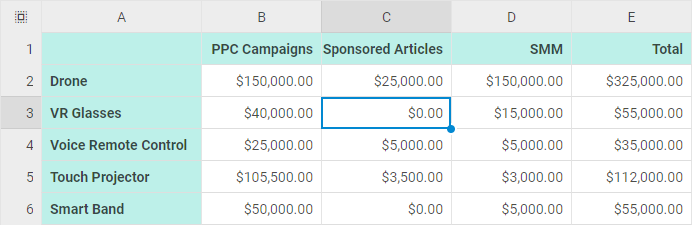

# How to Start

{{note This documentation is dedicated to the renewed DHTMLX Spreadsheet of version 3.0. To get information about the previous version 2.1, [follow the related documentation](https://docs.dhtmlx.com/spreadsheet__index.html).}}

This clear and comprehensive tutorial will guide your through the steps you need to complete in order to get a full-functional DHTMLX Spreadsheet on a page. The component will be especially effective for managing large amounts of data when you need to save the results of calculations and reproduce them.

## Step 1. Including source files

Start from creating an HTML file and call it *index.html*. Then proceed to include Spreadsheet source files into the created file. [The detailed description of the DHTMLX Spreadsheet package is given here](initialization.md#including-source-files).

There are two necessary files:

- the JS file of DHTMLX Spreadsheet
- the CSS file of DHTMLX Spreadsheet

and

- the link to the Google Fonts source file for the correct rendering of fonts.

~~~html title="index.html"
<!DOCTYPE html>
<html>
<head>
  <title>How to Start with DHTMLX Spreadsheet</title>
     
  
  <link href="codebase/spreadsheet.css" rel="stylesheet"> 
  <link href="https://fonts.googleapis.com/css?family=Roboto:400,500" rel="stylesheet">
</head>
<body>
	
</body>
</html>
~~~

## Step 2. Creating Spreadsheet

Now you are ready to add Spreadsheet to the page. First, let's create a DIV container and then place DHTMLX Spreadsheet into it. So, your steps will be:

- to specify a DIV container in the **index.html** file
- to initialize DHTMLX Spreadsheet using the `dhx.Spreadsheet` constructor

As parameters, the constructor function takes the HTML container to place Spreadsheet into and the Spreadsheet configuration object.

~~~html title="index.html"
<!DOCTYPE html>
<html>
<head>
	<title>How to Start with DHTMLX Spreadsheet</title>
	   
   
 	<link href="codebase/spreadsheet.css" rel="stylesheet">  
 	<link href="https://fonts.googleapis.com/css?family=Roboto:400,500" rel="stylesheet">
</head>
<body>
 	

 	
</body>
</html>
~~~

## Step 3. Setting Spreadsheet configuration

Next you can specify additional configuration options you want the Spreadsheet component to have when initialized besides the default ones.

There are several options you can use to adjust the look and feel of Spreadsheet to your needs, e.g.: **toolbarBlocks**, **rowsCount** and **colsCount**. [Check the details](configuration.md).

~~~js
const spreadsheet = new dhx.Spreadsheet("spreadsheet", {
	toolbarBlocks: ["columns", "rows", "clear"],
	rowsCount: 10,
	colsCount: 10
});
~~~

The configuration of DHTMLX Spreadsheet is quite flexible, so you can change it at any time. [Read the related guide](configuration.md) to go into the basics of configuring Spreadsheet.

## Step 4. Loading data into Spreadsheet

The last step is to populate Spreadsheet with data. DHTMLX Spreadsheet takes data in JSON format. Besides data you can pass necessary styles in a dataset. While loading inline data, you need to use the **parse()** method and pass an object with data to it as in the example below:

~~~js title="data.json"
const data = [
	{ "cell": "a1", "value": "Country" },
	{ "cell": "b1", "value": "Product" },
	{ "cell": "c1", "value": "Price" },
	{ "cell": "d1", "value": "Amount" },
	{ "cell": "e1", "value": "Total Price" },

	{ "cell": "a2", "value": "Ecuador" },
	{ "cell": "b2", "value": "Banana" },
	{ "cell": "c2", "value": 6.68 },
	{ "cell": "d2", "value": 430 },
	{ "cell": "e2", "value": 2872.4 },

	{ "cell": "a3", "value": "Belarus" },
	{ "cell": "b3", "value": "Apple" },
	{ "cell": "c3", "value": 3.75 },
	{ "cell": "d3", "value": 600 },
	{ "cell": "e3", "value": 2250 },
]

// initializing spreadsheet
const spreadsheet = new dhx.Spreadsheet("spreadsheet", {
    //config
});
// loading data into spreadsheet
spreadsheet.parse(data);
~~~

**Related sample**: [Spreadsheet. Custom Cells Count](https://snippet.dhtmlx.com/vc3mstsw)

## What's next

That's all. Just four simple steps and you have a handy tool for work with data in the tabular form. Now you can start working with your data or keep exploring the inner world of DHTMLX Spreadsheet.

- 
- 
- 
