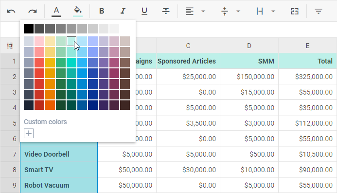
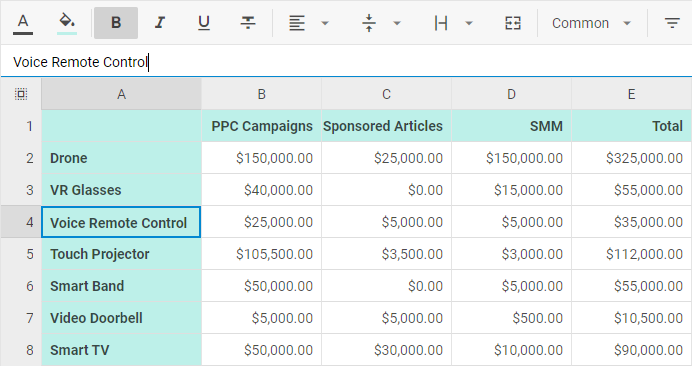
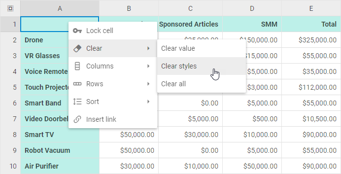
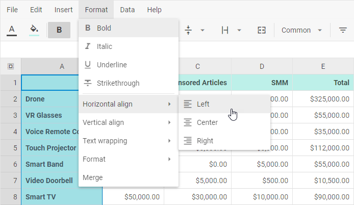

# DHTMLX Spreadsheet overview

DHTMLX Spreadsheet is a client-side JavaScript component that allows editing and formatting data in spreadsheets online. It includes a configurable toolbar, handy menu and context menu, and adjustable grid, supports hot keys navigation, loads data both from external and local sources, provides the ability to localize interface into the desired language.

:::tip
There is a [User Guide](guides/#user-guides) provided to make work with Spreadsheet easy for your end users
:::

## Spreadsheet structure

### Toolbar

The **Toolbar** section is rather flexible. It contains 6 default blocks of controls: "undo", "colors", "decoration", "align", "format", "actions", "helpers". You can [change the toolbar structure](configuration.md#toolbar) and add more blocks, or change the order of the blocks.

It is also possible to [customize the toolbar](customization.md#toolbar) by adding your own controls and updating the controls' configuration.  

### Editing line

The **editing line** can be used for two purposes:

- to edit the content of the selected cell
- to control changes made in the currently edited cell

You can switch the editing line off, if necessary via the corresponding [configuration option](configuration.md#editing-bar).

### Grid

**Grid** represents a table with columns defined by letters and rows defined by numbers. Thus, a cell of the grid is defined by the column's letter and the row's number, e.g. C3.

### Context menu

The **Context menu** section includes 5 items **Lock**, **Clear**, **Columns**, **Rows**, **Sort**, and **Insert link** with sub-items.

The [structure of Context menu is customizable](customization.md#context-menu) as well. You can add custom controls, update the controls' configuration and remove unnecessary controls.

### Menu

The **Menu** section contains several blocks that combine most frequently used options from the Toolbar and Context Menu to provide quick and handy access to them.

By default the **Menu** section is hidden, but you can switch it on via the related [configuration option](configuration.md#menu).

You can [modify the structure of the menu](customization.md#menu) by using custom controls, updating the controls' configuration and removing unnecessary controls.

## What's next

Now you can get down to using DHTMLX Spreadsheet in your application. Follow the directions of the [How to Start](how_to_start.md) tutorial for guidance.

To dive deeper into the specificity of DHTMLX Spreadsheet, go into more profound manuals:

- [API overview](api/api_overview.md)
- [Guides](guides.md)
