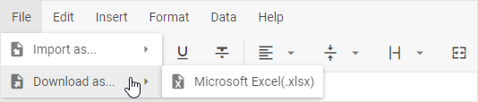

# Data loading and export

You can populate DHTMLX Spreadsheet with a ready dataset that may include the data itself and styling for cells. The component supports two ways of data loading:

- load from an external file
- load from a local source

The component also supports [export of data into an Excel file](#exporting-data).

## Preparing data

DHTMLX Spreadsheet expects data in the JSON format. 

It can be a simple array with cell objects. Use this way if you need to create a data set for only one sheet.

~~~jsx  title="Prepare data for one sheet"
const data = [
    { cell: "A1", value: "Country" },
    { cell: "B1", value: "Product" },
    { cell: "C1", value: "Price" },
    { cell: "D1", value: "Amount" },
    { cell: "E1", value: "Total Price" },

    { cell: "A2", value: "Ecuador" },
    { cell: "B2", value: "Banana" },
    { cell: "C2", value: 6.68, format:"currency" },
    { cell: "D2", value: 430, format:"percent" },
    // "myFormat" is the id of a custom format
    { cell: "E2", value: 2872.4, format:"myFormat" },
    
    // add drop-down lists to cells
    { cell: "A9", value: "Turkey", editor: {type: "select", options: ["Turkey","India","USA","Italy"]} },
    { cell: "B9", value: "", editor: {type: "select", options: "B2:B8" } },

    // more cell objects
];
~~~

Or it can be an object with data to be loaded into several sheets at once. For example:

~~~jsx title="Prepare data for several sheets"
const data = {
    sheets: [
        { 
            name: "sheet 1", 
            id: "sheet_1",
            data: [
                { cell: "A1", value: "Country" },
                { cell: "B1", value: "Product" },
                // more data
            ],
            merged: [
                // merge cells A1 and B1
                { from: { column: 0, row: 0 }, to: { column: 1, row: 0 } },
                // merge cells A2, A3, A4, and A5
                { from: { column: 0, row: 1 }, to: { column: 0, row: 4 } },
            ]
        }, 
        { 
            name: "sheet 2", 
            id: "sheet_2", 
            data: [
                { cell: "A1", value: "Country" },
                { cell: "B1", value: "Product" },
                // more data
            ]
        },
        // more sheet objects
    ]
};
~~~

Check the full lists of available properties for these two ways in the [API reference](/api/spreadsheet_parse_method).

:::tip
The ability to load merged cells is available only if you prepare data in a sheet object. 
:::

### Setting styles for cells

You may need to define the cells styling in the data set. In this case the data should be an object with *separate properties* that describe data objects and CSS classes applied to particular cells. 

A CSS class is set for a cell via the **css** property.

~~~jsx
const styledData = {
    styles: {
        someclass: {
            background: "#F2F2F2",
            color: "#F57C00"
        }
    },
    data: [
        { cell: "A1", value: "Country" },
        { cell: "B1", value: "Product" },
        { cell: "C1", value: "Price" },
        { cell: "D1", value: "Amount" },
        { cell: "E1", value: "Total Price" },

        { cell: "A2", value: "Ecuador" },
        { cell: "B2", value: "Banana" },
        { cell: "C2", value: 6.68, css: "someclass" },
        { cell: "D2", value: 430, css: "someclass" },
        { cell: "E2", value: 2872.4 }
    ],
}
~~~

:::info
[Check the list of properties which you can use for styling cells](/api/spreadsheet_parse_method.#list-of-properties) 
:::

### Setting the locked state for a cell

If you want to specify locked cells in a data set, you can do it with the help of the **locked** property of a cell by setting it to *true*:

~~~jsx
const dataset = [
    { cell: "a1", value: "Country", locked: true }, //locks a cell
    { cell: "b1", value: "Product", locked: true },   

    { cell: "a2", value: "Ecuador" },
    { cell: "b2", value: "Banana" },

    { cell: "a3", value: "Belarus" },
    { cell: "b3", value: "Apple" },
    // more cells
];
~~~

Check the full list of available cell properties in the [API reference](/api/spreadsheet_parse_method#parameters).

**Related sample**: [Spreadsheet. Locked cells](https://snippet.dhtmlx.com/czeyiuf8?tag=spreadsheet)

### Adding a link into a cell

There is a possibility to specify a link for a cell right in a data set. For this, you need to set the **link** property as an object and provide the necessary settings:

- `text` - (optional) the text of a link
- `href` - (required) the URL that defines the link destination

Here's what it looks like in a data set:

~~~jsx
const dataset = [
    { cell: "a1", value: "Country"}, //locks a cell
    { cell: "b1", value: "Product"},   

    { cell: "a2", value: "Ecuador"},
    { 
        cell: "b2", 
        value: "Banana", 
        link:{
            href:"http://localhost:8080/"
        } 
    },
    // more cells
];
~~~

:::note
Note that you should not use the **value** property of the *cell* object and the **text** property of the *link* object at the same time, since they are mutually exclusive.
:::

**Related sample**: [Spreadsheet. Import and export to JSON](https://snippet.dhtmlx.com/e3xct53l?tag=spreadsheet)

## External data loading

### Loading JSON data

By default, Spreadsheet expects data in JSON format. To load data from an external source, use the  method. It takes the URL of the file with data as a parameter:

~~~jsx
var spreadsheet = new dhx.Spreadsheet("spreadsheet");
spreadsheet.load("../common/data.json");
~~~

**Related sample**: [Spreadsheet. Load Data](https://snippet.dhtmlx.com/ih9zmc3e?tag=spreadsheet)

:::info
If you need to provide end users with the ability to import a JSON file into the spreadsheet via the File Explorer, read [Loading JSON files](/api/spreadsheet_load_method/#loading-json-files).
:::

### Loading CSV data

You can also load data in the CSV format. For this, you need to call the  method and pass the name of the format ("csv") as the second parameter:

~~~jsx
var spreadsheet = new dhx.Spreadsheet("spreadsheet");
spreadsheet.load("../common/data.csv", "csv");
~~~

**Related sample**: [Spreadsheet. CSV Load](https://snippet.dhtmlx.com/1f87y71v?tag=spreadsheet)

### Loading Excel file (.xlsx)

It is possible to load a file in the Excel format with the **.xlsx** extension into a spreadsheet. There are corresponding controls in the Toolbar and Menu in the user interface:

- Menu: File -> Import as..-> Microsoft Excel(.xlsx)

- Toolbar: Import -> Microsoft Excel(.xlsx)

#### How to import data

{{note Please note that the import feature won't work in the Internet Explorer browser.}}

DHTMLX Spreadsheet uses the WebAssembly-based library [Excel2Json](https://github.com/dhtmlx/excel2json) for import of data from Excel. So, to enable the possibility to load data from Excel into Spreadsheet, you need to:

- install the **Excel2Json** library
- specify the  option in the Spreadsheet configuration and set the path to the **worker.js** file in one of the two ways:
  - by providing a local path to the file on your computer, like: `"../libs/excel2json/1.0/worker.js"`
  - by providing a link to the file from CDN: `"https://cdn.dhtmlx.com/libs/excel2json/1.0/worker.js"`

~~~jsx
var spreadsheet = new dhx.Spreadsheet(document.body, {          
    importModulePath: "../libs/excel2json/1.0/worker.js"
});
~~~

**Related sample**: [Spreadsheet. Custom Import Export Path](https://snippet.dhtmlx.com/wykwzfhm)

To load data from an Excel file, pass a string with the type of the extension ("xlsx") as the second parameter of the  method :

~~~jsx
// .xlsx only
spreadsheet.load("../common/data.xlsx", "xlsx");
~~~

{{note Please note that the component supports import from Excel files with the **.xlsx** extension only.}}

**Related sample**: [Spreadsheet. Import Xlsx](https://snippet.dhtmlx.com/cqlpy828?tag=spreadsheet)

You can also [export data from a spreadsheet into an Excel file](#exporting-data), if needed.

### Processing after-loading code

The component will make an AJAX call and expect the remote URL to provide valid data. Data loading is asynchronous, so you need to wrap any after-loading code into a promise:

~~~jsx
spreadsheet.load("/some/data").then(function(){
   // do something
});
~~~

## Loading from local source

To load data from a local source, make use of the  method. Pass a [predefined data set](#preparing-data) as a parameter of this method:

~~~jsx
const spreadsheet = new dhx.Spreadsheet("spreadsheet");
spreadsheet.parse(data);
~~~

**Related sample**: [Spreadsheet. Custom Cells Count](https://snippet.dhtmlx.com/vc3mstsw)

For details on how to load multiple sheets into the spreadsheet, see the [Work with Sheets](/working_with_sheets/#loading-multiple-sheets) article.

## Saving and restoring state

To save the current state of a spreadsheet, use the  method. It converts data into an array of JSON objects. Each JSON object contains the configuration of a cell.

~~~jsx
// saving state of the spreadsheet1
var state = spreadsheet1.serialize();
~~~

Then you can parse the data stored in the saved state array to a different spreadsheet. For example:

~~~jsx
// creating a new spreadsheet
var spreadsheet2 = new dhx.Spreadsheet(document.body);
// parsing the state of the spreadsheet1 into spreadsheet2
spreadsheet2.parse(state);
~~~

## Exporting data

### Export into Excel

DHTMLX Spreadsheet provides the ability to export data from a spreadsheet into an Excel file. There are corresponding controls in the Toolbar and Menu in the user interface:

- Menu: File -> Download as..-> Microsoft Excel(.xlsx)

- Toolbar: Export -> Microsoft Excel(.xlsx)

#### How to export data

{{note Please note that the export feature won't work in the Internet Explorer browser.}}

The library uses the WebAssembly-based library [Json2Excel](https://github.com/dhtmlx/json2excel) to enable the functionality of export to Excel. Thus, to have the possibility of exporting files you need to:

- install the **JSON2Excel** library
- specify the  option in the Spreadsheet configuration and set the path to the **worker.js** file in one of the two ways:
  - by providing a local path to the file on your computer, like: `"../libs/json2excel/1.0/worker.js"`
  - by providing a link to the file from CDN: `"https://cdn.dhtmlx.com/libs/json2excel/1.0/worker.js"`

~~~jsx
var spreadsheet = new dhx.Spreadsheet(document.body, {          
    exportModulePath: "../libs/json2excel/1.0/worker.js"
});
~~~

**Related sample**: [Spreadsheet. Custom Import Export Path](https://snippet.dhtmlx.com/wykwzfhm)

Once you've adjusted the required sources, you can use the related  API method of the Export object to export data of the component, as in:

~~~jsx
spreadsheet.export.xlsx();
~~~

**Related sample**: [Spreadsheet. Export Xlsx](https://snippet.dhtmlx.com/btyo3j8s?tag=spreadsheet)

{{note Please note that the component supports export to Excel files with the **.xlsx** extension only.}}

#### How to set a custom name for an exported file

By default, the name for an exported file is "data". You can provide your own name for an exported file. For this, you need to pass a custom name as a parameter of the  method, as in:

~~~jsx
spreadsheet.export.xlsx("MyData");
~~~

**Related sample**: [Spreadsheet. Export Xlsx](https://snippet.dhtmlx.com/btyo3j8s?tag=spreadsheet)

Check the steps of [importing data from an Excel file into Spreadsheet](#loading-excel-file-xlsx).

### Export into JSON

From v4.3, the library also includes the ability to export data from a spreadsheet into a JSON file. Use the [json()](/api/export_json_method) method of the Export object for this purpose:

~~~jsx
spreadsheet.export.json();
~~~

**Related sample**: [Spreadsheet. Export/import JSON](https://snippet.dhtmlx.com/e3xct53l)