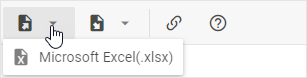

# Data loading and export

You can populate DHTMLX Spreadsheet with a ready dataset that may include the data itself and styling for cells. The component supports two ways of data loading:

- load from an external file
- load from a local source

The component also supports [export of data into an Excel file](#exporting-data).

## Preparing data

DHTMLX Spreadsheet expects data in the JSON format. It is an array with data objects each of which has two properties:

- **cell** - (*string*) the id of a cell that is formed as "id of the column + id of the row", e.g. A1
- **value** - (*string,number*) the value of a cell

The example below demonstrates a simple data set for Spreadsheet:

~~~js
 var data = [
	{ cell: "a1", value: "Country" },
	{ cell: "b1", value: "Product" },
	{ cell: "c1", value: "Price" },
	{ cell: "d1", value: "Amount" },
	{ cell: "e1", value: "Total Price" },

	{ cell: "a2", value: "Ecuador" },
	{ cell: "b2", value: "Banana" },
	{ cell: "c2", value: 6.68},
	{ cell: "d2", value: 430 },
	{ cell: "e2", value: 2872.4 },
    
    { cell: "a3", value: "Belarus" },
	{ cell: "b3", value: "Apple" },
	{ cell: "c3", value: 3.75},
	{ cell: "d3", value: 600 },
	{ cell: "e3", value: 2250 },
    
    // more data
];
~~~

### Setting styles for cells

You can also define the cells styling in the data set. In this case the data should be an object with *separate properties* that describe data objects and CSS classes applied to particular cells.

A CSS class is set for a cell via the **css** property.

~~~js
var styledData = {
    data: [
        { cell: "a1", value: "Country" },
        { cell: "b1", value: "Product" },
        { cell: "c1", value: "Price" },
        { cell: "d1", value: "Amount" },
        { cell: "e1", value: "Total Price" },

        { cell: "a2", value: "Ecuador" },
        { cell: "b2", value: "Banana" },
        { cell: "c2", value: 6.68, css: "someclass" },
        { cell: "d2", value: 430, css: "someclass" },
        { cell: "e2", value: 2872.4 }
    ],
	styles: {
		someclass: {
			background: "#F2F2F2",
			color: "#F57C00"
		}
	}
}
~~~

### Setting number formats for cells

You can specify particular number format for values of cells within a data set. A format is set for a cell via the **format** property. As the value of this property you should set the id of any of the [default formats](number_formatting.md#default-number-formats) or of a [custom format](number_formatting.md#formats-customization) that you've added.

~~~js
 var data = [
	{ cell: "a1", value: "Country" },
	{ cell: "b1", value: "Product" },
	{ cell: "c1", value: "Price" },
	{ cell: "d1", value: "Amount" },
	{ cell: "e1", value: "Total Price" },

	{ cell: "a2", value: "Ecuador" },
	{ cell: "b2", value: "Banana" },
	{ cell: "c2", value: 6.68, format:"currency" },
	{ cell: "d2", value: 430, format:"percent" },
    // "myFormat" is the id of a custom format
	{ cell: "e2", value: 2872.4, format:"myFormat" }
    
    // more data
];
~~~

## External data loading

### Loading JSON data

By default, Spreadsheet expects data in JSON format. To load data from an external source, use the  method. It takes the URL of the file with data as a parameter:

~~~js
var spreadsheet = new dhx.Spreadsheet("container");
spreadsheet.load("../common/data.json");
~~~

**Related sample**: [Spreadsheet. Load Data](https://snippet.dhtmlx.com/ih9zmc3e)

### Loading CSV data

You can also load data in the CSV format. For this, you need to call the  method and pass the name of the format ("csv") as the second parameter:

~~~js
var spreadsheet = new dhx.Spreadsheet("container");
spreadsheet.load("../common/data.csv", "csv");
~~~

**Related sample**: [Spreadsheet. CSV Load](https://snippet.dhtmlx.com/1f87y71v)

### Loading Excel file (.xlsx)

It is possible to load a file in the Excel format with the **.xlsx** extension into a spreadsheet. There are corresponding controls in the Toolbar and Menu in the user interface:

- Menu: File -> Import as..-> Microsoft Excel(.xlsx)

- Toolbar: Import -> Microsoft Excel(.xlsx)

#### How to import data

{{note Please note that the import feature won't work in the Internet Explorer browser.}}

DHTMLX Spreadsheet uses the WebAssembly-based library [Excel2Json](https://github.com/dhtmlx/excel2json) for import of data from Excel. So, to enable the possibility to load data from Excel into Spreadsheet, you need to:

- install the **Excel2Json** library
- specify the  option in the Spreadsheet configuration and set the path to the **worker.js** file in one of the two ways:
  - by providing a local path to the file on your computer, like: `"../libs/excel2json/1.0/worker.js"`
  - by providing a link to the file from CDN: `"https://cdn.dhtmlx.com/libs/excel2json/1.0/worker.js"`

~~~js
var spreadsheet = new dhx.Spreadsheet(document.body, {          
    importModulePath: "../libs/excel2json/1.0/worker.js"
});
~~~

**Related sample**: [Spreadsheet. Custom Import Export Path](https://snippet.dhtmlx.com/wykwzfhm)

To load data from an Excel file, pass a string with the type of the extension ("xlsx") as the second parameter of the  method :

~~~js
// .xlsx only
spreadsheet.load("../common/data.xlsx", "xlsx");
~~~

{{note Please note that the component supports import from Excel files with the **.xlsx** extension only.}}

**Related sample**: [Spreadsheet. Import Xlsx](https://snippet.dhtmlx.com/cqlpy828)

You can also [export data from a spreadsheet into an Excel file](#exporting-data), if needed.

### Processing after-loading code

The component will make an AJAX call and expect the remote URL to provide valid data. Data loading is asynchronous, so you need to wrap any after-loading code into a promise:

~~~js
spreadsheet.load("/some/data").then(function(){
   // do something
});
~~~

## Loading from local source

To load data from a local source, make use of the  method. The method takes an array with data objects as a parameter:

~~~js
var data = [
	{ cell: "a1", value: "Country" },
	{ cell: "b1", value: "Product" },
	{ cell: "c1", value: "Price" },

	{ cell: "a2", value: "Ecuador" },
	{ cell: "b2", value: "Banana" },
	{ cell: "c2", value: 6.68},

	{ cell: "a3", value: "Belarus" },
	{ cell: "b3", value: "Apple" },
	{ cell: "c3", value: 3.75}
];

var spreadsheet = new dhx.Spreadsheet(document.body);
spreadsheet.parse(data);
~~~

**Related sample**: [Spreadsheet. Initialization](https://snippet.dhtmlx.com/ihtkdcoc)

For details on how to load multiple sheets into the spreadsheet, see the [Work with Sheets](working_with_sheets.md#loading-multiple-sheets) article.

## Saving and restoring state

To save the current state of a spreadsheet, use the  method. It converts data into an array of JSON objects. Each JSON object contains the configuration of a cell.

~~~js
// saving state of the spreadsheet1
var state = spreadsheet1.serialize();
~~~

Then you can parse the data stored in the saved state array to a different spreadsheet. For example:

~~~js
// creating a new spreadsheet
var spreadsheet2 = new dhx.Spreadsheet(document.body);
// parsing the state of the spreadsheet1 into spreadsheet2
spreadsheet2.parse(state);
~~~

## Exporting data

DHTMLX Spreadsheet provides the ability to export data from a spreadsheet into an Excel file. There are corresponding controls in the Toolbar and Menu in the user interface:

- Menu: File -> Download as..-> Microsoft Excel(.xlsx)

- Toolbar: Export -> Microsoft Excel(.xlsx)

### How to export data

{{note Please note that the export feature won't work in the Internet Explorer browser.}}

The library uses the WebAssembly-based library [Json2Excel](https://github.com/dhtmlx/json2excel) to enable the functionality of export to Excel. Thus, to have the possibility of exporting files you need to:

- install the **JSON2Excel** library
- specify the  option in the Spreadsheet configuration and set the path to the **worker.js** file in one of the two ways:
  - by providing a local path to the file on your computer, like: `"../libs/json2excel/1.0/worker.js"`
  - by providing a link to the file from CDN: `"https://cdn.dhtmlx.com/libs/json2excel/1.0/worker.js"`

~~~js
var spreadsheet = new dhx.Spreadsheet(document.body, {          
    exportModulePath: "../libs/json2excel/1.0/worker.js"
});
~~~

**Related sample**: [Spreadsheet. Custom Import Export Path](https://snippet.dhtmlx.com/wykwzfhm)

Once you've adjusted the required sources, you can use the related  API method of the Export object to export data of the component, as in:

~~~js
spreadsheet.export.xlsx();
~~~

**Related sample**: [Spreadsheet. Export Xlsx](https://snippet.dhtmlx.com/btyo3j8s)

{{note Please note that the component supports export to Excel files with the **.xlsx** extension only.}}

Check the steps of [importing data from an Excel file into Spreadsheet](#loading-excel-file-xlsx).
