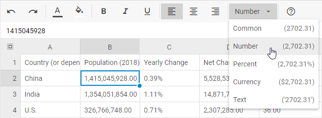

# Number formatting

DHTMLX Spreadsheet supports number formatting that you can apply for numeric values in cells.

{{note There is a [User Guide](/number_formatting_guide) provided to make work with Spreadsheet easy for your end users.}}

## Default number formats

A number format is an object that includes a set of properties:

- **id** - the id of a format that is used to set format to a cell via the  method
- **mask** - a mask for a number format. Check the list of characters available in a mask [below](#the-structure-of-a-mask)
- **name** - the name of a format displayed in the toolbar and menu drop-down lists
- **example** - an example that shows how a formatted number looks like. The number 2702.31 is used as a default value for format examples

The default number formats are the following:

~~~jsx
defaultFormats = [
    { name: "Common", id: "common", mask: "", example: "1500.31" },
    { name: "Number", id: "number", mask: "#,##0.00", example: "1,500.31" },
    { name: "Percent", id: "percent", mask: "#,##0.00%", example: "1,500.31%" },
    { name: "Currency", id: "currency", mask: "$#,##0.00", example: "$1,500.31" },
    { name: "Date", id: "date", mask: "mm-dd-yy", example: "28/12/2021" },
    { 
        name: "Time",
           id: "time",
           mask: hh:mm:ss am/pm || hh:mm:ss, // depending on the timeFormat config
           example: "13:30:00"
    },
    { name: "Text", id: "text", mask: "@", example: "'1500.31'" }
];
~~~

This is how a spreadsheet with data in various number formats looks like:

<iframe src="https://snippet.dhtmlx.com/ihtkdcoc?mode=result" frameborder="0" class="snippet_iframe" width="100%" height="500"></iframe>

## Date format

You can define the format the dates to be displayed in the spreadsheet via the [dateFormat](../api/spreadsheet_dateformat_config/) property. The default format is "%d/%m/%Y". 

~~~jsx
const spreadsheet = new dhx.Spreadsheet("spreadsheet", {
    dateFormat: "%D/%M/%Y",
});

spreadsheet.parse({
    styles: {
        // a set of styles
    },
    data: [
        {cell: "B1", value: "03/10/2022", format: "date"},
        {cell: "B2", value: new Date(), format: "date"},
       ]
});
~~~

Check [the full list of available characters used to make formats](../api/spreadsheet_dateformat_config/).

## Time format

To define the format in which the time should be shown in the spreadsheet cells, use the [timeFormat](../api/spreadsheet_timeformat_config/) property:

~~~jsx
const spreadsheet = new dhx.Spreadsheet("spreadsheet", {
    timeFormat: 24,
});

spreadsheet.parse({
    styles: {
        // a set of styles
    },
    data: [
        { cell: "A1", value: "18:30", format: "time" },
        { cell: "A2", value: 44550.5625, format: "time" },
        { cell: "A3", value: new Date(), format: "time" },
       ]
});
~~~

## Number, date, time, currency localization

With Spreadsheet configuration options, you can localize time and date, specify the necessary currency sign and provide the desired decimal and thousands separators. All these settings are available in the [localization](../api/spreadsheet_localization_config/) property. It is an object with the following properties:

- **decimal** - (optional) the symbol used as a decimal separator, **"."** (a period) by default Possible values are `"." | ","`
- **thousands** - (optional) the symbol used as a thousands separator, **","** (a comma) by default Possible values are `"." | "," | " " | ""`
- **currency** - (optional) the currency sign, **"$"** by default 
- **dateFormat** - (optional) the format of displaying dates set as a string, **"%d/%m/%Y"** by default. Check the details at the [dateFormat](../api/spreadsheet_dateformat_config/) API page
- **timeFormat** - (optional) the format of displaying time set as either *12* or *24*, **12** by default

For example, you can change the default localization settings as shown below:

~~~jsx
const spreadsheet = new dhx.Spreadsheet("spreadsheet", {
    localization: {
        decimal: ",", 
        thousands: " ", 
        currency: "¥",  
        dateFormat: "%D/%M/%Y",
        timeFormat: 24
    }
});

spreadsheet.parse(dataset);
~~~

Here is the result of configuring the **localization** object for Spreadsheet:

<iframe src="https://snippet.dhtmlx.com/xislsb3c?mode=result" frameborder="0" class="snippet_iframe" width="100%" height="500"></iframe>

## Formats customization

You are not limited by [default number formats](#default-number-formats) only. There are two options of formats customization available:

- changing the settings of default number formats
- adding custom number formats into spreadsheet

<iframe src="https://snippet.dhtmlx.com/4c0c0zm7?mode=js" frameborder="0" class="snippet_iframe" width="100%" height="500"></iframe>

All such modifications can be implemented via the  configuration option. It represents an array of format objects each of which contains a set of properties:

- **id** - (*string*) mandatory, the id of a format that is used to set format to a cell via the  method
- **mask** - (*string*) mandatory, a mask for a number format. Check the list of characters available in a mask [below](#the-structure-of-a-mask)
- **name** - (*string*) optional, the name of a format that will be displayed in the toolbar and menu drop-down lists
- **example** - (*string*) optional, an example that shows how a formatted number will look like

### The structure of a mask

A mask may contain a set of common syntax characters that include digit placeholders, separators, percent and currency signs, valid characters:

- **0** - a digit in the number. Used to display insignificant zeros, if a number has fewer digits than there are zeros in the format. For example, to display 2 as 2.0, use the format 0.0.
- **#** - a digit in the number. Used to display only significant numbers (insignificant zeros will be omitted, if a number has fewer digits than there are # symbols in the format).
- **$** - formats numbers as a dollar value. To use a different currency sign, you need to define it in a mask as **[$ your_currency_sign]**#,##0.00 ,e.g. [$ €]#,##0.00.
{{note Note that all characters between [$ and ] will be interpreted as a currency sign.}}
- **.(period)** - applies a decimal point to numbers.
- **,(comma)** - applies a thousands separator to numbers.
- **[characters for setting a date format](https://docs.dhtmlx.com/suite/calendar../api/calendar_dateformat_config/)** - used to create a mask for date and time. For example, to display 27.09.2023 as 27, Sep 2023 use the format "%d, %M %Y".

## Setting format

In order to apply the necessary format to a numeric value, make use of the  method. It takes two parameters:

- **cell** - (*string*) the id of a cell the value of which should be formatted
- **format** - (*string*) the name of the [default number format](#default-number-formats) to apply to the cell value

For example:

~~~jsx
// applies the currency format to the cell A1
spreadsheet.setFormat("A1","percent");
~~~

## Getting format

You can get the number format applied to the value of a cell with the help of the  method. The method takes the id of a cell as a parameter.

~~~jsx
var format = spreadsheet.getFormat("A1"); 
// ->"percent"
~~~

## Events

There is a pair of events you can use to control the process of cell's format changing. They are:

-  - fires before the format of a cell is changed
-  - fires after the format of a cell is changed