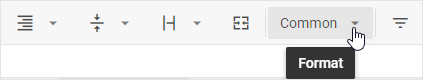

# Number formatting

## Supported number formats

There are 4 number formats your can apply to format numeric values of cells:

<table class="webixdoc_links">
	<tbody>
        <tr>
			<td class="webixdoc_links0"><b>Common</b></td>
			<td>numbers are displayed as is, with no formatting applied (<i>1415045928</i> )</td>
		</tr>
        <tr>
			<td class="webixdoc_links0"><b>Number</b></td>
			<td>numbers are displayed with tens, hundreds and thousands separated by specified delimiters (<i>1,415,045,928.00</i> )</td>
		</tr>
        <tr>
			<td class="webixdoc_links0"><b>Currency</b></td>
			<td>together with the <b>Number</b> format numbers get the currency sign (<i>$1,415,045,928.00</i> )</td>
		</tr>
        <tr>
			<td class="webixdoc_links0"><b>Percent</b></td>
			<td>together with the <b>Number</b> format numbers get the percent sign (<i>141,504,592,800.00%</i> )</td>
		</tr>
        <tr>
			<td class="webixdoc_links0"><b>Text</b></td>
			<td>numbers are displayed as text and exactly as you type them (<i>'1415045928'</i> )</td>
		</tr>
    </tbody>
</table>

## How to set format

Follow the steps below to apply a particular number format to Spreadsheet data via the toolbar:

- Select a cell or several cells that you want to format.
- Click the **Number format** button:

- Select the format you want to apply among the suggested options:

