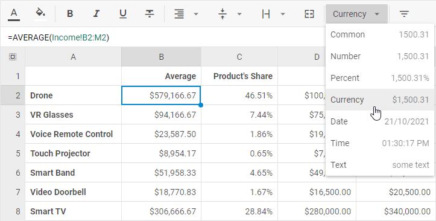

# Number formatting

## Supported number formats

There are several number formats you can apply to format numeric values of cells:

<table>
	<tbody>
        <tr>
			<td><b>Common</b></td>
			<td>numbers are displayed as is, with no formatting applied</td>
		</tr>
        <tr>
			<td><b>Number</b></td>
			<td>numbers are displayed with tens, hundreds and thousands separated by specified delimiters</td>
		</tr>
        <tr>
			<td><b>Currency</b></td>
			<td>numbers are displayed with the currency sign ($)</td>
		</tr>
        <tr>
			<td><b>Percent</b></td>
			<td>numbers are displayed with the percent sign (%)</td>
		</tr>
		<tr>
			<td><b>Date</b></td>
			<td>numbers are displayed as dates in the specified format</td>
		</tr>
		<tr>
			<td><b>Time</b></td>
			<td>numbers are displayed as times in either 12 or 24-hour format</td>
		</tr>
        <tr>
			<td><b>Text</b></td>
			<td>numbers are displayed as text and exactly as you type them</td>
		</tr>
    </tbody>
</table>

## How to set format

Follow the steps below to apply a particular number format to Spreadsheet data via the toolbar:

- Select a cell or several cells that you want to format.
- Click the **Number format** button:

- Select the format you want to apply among the suggested options:

