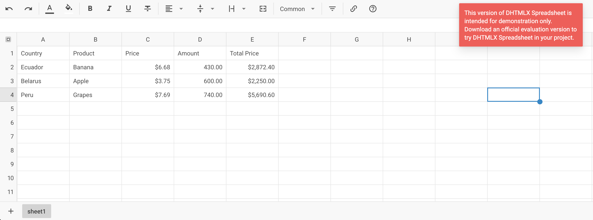

# Integration with React

:::tip
You should be familiar with the basic concepts and patterns of [**React**](https://react.dev) to use this documentation. To refresh your knowledge, please refer to the [**React documentation**](https://reactjs.org/docs/getting-started.html).
:::

DHTMLX Spreadsheet is compatible with **React**. We have prepared code examples of how to use DHTMLX Spreadsheet with **React**. For more information, refer to the corresponding [**Example on GitHub**](https://github.com/DHTMLX/react-spreadsheet-demo).

## Creating a project

:::info
Before you start to create a new project, install [**Vite**](https://vitejs.dev/) (optional) and [**Node.js**](https://nodejs.org/en/).
:::

You can create a basic **React** project or use **React with Vite**. Let's name the project as **my-react-spreadsheet-app**:

~~~json
npx create-react-app my-react-spreadsheet-app
~~~

### Installation of dependencies

Go to the new created app directory:

~~~json
cd my-react-spreadsheet-app
~~~

Install dependencies and start the dev server. For this, use a package manager:

- if you use [**yarn**](https://yarnpkg.com/), run the following commands:

~~~json
yarn
yarn start
~~~

- if you use [**npm**](https://www.npmjs.com/), run the following commands:

~~~json
npm install
npm run dev
~~~

The app should run on a localhost (for instance `http://localhost:3000`).

## Creating Spreadsheet

Now you should get the DHTMLX Spreadsheet source code. First of all, stop the app and proceed with installing the Spreadsheet package.

### Step 1. Package installation

Download the [**trial Spreadsheet package**](/how_to_start/#installing-spreadsheet-via-npm-and-yarn) and follow steps mentioned in the README file. Note that trial Spreadsheet is available 30 days only.

### Step 2. Component creation

Now you need to create a React component, to add an Spreadsheet into the application. Create a new file in the ***src/*** directory and name it ***Spreadsheet.jsx***.

#### Import source files

Open the ***Spreadsheet.jsx*** file and import Spreadsheet source files. Note that:

- if you use PRO version and install the Spreadsheet package from a local folder, the import paths look like this:

~~~jsx title="Spreadsheet.jsx"
import { Spreadsheet } from 'dhx-spreadsheet-package';
import 'dhx-spreadsheet-package/codebase/spreadsheet.css';
~~~

Note that depending on the used package, the source files can be minified. In this case make sure that you are importing the CSS file as **spreadsheet.min.css**.

- if you use the trial version of Spreadsheet, specify the following paths:

~~~jsx title="Spreadsheet.jsx"
import { Spreadsheet } from '@dhx/trial-spreadsheet';
import '@dhx/trial-spreadsheet/codebase/spreadsheet.min.css';
~~~

In this tutorial you can see how to configure the **trial** version of Spreadsheet.

#### Setting the container and adding Spreadsheet

To display Spreadsheet on the page, you need to create the container for Spreadsheet, and initialize this component using the corresponding constructor:

~~~jsx {2,6,9-10} title="Spreadsheet.jsx"
import { useEffect, useRef } from "react";
import { Spreadsheet } from "@dhx/trial-spreadsheet";
import "@dhx/trial-spreadsheet/codebase/spreadsheet.min.css"; // include Spreadsheet styles

export default function DHTMLXSpreadsheet(props) {
    let container = useRef(); // initialize container for Spreadsheet

    useEffect(() => {
        // initialize the Spreadsheet component
        const spreadsheet = new Spreadsheet(container.current, {});

        return () => {
            spreadsheet.destructor(); // destruct Spreadsheet
        }
    });

    return 

;
}
~~~

#### Adding styles

To display Spreadsheet correctly, you need to provide the corresponding styles. You can use the **index.css** file to specify important styles for Spreadsheet and its container:

~~~css title="index.css"
/* specify styles for initial page */
html,
body,
#root {
    height: 100%;
    padding: 0;
    margin: 0;
}

/* specify styles for the Spreadsheet container */
.widget {
    height: 100%;
}
~~~

#### Loading data

To add data into the Spreadsheet, we need to provide a data set. Let's create the ***data.js*** file in the ***src/*** directory and add some data into it:

~~~jsx title="data.js"
export function getData() {
    return {
        styles: {
            bold: {
                "font-weight": "bold"
            },
            right: {
                "justify-content": "flex-end",
                "text-align": "right"
            }
        },
        data: [
            { cell: "a1", value: "Country", css:"bold" },
            { cell: "b1", value: "Product", css:"bold" },
            { cell: "c1", value: "Price", css:"right bold" },
            { cell: "d1", value: "Amount", css:"right bold" },
            { cell: "e1", value: "Total Price", css:"right bold" },

            { cell: "a2", value: "Ecuador" },
            { cell: "b2", value: "Banana" },
            { cell: "c2", value: 6.68, format: "currency" },
            { cell: "d2", value: 430 },
            { cell: "e2", value: 2872.4, format: "currency" },

            { cell: "a3", value: "Belarus" },
            { cell: "b3", value: "Apple" },
            { cell: "c3", value: 3.75, format: "currency" },
            { cell: "d3", value: 600 },
            { cell: "e3", value: 2250, format: "currency" },

            { cell: "a4", value: "Peru" },
            { cell: "b4", value: "Grapes" },
            { cell: "c4", value: 7.69, format: "currency" },
            { cell: "d4", value: 740 },
            { cell: "e4", value: 5690.6, format: "currency" },

            // more cells with data
        ]
    }
}
~~~

Then open the ***App.js*** file and import data. After this you can pass data into the new created `<Spreadsheet/>` components as **props**:

~~~jsx {2,5-6} title="App.js"
import Spreadsheet from "./Spreadsheet";
import { getData } from "./data";

function App() {
    let data = getData();
    return <Spreadsheet data={data} />;
}

export default App;
~~~

Go to the ***Spreadsheet.jsx*** file and apply the passed **props** to the Spreadsheet via the [`parse()`](/api/spreadsheet_parse_method/) method:

~~~jsx {5,11} title="Spreadsheet.jsx"
import { useEffect, useRef } from "react";
import { Spreadsheet } from "@dhx/trial-spreadsheet";
import "@dhx/trial-spreadsheet/codebase/spreadsheet.min.css";

export default function SpreadsheetComponent(props) {
    let container = useRef();

    useEffect(() => {
        const spreadsheet = new Spreadsheet(container.current, {});
        
        spreadsheet.parse(props.data);

        return () => {
            spreadsheet.destructor();
        }
    });

    return 

;
}
~~~

The `parse(data)` method provides data reloading on each applied change.

Now the Spreadsheet component is ready to use. When the element will be added to the page, it will initialize the Spreadsheet with data. You can provide necessary configuration settings as well. Visit our [Spreadsheet API docs](spreadsheet/api/overview/properties_overview.md) to check the full list of available properties.

#### Handling events

When a user makes some action in the Spreadsheet, it invokes an event. You can use these events to detect the action and run the desired code for it. See the [full list of events](spreadsheet/api/overview/events_overview.md).

Open ***Spreadsheet.jsx*** and complete the `useEffect()` method in the following way:

~~~jsx {5-8} title="Spreadsheet.jsx"
// ...
useEffect(() => {
    const spreadsheet = new Spreadsheet(container.current, {});

    spreadsheet.events.on("afterFocusSet", function(cell){
        console.log("Focus is set on a cell " + spreadsheet.selection.getSelectedCell());
        console.log(cell);
    });

    return () => {
        spreadsheet.destructor();
    }
}, []);
~~~

### Step 3. Adding Spreadsheet into the app

To add the component into the app, open the **App.js** file and replace the default code with the following one:

~~~jsx title="App.js"
import Spreadsheet from "./Spreadsheet";
import { getData } from "./data";

function App() {
    let data = getData();
    return <Spreadsheet data={data} />;
}

export default App;
~~~

After that, you can start the app to see Spreadsheet loaded with data on a page.

Now you know how to integrate DHTMLX Spreadsheet with React. You can customize the code according to your specific requirements. The final example you can find on [**GitHub**](https://github.com/DHTMLX/react-spreadsheet-demo).
