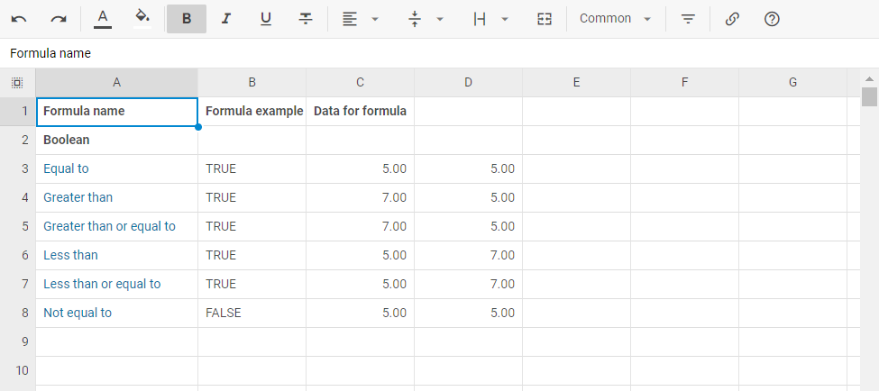

# Integration with React

:::tip
You should be familiar with the basic concepts and patterns of [**React**](https://react.dev) to use this documentation. If you are not, please refer to the [**React documentation**](https://reactjs.org/docs/getting-started.html) for a getting-started tutorial.
:::

DHTMLX Spreadsheet is compatible with **React**. We have prepared code examples of how to use DHTMLX Spreadsheet with **React**. To check online samples, please refer to the corresponding [**Example on Replit**](https://replit.com/@dhtmlx/dhtmlx-spreadsheet-with-react).

You can also [check the demo on GitHub](https://github.com/DHTMLX/react-spreadsheet-demo).

## Creating a project

:::info
Before you start to create a new project, install [**Vite**](https://vitejs.dev/) (optional) and [**Node.js**](https://nodejs.org/en/).
:::

You can create a basic **React** project or use **React with Vite**:

~~~
npx create-vite my-react-spreadsheet-app --template react
~~~

### Installation of dependencies

Next you should go to the app directory. Let's call our project **my-react-spreadsheet-app** and run:

~~~
cd my-react-spreadsheet-app
~~~

After that you should install dependencies and start the dev server. For this, you need to make use of a package manager:

- if you use [**yarn**](https://yarnpkg.com/), you need to call the following commands:

~~~
yarn install
yarn dev
~~~

- if you use [**npm**](https://www.npmjs.com/), you need to call the following commands:

~~~
npm install
npm run dev
~~~

You should now have your React project running on `http://localhost:5173`.

 

## Creating Spreadsheet

Now we should get the DHTMLX Spreadsheet code. First of all, we need to stop the app by pressing **Ctrl+C** in the command line. Then we can proceed with installing the Spreadsheet package.

### Step 1. Package installation

There are two options available: you can install the **Pro** package from a local folder or install the **trial** version using `npm` or `yarn`.

#### Installing the package from a local folder

The instructions are the following:

1. Copy the Spreadsheet package into some local directory inside the project
2. In the project directory run the command below replacing *spreadsheet-local-package-path* with the actual path:

~~~
npm install ./spreadsheet-local-package-path
//or
yarn add "./spreadsheet-local-package-path"
~~~

For example:

~~~
npm install ./spreadsheet_5.1.0_enterprise
// or
yarn add "./spreadsheet_5.1.0_enterprise"
~~~

#### Installing the trial version via a package manager

You can install the **trial** version of Spreadsheet using **npm** or **yarn** commands:

~~~jsx {2,3,6,7}
// npm
npm config set @dhx:registry https://npm.dhtmlx.com
npm i @dhx/trial-spreadsheet

//yarn
yarn config set @dhx:registry https://npm.dhtmlx.com
yarn add @dhx/trial-spreadsheet
~~~

To get Spreadsheet under the proprietary license, refer to the [Support Center](https://dhtmlx.com/docs/technical-support.shtml)!

### Step 2. Component creation

Now we should create a React component, to add a Spreadsheet into the application. Let's create a new file in the ***src/*** directory and name it ***Spreadsheet.jsx***.

#### Importing source files

Open the file and import Spreadsheet source files. Note that:

- if you've [installed the Spreadsheet package from a local folder](#installing-the-package-from-a-local-folder), your import paths will look like this:

~~~html title="Spreadsheet.jsx" 
import { Spreadsheet } from 'dhx-spreadsheet-package';
import 'dhx-spreadsheet-package/codebase/spreadsheet.css';
~~~

Note that depending on the used package, the source files can be minified. In this case make sure that you are importing the CSS file as **spreadsheet.min.css**.

{{note 
**In case you use *npm* with a local Spreadsheet package**, the way of importing Spreadsheet source files is different. [Check the details below](#using-npm-with-spreadsheet-package)
}}

- if you've chosen to [install the trial version](#installing-the-trial-version-via-a-package-manager), the import paths should be as in:

~~~html title="Spreadsheet.jsx" 
import { Spreadsheet } from '@dhx/trial-spreadsheet';
import '@dhx/trial-spreadsheet/codebase/spreadsheet.min.css';
~~~

In this tutorial we will use the **trial** version of Spreadsheet.

#### Setting the container and adding Spreadsheet

To display Spreadsheet on the page, we need to set the container to render the component inside. Check the code below:

~~~jsx {3,7,9-14} title="Spreadsheet.jsx"
import { Spreadsheet } from '@dhx/trial-spreadsheet';
import '@dhx/trial-spreadsheet/codebase/spreadsheet.min.css';
import { useRef } from "react";

// eslint-disable-next-line react/prop-types
const SpreadsheetComponent = () => {
  const node = useRef(null);

  return ( 
    

 
  );
};

export default SpreadsheetComponent;
~~~

Then we need to add our Spreadsheet into the container. To do that, import the `useEffect()` method of React and use it to render the Spreadsheet instance and destruct when it is no longer needed:

~~~jsx {1,6-12} title="Spreadsheet.jsx"
import { useEffect, useRef, useState } from "react";

// eslint-disable-next-line react/prop-types
const SpreadsheetComponent = () => {
  const node = useRef(null);
  let [spreadsheet, setSpreadsheet] = useState(null);

  useEffect(() => {
    const spreadsheet = new Spreadsheet(node.current, {});
    setSpreadsheet(spreadsheet);
    return () => spreadsheet.destructor();
  }, []);
 
  return ( 
    

 
  );
};

export default SpreadsheetComponent;
~~~

{{note 
**In case you use *npm* with a local Spreadsheet package**, the way of Spreadsheet initialization differs a little bit. [Check the details below](#using-npm-with-spreadsheet-package)
}}

#### Using npm with Spreadsheet package

If you use **npm with a Spreadsheet package**, the import of the source files and the initialization of Spreadsheet will differ from the common way:

- include the Spreadsheet source files in the ***index.html*** file as shown in the example below. Replace *spreadsheet_package* with the name of your local folder that contains Spreadsheet source files:

~~~html title="index.html"

<link rel="stylesheet" href="./spreadsheet_package/codebase/spreadsheet.css">
~~~

- use the **dhx** prefix to initialize Spreadsheet, check the example below:

~~~jsx {2} title="Spreadsheet.jsx"
useEffect(() => {
    const spreadsheet = new dhx.Spreadsheet(node.current, {});
    setSpreadsheet(spreadsheet);
    return () => spreadsheet.destructor();
}, []);
~~~

#### Loading data

To add data into the Spreadsheet, we need to provide a data set. Let's create the ***data.js*** file in the ***src/*** directory and add some data into it:

~~~jsx title="data.js"
export function getData() {
  return {
    styles: {
      bold: {
          "font-weight": "bold",
      },
      right: {
          "justify-content": "flex-end",
          "text-align": "right",
      },
    },
    data: [
      { cell: "a1", value: "Country", css:"bold" },
      { cell: "b1", value: "Product", css:"bold" },
      { cell: "c1", value: "Price", css:"right bold" },
      { cell: "d1", value: "Amount", css:"right bold" },
      { cell: "e1", value: "Total Price", css:"right bold" },

      { cell: "a2", value: "Ecuador" },
      { cell: "b2", value: "Banana" },
      { cell: "c2", value: 6.68, format: "currency" },
      { cell: "d2", value: 430 },
      { cell: "e2", value: 2872.4, format: "currency" },

      { cell: "a3", value: "Belarus" },
      { cell: "b3", value: "Apple" },
      { cell: "c3", value: 3.75, format: "currency" },
      { cell: "d3", value: 600 },
      { cell: "e3", value: 2250, format: "currency" },

      { cell: "a4", value: "Peru" },
      { cell: "b4", value: "Grapes" },
      { cell: "c4", value: 7.69, format: "currency" },
      { cell: "d4", value: 740 },
      { cell: "e4", value: 5690.6, format: "currency" },

      // more cells with data
    ],
  }
}
~~~

Then open the ***Spreadsheet.jsx*** file, pass the name of the data file to the component constructor function and use the `parse()` method inside the `useEffect()` method of React to load data into spreadsheet:

~~~jsx {1,11-15} title="Spreadsheet.jsx"
const SpreadsheetComponent = ({ data }) => {
  const node = useRef(null);
  let [spreadsheet, setSpreadsheet] = useState(null);

  useEffect(() => {
    const spreadsheet = new Spreadsheet(node.current, {});
    setSpreadsheet(spreadsheet);
    return () => spreadsheet.destructor();
  }, []);

  useEffect(() => {
    if (data && spreadsheet) {
      spreadsheet.parse(data);
    }
  }, [spreadsheet, data]);
 
  return 

;
};
~~~

The `spreadsheet.parse(data);` line will provide data reloading on each applied change.

Now the Spreadsheet component is ready. When the element will be added to the page, it will initialize the Spreadsheet object with data. You can provide necessary configuration settings as well. Visit our [Spreadsheet API docs](spreadsheet/api/overview/properties_overview.md) to check the full list of available properties.

#### Handling events

When a user makes some action in the Spreadsheet, it invokes an event. You can use these events to detect the action and run the desired code for it. See the [full list of events](spreadsheet/api/overview/events_overview.md).

Open **Spreadsheet.jsx** and complete the `useEffect()` method as in:

~~~jsx {5} title="Spreadsheet.jsx" 
useEffect(() => {
    const spreadsheet = new Spreadsheet(node.current, {});
    setSpreadsheet(spreadsheet);

    spreadsheet.events.on("ActionName", () => {});
    
    return () => spreadsheet.destructor();
  }, []);
~~~

Replace `'ActionName'` with the actual event name you want to handle, and implement the corresponding code inside the callback function. Get more information about the work with events in the [Event Handling](spreadsheet/handling_events.md) article.

### Step 3. Adding Spreadsheet into the app

Now it's time to add the component into our app. Open **App.jsx** and replace the default code with the following one:

~~~jsx title="App.jsx"
import { useState } from "react";
import SpreadsheetComponent from "./SpreadsheetComponent";
import { getData } from "./data";

function App() {
  let [data] = useState(getData());

  return <SpreadsheetComponent data={data} />;
}

export default App;
~~~

After that, when we start the app, we should see Spreadsheet loaded with data on a page.

Now you should have a basic setup for integrating DHTMLX Spreadsheet with React. You can customize the code according to your specific requirements.
