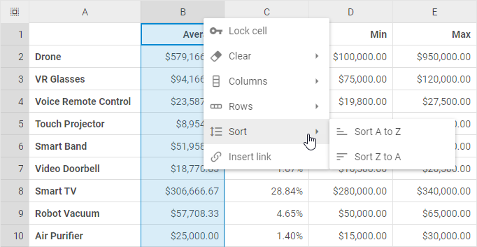
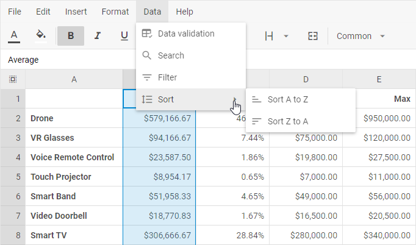

# Sorting data

## Sorting data by a column

To sort spreadsheet data by a column, take the following steps:

1\. Right-click the header of the column you want to sort the data by

2\. Choose *Sort* -> *Sort A to Z* or *Sort Z to A*

or

1\. Select the necessary column by clicking on its header

2\. Go to: *Data* -> *Sort* -> *Sort A to Z* or *Sort Z to A* in the menu

## Sorting data by a range

To sort spreadsheet data by a separate range, take the following steps:

1\. Select a range of cells in the column you want to sort the data by

2\. Choose one of the two actions:

- Right-click a cell in the selected range and choose *Sort* -> *Sort A to Z* or *Sort Z to A*

- Or go to: *Data* -> *Sort* -> *Sort A to Z* or *Sort Z to A* in the menu

