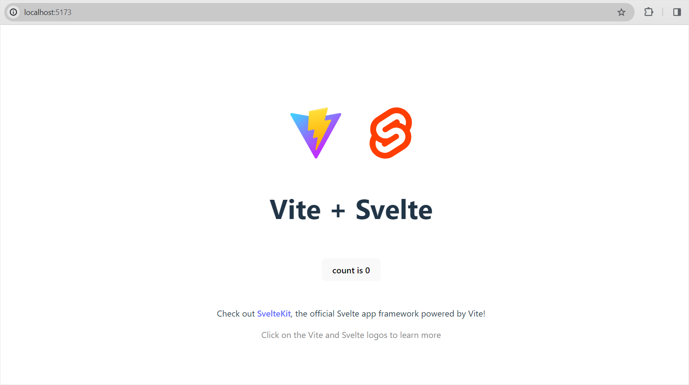

# Integration with Svelte

You can use DHTMLX Spreadsheet in an application created with the [Svelte](https://svelte.dev/) framework. [Check the demo on CodeSandbox](https://codesandbox.io/p/devbox/dhtmlx-spreadsheet-with-svelte-wt5v34).

## Preparations

You will need [Vite](https://vitejs.dev/) and [Node.js](https://nodejs.org/en/) to create a project, so you should install them, if haven't done it before.

## Creating a project

There are several ways of creating a project: 

- you can use the [SvelteKit](https://kit.svelte.dev/)

- you can also use **Svelte with Vite** (but without SvelteKit), if you don't want to use SvelteKit for some reason, by running: 

~~~
npm create vite@latest
~~~

Check the details in the [related article](https://svelte.dev/docs/introduction#start-a-new-project-alternatives-to-sveltekit).

Independent of the chosen way, next you should go to the app directory. Let's call our project **spreadsheet-svelte** and run:

~~~
cd spreadsheet-svelte
~~~

Then you need to install dependencies and run the app. For this, you need to make use of a package manager:

- if you use [yarn](https://yarnpkg.com/), you need to call the following commands:

~~~
yarn install
yarn dev
~~~

- if you use [npm](https://www.npmjs.com/), you need to call the following commands:

~~~
npm install
npm run dev
~~~ 

After the above steps are complete, the app should run on `http://localhost:5173`.

 

## Adding Spreadsheet

Now we should get the DHTMLX Spreadsheet code. First of all, we need to stop the app by pressing **Ctrl+C** in the command line.

### Package installation

We will install the Pro package from a local folder. There are step-by-step instructions:

1. Copy the Spreadsheet package into some local directory.
2. In the project directory call `npm install ./spreadsheet-local-package-path`, for example:

~~~
npm install ./spreadsheet_5.1.0_enterprise
~~~

Or you can install the **trial** version from npm as in:

~~~
npm install @dhx/trial-spreadsheet
~~~
	
One more option is to login in our npm pro with your credentials.

### Component creation

Then we should create a component, to add a Spreadsheet into the application. You can configure the component via the "config" object, see the [list of available properties](spreadsheet/api/overview/properties_overview.md).

To display Spreadsheet on the page, we need to set the container to render the component inside. Let's create a new file named **src/components/Spreadsheet.svelte** and add the following code into it:

~~~svelte title="Spreadsheet.svelte"

~~~

Then we need to render our Spreadsheet in the node. To do that, use the `onMount()` method of Svelte:

~~~svelte title="Spreadsheet.svelte"

~~~
	
In the above example we've returned `spreadsheet.destructor` from `onMount()` to clear the component as it has unmounted. We've also added data into Spreadsheet in the `$: spreadsheet?.parse(data);` line. It will reload data on each applied change.

Now the Spreadsheet component is ready. When the element will be added to the page, it will initialize the Spreadsheet object with data. You can provide necessary configuration settings as well. Visit our [Spreadsheet API docs](spreadsheet/api/overview/properties_overview.md) to check the full list of available properties.

### Adding Spreadsheet into the app

Now it's time to add the component into our app. Open **App.svelte** and add the following code instead of the one that had been there before:

~~~svelte title="App.svelte"

<Spreadsheet data={getData()} />
~~~

Now when we start the app, we should see Spreadsheet loaded with data on a page.

 

## Handling events

When a user makes some action in the Spreadsheet, it invokes an event. You can use these events to detect the action and run the desired code for it. See the [full list of events](spreadsheet/api/overview/events_overview.md).

Open **Spreadsheet.svelte** and complete the `onMount` method as in:

~~~svelte title="Spreadsheet.svelte" 
onMount(() => {
    spreadsheet = new Spreadsheet(container, {});
    spreadsheet.events.on("ActionName", () => {do something})
});
~~~

Get more information about the work with events in the [Event Handling](spreadsheet/handling_events.md) article.
