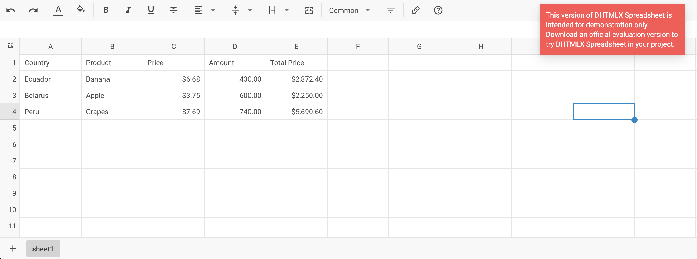

# Integration with Svelte

:::tip
You should be familiar with the basic concepts and patterns of **Svelte** before reading this documentation. To refresh your knowledge, please refer to the [**Svelte documentation**](https://svelte.dev/).
:::

DHTMLX Spreadsheet is compatible with **Svelte**. We have prepared code examples on how to use DHTMLX Spreadsheet with **Svelte**. For more information, refer to the corresponding [**Example on GitHub**](https://github.com/DHTMLX/svelte-spreadsheet-demo).

## Creating a project

:::info
Before you start to create a new project, install [**Vite**](https://vitejs.dev/) (optional) and [**Node.js**](https://nodejs.org/en/).
:::

To create a **Svelte** JS project, run the following command:

~~~json
npm create vite@latest
~~~

Let's name the project as **my-svelte-spreadsheet-app**.

### Installation of dependencies

Go to the app directory:

~~~json
cd my-svelte-spreadsheet-app
~~~

Then you need to install dependencies and run the app. For this, you need to make use of a package manager:

- if you use [**yarn**](https://yarnpkg.com/), you need to call the following commands:

~~~jsx
yarn
yarn dev // or yarn dev
~~~

- if you use [**npm**](https://www.npmjs.com/), you need to call the following commands:

~~~json
npm install
npm run dev
~~~

The app should run on a localhost (for instance `http://localhost:3000`).

## Creating Spreadsheet

Now you should get the DHTMLX Spreadsheet source code. First of all, stop the app and proceed with installing the Spreadsheet package.

### Step 1. Package installation

Download the [**trial Spreadsheet package**](/how_to_start/#installing-spreadsheet-via-npm-and-yarn) and follow steps mentioned in the README file. Note that trial Spreadsheet is available 30 days only.

### Step 2. Component creation

Now you need to create a Svelte component, to add Spreadsheet into the application. Let's create a new file in the ***src/*** directory and name it ***Spreadsheet.svelte***.

#### Importing source files

Open the ***Spreadsheet.svelte*** file and import Spreadsheet source files. Note that:

- if you use PRO version and install the Spreadsheet package from a local folder, the import paths look like this:

~~~html title="Spreadsheet.svelte"

~~~

Note that depending on the used package, the source files can be minified. In this case make sure that you are importing the CSS file as **spreadsheet.min.css**.

- if you use the trial version of Spreadsheet, specify the following paths:

~~~html title="Spreadsheet.svelte"

~~~

In this tutorial you can see how to configure the **trial** version of Spreadsheet.

#### Setting the container and adding Spreadsheet

To display Spreadsheet on the page, you need to create the container for Spreadsheet, and initialize this component using the corresponding constructor:

~~~html {3,6,10-11,19} title="Spreadsheet.svelte"

~~~

#### Adding styles

To display Spreadsheet correctly, you need to specify important styles for Spreadsheet and its container in the main css file of the project:

~~~css title="app.css"
/* specify styles for initial page */
html,
body,
#app { /* make sure that you use the #app root container */
    height: 100%;
    padding: 0;
    margin: 0;
}

/* specify styles for the Spreadsheet container */
.widget {
    height: 100%;
}
~~~

#### Loading data

To add data into the Spreadsheet, we need to provide a data set. Let's create the ***data.js*** file in the ***src/*** directory and add some data into it:

~~~jsx title="data.js"
export function getData() {
    return {
        styles: {
            bold: {
                "font-weight": "bold"
            },
            right: {
                "justify-content": "flex-end",
                "text-align": "right"
            }
        },
        data: [
            { cell: "a1", value: "Country", css:"bold" },
            { cell: "b1", value: "Product", css:"bold" },
            { cell: "c1", value: "Price", css:"right bold" },
            { cell: "d1", value: "Amount", css:"right bold" },
            { cell: "e1", value: "Total Price", css:"right bold" },

            { cell: "a2", value: "Ecuador" },
            { cell: "b2", value: "Banana" },
            { cell: "c2", value: 6.68, format: "currency" },
            { cell: "d2", value: 430 },
            { cell: "e2", value: 2872.4, format: "currency" },

            { cell: "a3", value: "Belarus" },
            { cell: "b3", value: "Apple" },
            { cell: "c3", value: 3.75, format: "currency" },
            { cell: "d3", value: 600 },
            { cell: "e3", value: 2250, format: "currency" },

            { cell: "a4", value: "Peru" },
            { cell: "b4", value: "Grapes" },
            { cell: "c4", value: 7.69, format: "currency" },
            { cell: "d4", value: 740 },
            { cell: "e4", value: 5690.6, format: "currency" },

            // more cells with data
        ]
    }
}
~~~

Then open the ***App.svelte*** file, import data, and pass it into the new created `<Spreadsheet/>` components as **props**:

~~~html {3,5,8} title="App.svelte"

<Spreadsheet data={data} />
~~~

Go to the ***Spreadsheet.svelte*** file and apply the passed **props** to the Spreadsheet via the [`parse()`](/api/spreadsheet_parse_method/) method:

~~~html {6,13} title="Spreadsheet.svelte"

~~~

The `parse(data)` method provides data reloading on each applied change.

Now the Spreadsheet component is ready to use. When the element will be added to the page, it will initialize the Spreadsheet with data. You can provide necessary configuration settings as well. Visit our [Spreadsheet API docs](spreadsheet/api/overview/properties_overview.md) to check the full list of available properties.

#### Handling events

When a user makes some action in the Spreadsheet, it invokes an event. You can use these events to detect the action and run the desired code for it. See the [full list of events](spreadsheet/api/overview/events_overview.md).

Open ***Spreadsheet.svelte*** and complete the `onMount()` method in the following way:

~~~html {8-11} title="Spreadsheet.svelte"

// ...
~~~

After that, when we start the app, we should see Spreadsheet loaded with data on a page.

Now you should have a basic setup for integrating DHTMLX Spreadsheet with Svelte. You can customize the code according to your specific requirements. The final example you can find on [**GitHub**](https://github.com/DHTMLX/svelte-spreadsheet-demo).
