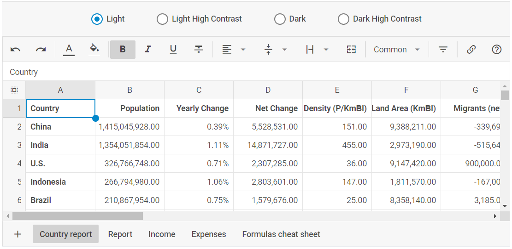
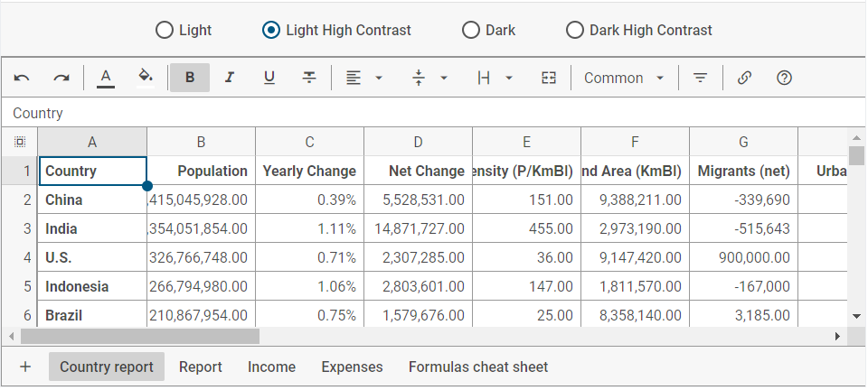
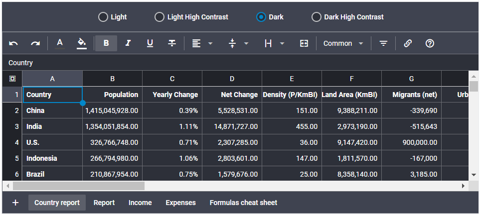
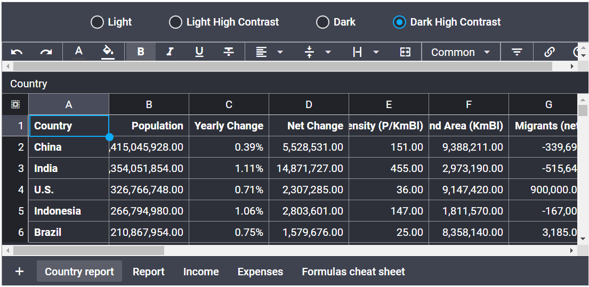

# Built-in themes

DHTMLX Spreadsheet library provides 4 predefined themes:

- [light theme](#light-theme-default) ("light") - used by default
- [dark theme](#dark-theme) ("dark")
- [light high contrast theme](#light-high-contrast-theme) ("contrast-light")
- [dark high contrast theme](#dark-high-contrast-theme) ("contrast-dark")

The Spreadsheet themes are developed in accordance with international standards. The high contrast themes will be helpful for users who have vision impairment. For more detail, read the [Accessibility support](https://docs.dhtmlx.com/suite/common_features/accessibility_support/) article.

You can try all themes in the example below:

<iframe src="https://snippet.dhtmlx.com/t6rspqai?mode=result" frameborder="0" class="snippet_iframe" width="100%" height="500"></iframe>

## Light theme (default)

The default **"light"** theme is configured on the base of the CSS variables which are listed below:

~~~css
:root, [data-dhx-theme] {
    /* base colors */
    --dhx-color-white: #fff;
    --dhx-color-gray-100: #e6e6e6;
    --dhx-color-gray-200: #ccc;
    --dhx-color-gray-300: #b3b3b3;
    --dhx-color-gray-400: #999;
    --dhx-color-gray-500: #808080;
    --dhx-color-gray-600: #666;
    --dhx-color-gray-700: #4d4d4d;
    --dhx-color-gray-800: #333;
    --dhx-color-gray-900: #1a1a1a;
    --dhx-color-black: #000;
    /* end base colors */

    /* font */
    --dhx-font-family: "Roboto", Arial, Tahoma, Verdana, sans-serif;

    --dhx-font-weight-regular: 400; 
    --dhx-font-weight-medium: 500; 
    --dhx-font-weight-bold: 700;

    --dhx-font-size-small: 12px;
    --dhx-font-size-normal: 14px;
    --dhx-font-size-large: 16px;

    --dhx-line-height-small: 16px;
    --dhx-line-height-normal: 20px;
    --dhx-line-height-large: 24px;

    --dhx-font-color-primary: rgba(0, 0, 0, .7);
    --dhx-font-color-secondary: rgba(0, 0, 0, .5);
    --dhx-font-color-additional: rgba(0, 0, 0, .3);
    --dhx-font-color-disabled: rgba(0, 0, 0, .3);

    --dhx-font-color-contrast: var(--dhx-color-white);
    --dhx-font-color-contrast-disabled: var(--dhx-color-white);
    /* end font */

    /* icon */
    --dhx-icon-size-small: 16px;
    --dhx-icon-size-normal: 20px;
    --dhx-icon-size-large: 24px;
    /* end icon */

    /* border */
    --dhx-border-width: 1px;
    --dhx-border-radius: 2px;
    --dhx-border-color: rgba(0, 0, 0, .1);
    --dhx-border-color-focused: rgba(0, 0, 0, .3);
    --dhx-border: var(--dhx-border-width) solid var(--dhx-border-color);
    /* end border */

    /* border shadow */
    --dhx-border-shadow-small: 0 2px 4px rgba(0, 0, 0, .15);
    --dhx-border-shadow-normal: 0 2px 5px rgba(0, 0, 0, .3);
    --dhx-border-shadow-large: 0px 1px 6px rgba(0, 0, 0, 0.1), 0px 10px 20px rgba(0, 0, 0, 0.1);

    --dhx-shadow-input-size: inset 0px 0px 0px var(--dhx-border-width);
    /* end border shadow */

    /* transitions */
    --dhx-transition-time: 0.2s;
    --dhx-transition-in: ease-in;
    --dhx-transition-out: ease-out;
    /* end transitions */

    /* z-index */
    --dhx-z-index-up: 1;
    --dhx-z-index-force-up: 10;
    --dhx-z-index-overlay: 999;
    --dhx-z-index-overlay-total: 10000000;
    /* end z-index */

    /* only service color scheme */
    --dhx-l-contrast-offset: 0%; /* lightness contrast theme offset */
    --dhx-l-h-offset: 10%; /* lightness hover offset */
    --dhx-s-d-offset: 30%; /* saturation disable offset */
    --dhx-l-d: 70%; /* lightness disable value */
    --dhx-a-l-h: .15; /* alpha light hover value */
    --dhx-a-l-a: .3; /* alpha light active value */
    /* end only service color scheme */

    /* color scheme */
    --dhx-h-primary: 200;
    --dhx-s-primary: 98%;
    --dhx-l-primary: 40%;

    --dhx-h-secondary: 0;
    --dhx-s-secondary: 0%;
    --dhx-l-secondary: 30%;

    --dhx-h-danger: 0;
    --dhx-s-danger: 100%;
    --dhx-l-danger: 60%;

    --dhx-h-success: 154;
    --dhx-s-success: 89%;
    --dhx-l-success: 37%;

    --dhx-h-background: 0;
    --dhx-s-background: 0%;
    --dhx-l-background: 100%;
    --dhx-a-background: 0.5;
    /* end color scheme */

    /* theme colors */
    --dhx-background-primary: hsl(var(--dhx-h-background), var(--dhx-s-background), var(--dhx-l-background));
    --dhx-background-secondary: hsl(var(--dhx-h-background), var(--dhx-s-background), calc(var(--dhx-l-background) - 3%));
    --dhx-background-additional: hsl(var(--dhx-h-background), var(--dhx-s-background), calc(var(--dhx-l-background) - 10%));
    --dhx-background-overlay: hsla(var(--dhx-h-background), var(--dhx-s-background), calc(var(--dhx-l-background) * -1), var(--dhx-a-background));
    --dhx-background-overlay-light: rgba(255, 255, 255, .5);

    --dhx-tooltip-background-dark: var(--dhx-color-gray-800);
    --dhx-tooltip-background-light: var(--dhx-color-white);

    --dhx-color-focused: hsl(calc(var(--dhx-h-primary) + 10), var(--dhx-s-primary), var(--dhx-l-primary));

    --dhx-color-primary: hsl(var(--dhx-h-primary), var(--dhx-s-primary), calc(var(--dhx-l-primary) - var(--dhx-l-contrast-offset)));
    --dhx-color-primary-hover: hsl(var(--dhx-h-primary), var(--dhx-s-primary), calc(var(--dhx-l-primary) + var(--dhx-l-h-offset) - var(--dhx-l-contrast-offset)));
    --dhx-color-primary-active: var(--dhx-color-primary);
    --dhx-color-primary-disabled: hsl(var(--dhx-h-primary), calc(var(--dhx-s-primary) - var(--dhx-s-d-offset)), var(--dhx-l-d));
    --dhx-color-primary-light-hover: hsla(var(--dhx-h-primary), var(--dhx-s-primary), calc(var(--dhx-l-primary) - var(--dhx-l-contrast-offset)), var(--dhx-a-l-h));
    --dhx-color-primary-light-active: hsla(var(--dhx-h-primary), var(--dhx-s-primary), calc(var(--dhx-l-primary) - var(--dhx-l-contrast-offset)), var(--dhx-a-l-a));

    --dhx-color-secondary: hsl(var(--dhx-h-secondary), var(--dhx-s-secondary), calc(var(--dhx-l-secondary) - var(--dhx-l-contrast-offset)));
    --dhx-color-secondary-hover: hsl(var(--dhx-h-secondary), var(--dhx-s-secondary), calc(var(--dhx-l-secondary) + var(--dhx-l-h-offset) - var(--dhx-l-contrast-offset)));
    --dhx-color-secondary-active: var(--dhx-color-secondary);
    --dhx-color-secondary-disabled: hsl(var(--dhx-h-secondary), calc(var(--dhx-s-secondary) - var(--dhx-s-d-offset)), var(--dhx-l-d));
    --dhx-color-secondary-light-hover: hsla(var(--dhx-h-secondary), var(--dhx-s-secondary), calc(var(--dhx-l-secondary) - var(--dhx-l-contrast-offset)), var(--dhx-a-l-h));
    --dhx-color-secondary-light-active: hsla(var(--dhx-h-secondary), var(--dhx-s-secondary), calc(var(--dhx-l-secondary) - var(--dhx-l-contrast-offset)), var(--dhx-a-l-a));

    --dhx-color-danger: hsl(var(--dhx-h-danger), var(--dhx-s-danger), calc(var(--dhx-l-danger) - var(--dhx-l-contrast-offset)));
    --dhx-color-danger-hover: hsl(var(--dhx-h-danger), var(--dhx-s-danger), calc(var(--dhx-l-danger) + var(--dhx-l-h-offset) - var(--dhx-l-contrast-offset)));
    --dhx-color-danger-active: var(--dhx-color-danger);
    --dhx-color-danger-disabled: hsl(var(--dhx-h-danger), calc(var(--dhx-s-danger) - var(--dhx-s-d-offset)), var(--dhx-l-d));
    --dhx-color-danger-light-hover: hsla(var(--dhx-h-danger), var(--dhx-s-danger), calc(var(--dhx-l-danger) - var(--dhx-l-contrast-offset)), var(--dhx-a-l-h));
    --dhx-color-danger-light-active: hsla(var(--dhx-h-danger), var(--dhx-s-danger), calc(var(--dhx-l-danger) - var(--dhx-l-contrast-offset)), var(--dhx-a-l-a));

    --dhx-color-success: hsl(var(--dhx-h-success), var(--dhx-s-success), calc(var(--dhx-l-success) - var(--dhx-l-contrast-offset)));
    --dhx-color-success-hover: hsl(var(--dhx-h-success), var(--dhx-s-success), calc(var(--dhx-l-success) + var(--dhx-l-h-offset) - var(--dhx-l-contrast-offset)));
    --dhx-color-success-active: var(--dhx-color-success);
    --dhx-color-success-disabled: hsl(var(--dhx-h-success), calc(var(--dhx-s-success) - var(--dhx-s-d-offset)), var(--dhx-l-d));
    --dhx-color-success-light-hover: hsla(var(--dhx-h-success), var(--dhx-s-success), calc(var(--dhx-l-success) - var(--dhx-l-contrast-offset)), var(--dhx-a-l-h));
    --dhx-color-success-light-active: hsla(var(--dhx-h-success), var(--dhx-s-success), calc(var(--dhx-l-success) - var(--dhx-l-contrast-offset)), var(--dhx-a-l-a));
    /* end theme colors */

    /* DHTMLX Toolbar service variables*/
    --dhx-s-toolbar-background: var(--dhx-background-primary);
    --dhx-s-toolbar-button-background-hover: rgba(0, 0, 0, .07);
    --dhx-s-toolbar-button-background-active: rgba(0, 0, 0, .15);
    /* end DHTMLX Toolbar service variables */

    /* DHTMLX Grid service variables*/
    --dhx-s-grid-header-background: var(--dhx-background-secondary);
    --dhx-s-grid-selection-background: var(--dhx-color-gray-700);
    /* end DHTMLX Grid service variables*/

    /* DHTMLX Calendar service variables*/
    --dhx-s-calendar-muffled: .6;
    /* end DHTMLX Calendar service variables*/

    /* DHTMLX Slider service variables*/
    --dhx-s-tick-font-size: calc(var(--dhx-font-size-small) / 1.2);
    /* end DHTMLX Slider service variables*/
}
~~~

## Light high contrast theme

The **"contrast-light"** theme is configured both on the base of the [root CSS variables](#light-theme-default) and the variables which are listed below:

~~~css
[data-dhx-theme='contrast-light'] {
    /* font */
    --dhx-font-size-normal: 16px;
    --dhx-font-size-small: var(--dhx-font-size-normal);

    --dhx-font-color-secondary: rgba(0, 0, 0, .66);
    --dhx-font-color-additional: var(--dhx-font-color-secondary);
    /* end font */

    /* border */
    --dhx-border-color: rgba(0, 0, 0, .4);
    /* end border */

    /* color scheme */
    --dhx-l-contrast-offset: 14%;
    /* end color scheme */

    /* DHTMLX Toolbar service variables*/
    --dhx-s-toolbar-background: var(--dhx-background-primary);
    --dhx-s-toolbar-button-background-hover: rgba(0, 0, 0, .07);
    --dhx-s-toolbar-button-background-active: rgba(0, 0, 0, .15);
    /* end DHTMLX Toolbar service variables */

    /* DHTMLX Grid service variables*/
    --dhx-s-grid-header-background: var(--dhx-background-secondary);
    --dhx-s-grid-selection-background: var(--dhx-color-gray-700);
    /* end DHTMLX Grid service variables*/
    
    /* DHTMLX Calendar service variables*/
    --dhx-s-calendar-muffled: .8;
    /* end DHTMLX Calendar service variables*/

    /* DHTMLX Slider service variables*/
    --dhx-s-tick-font-size: var(--dhx-font-size-small);
    /* end DHTMLX Slider service variables*/
}
~~~

## Dark theme

The **"dark"** theme is configured both on the base of the [root CSS variables](#light-theme-default) and the variables which are listed below:

~~~css
[data-dhx-theme='dark'] {
    /* font */
    --dhx-font-color-primary: var(--dhx-color-white);
    --dhx-font-color-secondary: rgba(255, 255, 255, .7);
    --dhx-font-color-additional: rgba(255, 255, 255, .5);
    --dhx-font-color-disabled: rgba(255, 255, 255, .5);
    --dhx-font-color-contrast: var(--dhx-color-white);
    --dhx-font-color-contrast-disabled: var(--dhx-font-color-disabled);
    /* end font */

    /* border */
    --dhx-border-color: rgba(255, 255, 255, 0.3);
    --dhx-border-color-focused: rgba(255, 255, 255, 0.5);
    /* end border */

    /* color scheme */
    --dhx-l-secondary: 60%; /* lightness contrast theme offset */

    --dhx-h-background: 226;
    --dhx-s-background: 12%;
    --dhx-l-background: 20%;
    /* end color scheme */

    /* theme colors */
    --dhx-background-primary: hsl(var(--dhx-h-background), var(--dhx-s-background), var(--dhx-l-background));
    --dhx-background-secondary: hsl(var(--dhx-h-background), var(--dhx-s-background), calc(var(--dhx-l-background) + 8%));
    --dhx-background-additional: hsl(var(--dhx-h-background), var(--dhx-s-background), calc(var(--dhx-l-background) + 12%));
    /* end theme colors */

    /* DHTMLX Toolbar service variables*/
    --dhx-s-toolbar-background: var(--dhx-color-black);
    --dhx-s-toolbar-button-background-hover: rgba(255, 255, 255, .07);
    --dhx-s-toolbar-button-background-active: rgba(255, 255, 255, .15);
    /* end DHTMLX Toolbar service variables */

    /* DHTMLX Grid service variables*/
    --dhx-s-grid-header-background: #212329;
    --dhx-s-grid-selection-background: var(--dhx-color-gray-100);
    /* end DHTMLX Grid service variables*/
    
    /* DHTMLX Calendar service variables*/
    --dhx-s-calendar-muffled: .6;
    /* end DHTMLX Calendar service variables*/

    /* DHTMLX Slider service variables*/
    --dhx-s-tick-font-size: calc(var(--dhx-font-size-small) / 1.2);
    /* end DHTMLX Slider service variables*/
}
~~~ 

## Dark high contrast theme

The **"contrast-dark"** theme is configured both on the base of the [root CSS variables](#light-theme-default) and the variables which are listed below:

~~~css
[data-dhx-theme='contrast-dark'] {
    /* font */
    --dhx-font-size-normal: 16px;
    --dhx-font-size-small: var(--dhx-font-size-normal);

    --dhx-font-color-primary: var(--dhx-color-white);
    --dhx-font-color-secondary: rgba(255, 255, 255, 0.86);
    --dhx-font-color-additional: var(--dhx-font-color-secondary);
    --dhx-font-color-disabled: rgba(255, 255, 255, .5);
    --dhx-font-color-contrast: var(--dhx-color-black);
    --dhx-font-color-contrast-disabled: var(--dhx-font-color-disabled);
    /* end font */

    /* border */
    --dhx-border-color: rgba(255, 255, 255, 0.5);
    --dhx-border-color-focused: rgba(255, 255, 255, 0.7);
    /* end border */

    /* color scheme */
    --dhx-l-contrast-offset: -12%; /* lightness contrast theme offset */

    --dhx-l-secondary: 60%;

    --dhx-h-background: 226;
    --dhx-s-background: 12%;
    --dhx-l-background: 20%;
    /* end color scheme */

    /* theme colors */
    --dhx-background-primary: hsl(var(--dhx-h-background), var(--dhx-s-background), var(--dhx-l-background));
    --dhx-background-secondary: hsl(var(--dhx-h-background), var(--dhx-s-background), calc(var(--dhx-l-background) + 8%));
    --dhx-background-additional: hsl(var(--dhx-h-background), var(--dhx-s-background), calc(var(--dhx-l-background) + 12%));
    /* end theme colors */

    /* DHTMLX Toolbar service variables*/
    --dhx-s-toolbar-background: var(--dhx-color-black);
    --dhx-s-toolbar-button-background-hover: rgba(255, 255, 255, .07);
    --dhx-s-toolbar-button-background-active: rgba(255, 255, 255, .15);
    /* end DHTMLX Toolbar service variables */

    /* DHTMLX Grid service variables*/
    --dhx-s-grid-header-background: #212329;
    --dhx-s-grid-selection-background: var(--dhx-color-gray-100);
    /* end DHTMLX Grid service variables*/

    /* DHTMLX Calendar service variables*/
    --dhx-s-calendar-muffled: .8;
    /* end DHTMLX Calendar service variables*/

    /* DHTMLX Slider service variables*/
    --dhx-s-tick-font-size: var(--dhx-font-size-small);
    /* end DHTMLX Slider service variables*/
}
~~~

## Spreadsheet specific styles

The list of variables specific for the Spreadsheet component includes the following ones:

- for the **default light** theme and the **light high contrast** skin:

~~~css
:root, [data-dhx-theme],[data-dhx-theme='contrast-light'] {
    
    --dhx-spreadsheet-range-background-1: #8be3c9;
    --dhx-spreadsheet-range-background-2: #f6f740;
    --dhx-spreadsheet-range-background-3: #f7b69e;
    --dhx-spreadsheet-range-background-4: #e0fcff;
    --dhx-spreadsheet-range-background-5: #8fe9ff;
    --dhx-spreadsheet-range-background-6: #d8ffa6;
    --dhx-spreadsheet-range-background-7: #e4e4e4;
    --dhx-spreadsheet-range-background-8: #ecb6ff;

    --dhx-spreadsheet-range-color-1: #00815a;
    --dhx-spreadsheet-range-color-2: #bfc000;
    --dhx-spreadsheet-range-color-3: #c55933;
    --dhx-spreadsheet-range-color-4: #0cc1d6;
    --dhx-spreadsheet-range-color-5: #0080a3;
    --dhx-spreadsheet-range-color-6: #529a0a;
    --dhx-spreadsheet-range-color-7: #6d767b;
    --dhx-spreadsheet-range-color-8: #ba38e7;

}
~~~

- for the **dark** and **dark high contrast** themes:

~~~css
[data-dhx-theme='contrast-dark'],
[data-dhx-theme='dark'] {
    --dhx-spreadsheet-range-background-1: #00815a;
    --dhx-spreadsheet-range-background-2: #bfc000;
    --dhx-spreadsheet-range-background-3: #c55933;
    --dhx-spreadsheet-range-background-4: #0cc1d6;
    --dhx-spreadsheet-range-background-5: #0080a3;
    --dhx-spreadsheet-range-background-6: #529a0a;
    --dhx-spreadsheet-range-background-7: #6d767b;
    --dhx-spreadsheet-range-background-8: #ba38e7;

    --dhx-spreadsheet-range-color-1: #8be3c9;
    --dhx-spreadsheet-range-color-2: #f6f740;
    --dhx-spreadsheet-range-color-3: #f7b69e;
    --dhx-spreadsheet-range-color-4: #e0fcff;
    --dhx-spreadsheet-range-color-5: #8fe9ff;
    --dhx-spreadsheet-range-color-6: #d8ffa6;
    --dhx-spreadsheet-range-color-7: #e4e4e4;
    --dhx-spreadsheet-range-color-8: #ecb6ff;

}
~~~

## Setting themes

To set the necessary theme, be it a built-in Spreadsheet theme or a [custom](/themes/custom_theme/) one, use one of the ways described below:

### Using the ***data-dhx-theme*** attribute 

You can choose from the following variants:

- set the ***data-dhx-theme*** attribute for the *chosen container*:

~~~html title="index.html"
<!-- component container -->

~~~

- set the ***data-dhx-theme*** attribute for an *HTML element*, e.g. for *documentElement*:

~~~jsx title="index.js"
document.documentElement.setAttribute("data-dhx-theme", "dark");
~~~

### Using the ***dhx.setTheme()*** method

The ***dhx.setTheme()*** method takes the following parameters:

- ***theme: string*** - (required) the name of the theme. It can be:
    - the name of the Spreadsheet theme: *"light" | "contrast-light" | "dark" | "contrast-dark"*
    - the name of a [custom theme](/themes/custom_theme/)
    - *"light"* - by default
- ***container: string | HTMLElement*** - (optional) the container to which the theme must be applied. It can be:
    - an HTMLElement
    - a string value with the ID of the container or the ID of a Layout cell
    - *document.documentElement* - by default

Below you'll find the examples of the ***dhx.setTheme()*** method usage:

- setting a theme either to the body or to the container 

~~~html 

Other content

~~~

- setting a theme to the container specified via an HTMLElement

~~~html 

Other content

~~~

**Related samples:**

- [Spreadsheet. Light, Dark, Light High Contrast, and Dark High Contrast themes (skins)](https://snippet.dhtmlx.com/t6rspqai?tag=spreadsheet)
- [Spreadsheet. Custom themes (skins)](https://snippet.dhtmlx.com/59nt1rcb?tag=spreadsheet)
