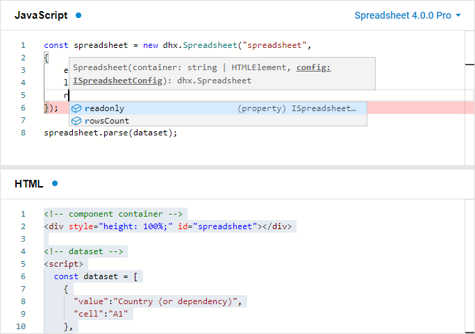

# Using Spreadsheet with TypeScript

Starting from v4.0, the library of DHTMLX Spreadsheet provides the ability to use TypeScript definitions. The built-in support of Typescript works out of the box.

{{note You can try out the functionality directly in our <a href="https://snippet.dhtmlx.com/ihtkdcoc"  target="_blank">Snippet Tool</a>.}}

## Advantages of using TypeScript

Why do you need to use DHTMLX Spreadsheet with TypeScript?

The main benefit of TypeScript is that it allows you to significantly increase the efficiency of the development process.

The way of building an application becomes more robust as checking the types together with autocompletion allow you to avoid potential mistakes. Besides, TypeScript provides you with information about types of data you should use while working with the API of the DHTMLX Spreadsheet library.

todo: delete 