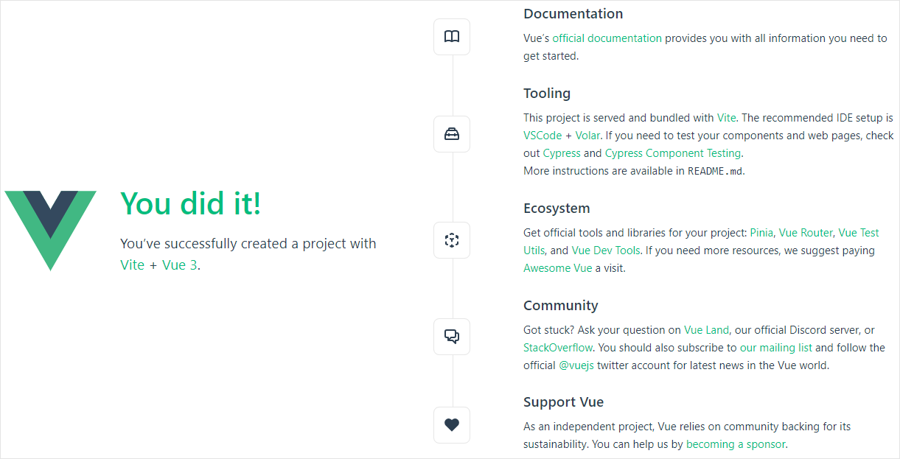

# Integration with Vue.js

You can use DHTMLX Spreadsheet in an application created with the [Vue.js](https://vuejs.org/) framework. [Check the demo on CodeSandbox](https://codesandbox.io/p/sandbox/dhtmlx-spreadsheet-with-vue3-c75m2t).

## Preparations

You will need [Vite](https://vitejs.dev/) and [Node.js](https://nodejs.org/en/) to create a project, so you should install them, if haven't done it before.

## Creating a project

There are several ways of creating a project: 

- you can use **Vue.js with Vite**, by running: 

~~~
npm create vue@latest
~~~

This command will install and execute `create-vue`, the official Vue project scaffolding tool. Check the details in the [Vue.js Quick Start](https://vuejs.org/guide/quick-start.html#creating-a-vue-application).

Next you should go to the app directory. Let's call our project **spreadsheet-vue** and run:

~~~
cd spreadsheet-vue
~~~

After that you should install dependencies and start the dev server. For this, you need to make use of a package manager:

- if you use [yarn](https://yarnpkg.com/), you need to call the following commands:

~~~
yarn install
yarn dev
~~~

- if you use [npm](https://www.npmjs.com/), you need to call the following commands:

~~~
npm install
npm run dev
~~~

You should now have your Vue project running on `http://localhost:5173`.

 

## Adding Spreadsheet

Now we should get the DHTMLX Spreadsheet code. First of all, we need to stop the app by pressing **Ctrl+C** in the command line.

### Package installation

We will install the Pro package from a local folder. There are step-by-step instructions:

1. Copy the Spreadsheet package into some local directory.
2. In the project directory call `npm install ./spreadsheet-local-package-path`, for example:

~~~
npm install ./spreadsheet_5.1.0_enterprise
~~~

Or you can install the **trial** version from npm as in:

~~~
npm install @dhx/trial-spreadsheet
~~~

### Component creation

Then we should create a component, to add a Spreadsheet into the application. You can configure the component via the "config" object, see the [list of available properties](spreadsheet/api/overview/properties_overview.md). Here are the steps to display Spreadsheet on the page:

- Set the container to render the component inside. Let's create a new file named **src/components/Spreadsheet.vue** and add a container for Spreadsheet inside the `template` tags. Define the name of the container in the **ref** attribute:

~~~js title="Spreadsheet.vue"
<template>
	

</template>
~~~

- Define the JS part of the Vue component and use the `new Spreadsheet` constructor inside the `mounted()` method of Vue.js to initialize Spreadsheet inside of the container that you've set above:

~~~js title="Spreadsheet.vue"

~~~

- To clear the component as it has unmounted, use the `spreadsheet.destructor()` call inside the `unmounted()` method of Vue.js:

~~~js title="Spreadsheet.vue"

~~~

- Next you can load data into the Spreadsheet. Use the `spreadsheet.parse()` method for this purpose. It will reload data on each applied change:

~~~js title="Spreadsheet.vue"

~~~

Now the Spreadsheet component is ready. When the element will be added to the page, it will initialize the Spreadsheet object with data. You can provide necessary configuration settings as well. Visit our [Spreadsheet API docs](spreadsheet/api/overview/properties_overview.md) to check the full list of available properties.

### Adding Spreadsheet into the app

Now it's time to add the component into our app. Open **App.vue** and replace the code with the following one:

~~~js title="App.vue"

<template>
  <Spreadsheet :data="data" />
</template>
~~~

Now when we start the app, we should see Spreadsheet loaded with data on a page.

 

## Handling events

When a user makes some action in the Spreadsheet, it invokes an event. You can use these events to detect the action and run the desired code for it. See the [full list of events](spreadsheet/api/overview/events_overview.md).

Open **Spreadsheet.vue** and complete the `mounted()` method as in:

~~~js title="Spreadsheet.vue"
// check the code !!

~~~

Get more information about the work with events in the [Event Handling](spreadsheet/handling_events.md) article.
