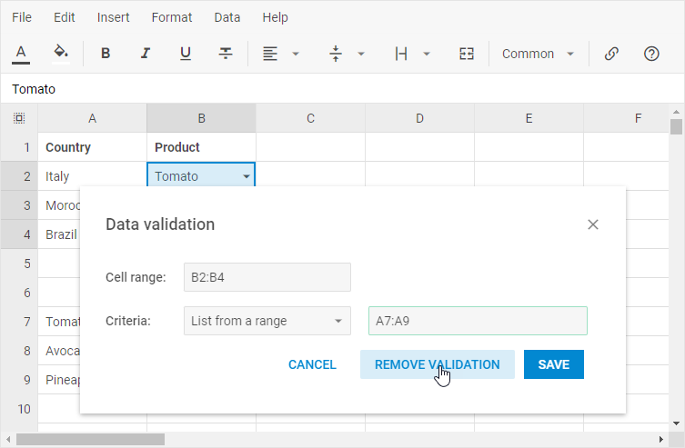

# Editing cells

## Entering content in a cell

### Entering data manually

- Click a desired cell on a sheet.
- Type a text, a number(s), a date, or time and press **Enter**.

### Entering a formula

- Click the cell where you want the formula results to appear.
- Type the '=' sign.
- Create a formula. For this, you can use:
    - constant numbers and calculation operators, for example **=3-2*5+12**
    - cell references and calculation operators, for example **=A1/A2**
    - [built-in functions](../functions/), for example **=MAX(C46;D46)**
- Press **Enter**.

## Inserting a hyperlink into a cell

### Adding a link

To insert a hyperlink into a cell, you can use one of the ways described below.

#### Using context menu

- Right-click the cell, choose *Insert link*

- In the appeared window, type the Text, the Link, and click *Save*

#### Using toolbar button

- Select the cell, click the **Insert link** button in the toolbar

- In the appeared window, type the Text, the Link, and click *Save*

#### Using menu

- Select the cell, go to: *Insert -> Insert link* in the menu

- In the appeared window, type the Text, the Link, and click *Save*.

### Copying a link

- Select the cell that contains the link you want to copy
- In the appeared popup, click the **Copy** icon

### Editing a link

- Select the cell that contains the link you want to edit
- In the appeared popup, click the **Edit** icon

### Removing a link

- Select the cell that contains the link you want to remove
- In the appeared popup, click the **Remove link** icon

## Using drop-down lists in cells

You may create a drop-down list in a cell(s) to allow users to select the necessary item from the list.

### Creating a drop-down list by typing it manually

- Select a cell or a range of cells where you want to create the list

- Go to: *Data -> Data validation* in the menu

- Choose the *List of items* criteria

- Type the items you want to appear in the drop-down list

- Press the **Save** button

### Creating a drop-down list by using a range

- Type the items you want to appear in the drop-down list

- Select a cell or a range of cells where you want to create the list

- Go to: *Data -> Data validation* in the menu

- Choose the *List from a range* criteria

- Select your list range

- Press the **Save** button

### Removing validation from a cell

You can stop using a drop-down list in a cell. To do that:

- Select the necessary cell or a range of cells from which you want to remove a drop-down list
- Go to: *Data -> Data validation* in the menu
- Select the *Remove validation* option

## Entering the same data in several cells

You can enter the same data into several cells by using the **Fill Handle** to automatically fill data in worksheet cells. See the details below.

### Auto filling cells with content

You can automatically fill cells with data.  This is how it works:

1\. Select a cell(s) the data of which will be used as a basis for filling more cells.

2\. Type data into the selected cell(s). There are several ways of how auto filling is implemented:

- copying the value

​For example, to make a series 4,4,4,4..., type 4 in the first cell only.

- following the pattern
    - to make a series 1, 2, 3, 4, 5, ... , type 1 and 2 into the first two cells.
    - to make a series 1 ,3, 5, 7, 9, ... , type 1 and 3 into the first two cells.
    - to make a series 2 ,4, 6, 8, 10, ... , type 2 and 4 into the first two cells.
    - besides numbers, you can also use letters in a pattern, e.g. to make a series like 1, a, 2, b, 3, a, 4, b, ..., type 1, a, 2, b into the first four cells.

3\. Drag the **Fill Handle**

## Locking cells

You can lock cells to protect them from changing their values. When you lock a cell, it gets a gray "key" in the top right corner. Locked cells remain unresponsive to any attempts of editing them.

To lock/unlock a cell, go one of the ways described below:

### Lock cells via the toolbar button

- Select the cells you want to lock/unlock (they do not have to be adjacent).
- Click the **Lock cell** button in the toolbar.

### Lock cells via the context menu

- Right-click a cell/a range of cells you want to lock/unlock.
- Choose the Lock/Unlock cell option in the appeared context menu.

