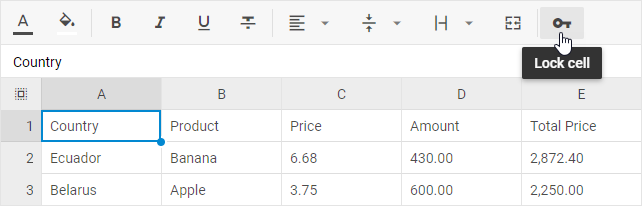

# Work with cells

## Entering content in a cell

- Click a desired cell on a sheet.
- Type a text or a number(s), and press **Enter**.

### Entering the same data in several cells

You can enter the same data into several cells by using the **Fill Handle** to automatically fill data in worksheet cells. See the details below.

## Auto filling cells with content

You can automatically fill cells with data.  This is how it works:

1\. Select a cell(s) the data of which will be used as a basis for filling more cells.

2\. Type data into the selected cell(s). There are several ways of how auto filling is implemented:

- copying the value

​For example, to make a series 4,4,4,4..., type 4 in the first cell only.

- following the pattern
    - to make a series 1, 2, 3, 4, 5, ... , type 1 and 2 into the first two cells.
    - to make a series 1 ,3, 5, 7, 9, ... , type 1 and 3 into the first two cells.
    - to make a series 2 ,4, 6, 8, 10, ... , type 2 and 4 into the first two cells.
    - besides numbers, you can also use letters in a pattern, e.g. to make a series like 1, a, 2, b, 3, a, 4, b, ..., type 1, a, 2, b into the first four cells.

3\. Drag the **Fill Handle**

## Locking cells

You can lock cells to protect them from changing their values. When you lock a cell, it gets a gray "key" in the top right corner. Locked cells remain unresponsive to any attempts of editing them.

To lock/unlock a cell, go one of the ways described below:

### Lock cells via the toolbar button

- Select the cells you want to lock/unlock (they do not have to be adjacent).
- Click the **Lock cell** button in the toolbar.

### Lock cells via the context menu

- Right-click a cell/a range of cells you want to lock/unlock.
- Choose the Lock/Unlock cell option in the appeared context menu.

