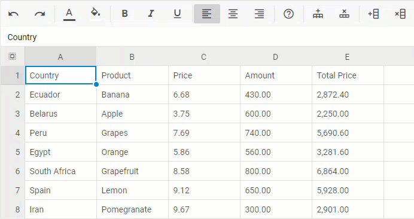
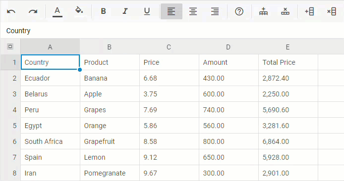
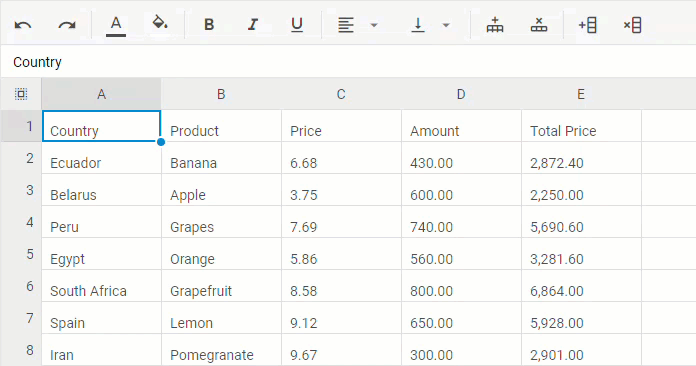
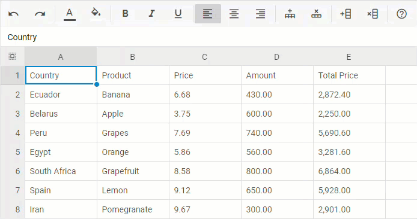
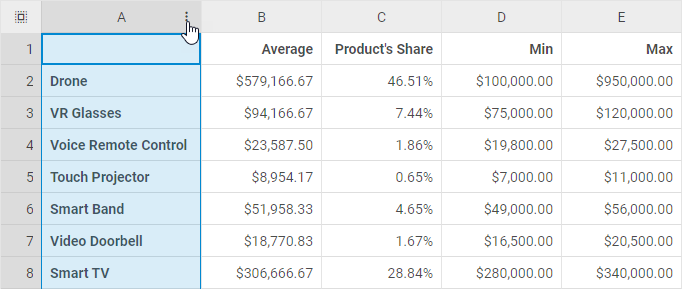
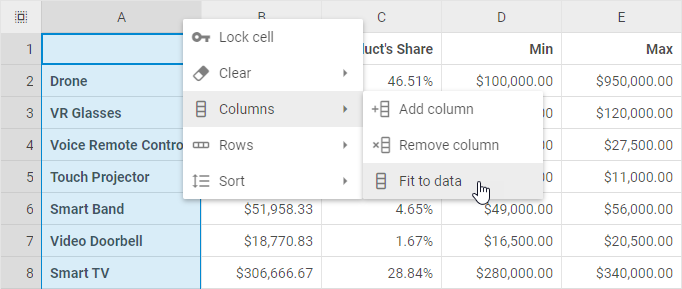

# Work with rows and columns

DHTMLX Spreadsheet allows adding and removing columns and rows into a sheet via both toolbar buttons and options of the context menu.

## Adding rows

To add a new row, take the following steps:

1\. Select a row by clicking on its header.

2\. Choose one of the two actions:

- click the **Add row** button in the toolbar
- or right-click the row and choose *Rows -> Add row*

{{note Note that a new row will be added above the selected one.}}

## Removing rows

To remove a row, take the following steps:

1\. Select a row by clicking on its header.

2\. Choose one of the two actions:

- click the **Remove row** button in the toolbar
- or right-click the row and choose *Rows -> Remove row*

## Adding columns

To add a new column, take the following steps:

1\. Select a column by clicking on its header.

2\. Choose one of the two actions:

- click the **Add column** button in the toolbar
- or right-click the column and choose *Columns -> Add column*

{{note Note that a new column will be added to the left of the selected one.}}

## Removing columns

To remove a column, take the following steps:

1\. Select a column by clicking on its header.

2\. Choose one of the two actions:

- click the Remove column button in the toolbar
- or right-click the column and choose *Columns -> Remove column*

## AutoFit column width

To change the column width so that it would automatically fit the longest content in the column, take the following steps:

1\. Left-click on a 3 dots icon of the column

2\. Choose *Columns -> Fit to data*

