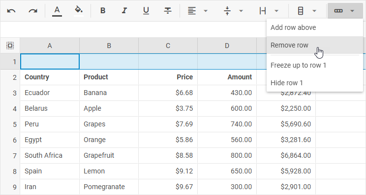
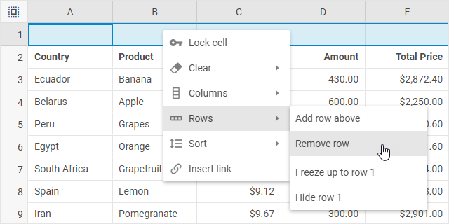
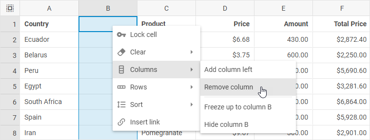

# Work with rows and columns

DHTMLX Spreadsheet allows adding and removing columns and rows into a sheet via both toolbar buttons and options of the context menu.

## Adding rows

To add a new row, take the following steps:

1\. Select a row by clicking on its header.

2\. Choose one of the two actions:

- click the **Add row** button in the toolbar

- or right-click the row and choose *Rows -> Add row*

{{note Note that a new row will be added above the selected one.}}

## Removing rows

To remove a row, take the following steps:

1\. Select a row by clicking on its header.

2\. Choose one of the two actions:

- click the **Remove row** button in the toolbar

- or right-click the row and choose *Rows -> Remove row*

## Adding columns

To add a new column, take the following steps:

1\. Select a column by clicking on its header.

2\. Choose one of the two actions:

- click the **Add column** button in the toolbar

- or right-click the column and choose *Columns -> Add column*

{{note Note that a new column will be added to the left of the selected one.}}

## Removing columns

To remove a column, take the following steps:

1\. Select a column by clicking on its header.

2\. Choose one of the two actions:

- click the Remove column button in the toolbar

- or right-click the column and choose *Columns -> Remove column*

## AutoFit column width

To change the column width so that it would automatically fit the longest content in the column, you can:

- double-click the resize cursor of a column in the table header 

- or take the following steps:

1\. Left-click on a 3 dots icon of the column

2\. Choose *Columns -> Fit to data*

## Hiding rows

To hide a row, take the following steps:

1\. Select a row (by clicking on its header) or a cell in the necessary row.

2\. Choose one of the following actions:

- either click the **Rows** button in the toolbar and select the *Hide row(s) [id]* option

- or right-click a row/cell and choose *Rows -> Hide row(s) [id]*

## Showing rows

To show a hidden row/rows, click the "arrows" icon that appears in the rows header instead of the hidden row/rows. In the image below the rows 8 and 11 are hidden:

## Hiding columns

To hide a column, take the following steps:

1\. Select a column (by clicking on its header) or a cell in the necessary column.

2\. Choose one of the following actions:

- either click the **Columns** button in the toolbar and select the *Hide column(s) [id]* option

- or right-click a column/cell and choose *Columns -> Hide column(s) [id]*

## Showing columns

To show a hidden column/columns, click the "arrows" icon that appears in the columns header instead of the hidden column/columns. In the image below the columns C and E are hidden:

