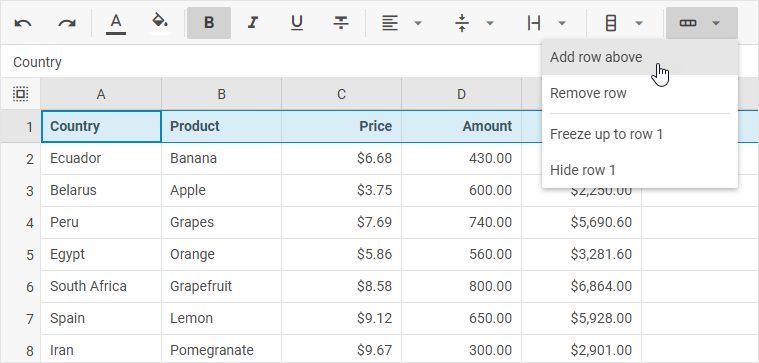
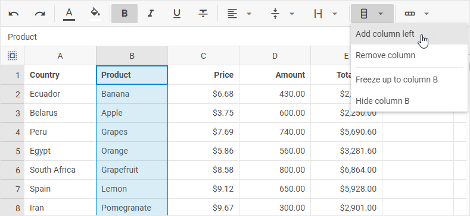
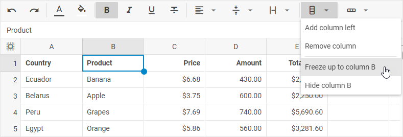

# Work with rows and columns

DHTMLX Spreadsheet allows adding and removing columns and rows into a sheet via both toolbar buttons and options of the context menu.

## Adding rows

To add a new row, take the following steps:

1\. Select a row by clicking on its header.

2\. Choose one of the two actions:

- click the **Add row** button in the toolbar

- or right-click the row and choose *Rows -> Add row*

:::note 
Note that a new row will be added above the selected one.
:::

## Removing rows

To remove a row, take the following steps:

1\. Select a row by clicking on its header.

2\. Choose one of the two actions:

- click the **Remove row** button in the toolbar

- or right-click the row and choose *Rows -> Remove row*

## Adding columns

To add a new column, take the following steps:

1\. Select a column by clicking on its header.

2\. Choose one of the two actions:

- click the **Add column** button in the toolbar

- or right-click the column and choose *Columns -> Add column*

:::note 
Note that a new column will be added to the left of the selected one.
:::

## Removing columns

To remove a column, take the following steps:

1\. Select a column by clicking on its header.

2\. Choose one of the two actions:

- click the **Remove column** button in the toolbar

- or right-click the column and choose *Columns -> Remove column*

## AutoFit column width

To change the column width so that it would automatically fit the longest content in the column, you can:

- double-click the resize cursor of a column in the table header 

- or take the following steps:

1\. Left-click on a 3 dots icon of the column

2\. Choose *Columns -> Fit to data*

## Freezing/unfreezing rows and columns

### Freezing rows

To freeze rows up to a certain row, take the following steps:

1\. Select a row (by clicking on its header) or a cell in the necessary row.

2\. Choose one of the following actions:

- either click the **Rows** button in the toolbar and select the *Freeze up to row [id]* option

- or select the **Edit** menu option and choose *Freeze -> Freeze up to row [id]*

- or right-click a row/cell and choose *Rows -> Freeze up to row [id]*

### Unfreezing rows

(*In the images below rows are frozen up to the "5" row*)

To unfreeze rows, take one of the following steps:

- either click the **Rows** button in the toolbar and select the *Unfreeze rows* option

- or select the **Edit** menu option and choose *Freeze -> Unfreeze rows*

- or right-click any row/cell in the row and choose *Rows -> Unfreeze rows*

### Freezing columns

To freeze columns up to a certain column, take the following steps:

1\. Select a column (by clicking on its header) or a cell in the necessary column.

2\. Choose one of the following actions:

- either click the **Columns** button in the toolbar and select the *Freeze up to column [id]* option

- or select the **Edit** menu option and choose *Freeze -> Freeze up to column [id]*

- or right-click a column/cell and choose *Columns -> Freeze up to column [id]*

### Unfreezing columns

(*In the images below columns are frozen up to the "D" column*)

To unfreeze columns, take one of the following steps:

- either click the **Columns** button in the toolbar and select the *Unfreeze columns* option

- or select the **Edit** menu option and choose *Freeze -> Unfreeze columns*

- or right-click any column/cell and choose *Columns -> Unfreeze columns*

