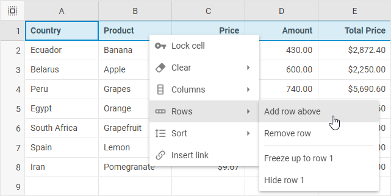
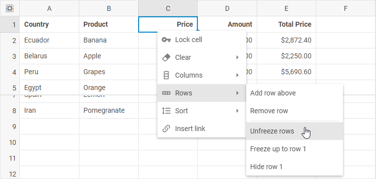
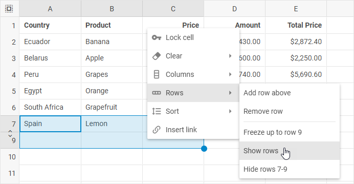
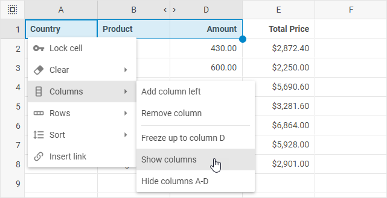

# Work with rows and columns

DHTMLX Spreadsheet allows adding/removing columns and rows, automatically fitting the column width to the content, freezing/unfreezing columns and rows, as well as hiding/showing columns and rows via toolbar buttons, menu options and the options of the context menu of a cell.

## Adding/removing rows and columns

### Adding rows

To add a new row, take the following steps:

1\. Select a row (by clicking on its header) or a cell in the necessary row.

2\. Choose one of the following actions:

- either click the **Rows** button in the toolbar and select the *Add row above* option

- or select the **Insert** menu option and choose *Rows -> Add row above*

- or right-click the row or a cell in the row and choose *Rows -> Add row above*

### Removing rows

To remove a row, take the following steps:

1\. Select a row (by clicking on its header) or a cell in the row.

2\. Choose one of the following actions:

- click the **Rows** button in the toolbar and select the *Remove row* option

- or select the **Insert** menu option and choose *Rows -> Remove row*

- or right-click the row or a cell in the row and choose *Rows -> Remove row*

### Adding columns

To add a new column, take the following steps:

1\. Select a column (by clicking on its header) or a cell in the necessary column.

2\. Choose one of the following actions:

- either click the **Columns** button in the toolbar and select the *Add column left* option

- or select the **Insert** menu option and choose *Columns -> Add column left*

- or right-click the column or a cell in the column and choose *Columns -> Add column left*

### Removing columns

To remove a column, take the following steps:

1\. Select a column (by clicking on its header) or a cell in the column.

2\. Choose one of the following actions:

- click the **Columns** button in the toolbar and select the *Remove column* option

- or select the **Insert** menu option and choose *Columns -> Remove column*

- or right-click the column or a cell in the column and choose *Columns -> Remove column*

## AutoFit column width

To change the column width so that it would automatically fit the longest content in the column, you can:

- double-click the resize cursor of a column in the table header 

- or take the following steps:

1\. Left-click on a 3 dots icon of the column

2\. Choose *Columns -> Fit to data*

## Freezing/unfreezing rows and columns

### Freezing rows

To freeze rows up to a certain row, take the following steps:

1\. Select a row (by clicking on its header) or a cell in the necessary row.

2\. Choose one of the following actions:

- either click the **Rows** button in the toolbar and select the *Freeze up to row [id]* option

- or select the **Edit** menu option and choose *Freeze -> Freeze up to row [id]*

- or right-click a row or a cell in the row and choose *Rows -> Freeze up to row [id]*

### Unfreezing rows

(*In the images below rows are frozen up to the row 5*)

To unfreeze rows, take one of the following steps:

- either click the **Rows** button in the toolbar and select the *Unfreeze rows* option

- or select the **Edit** menu option and choose *Freeze -> Unfreeze rows*

- or right-click any cell and choose *Rows -> Unfreeze rows*

### Freezing columns

To freeze columns up to a certain column, take the following steps:

1\. Select a column (by clicking on its header) or a cell in the necessary column.

2\. Choose one of the following actions:

- either click the **Columns** button in the toolbar and select the *Freeze up to column [id]* option

- or select the **Edit** menu option and choose *Freeze -> Freeze up to column [id]*

- or right-click a column or a cell in the column and choose *Columns -> Freeze up to column [id]*

### Unfreezing columns

(*In the images below columns are frozen up to the column D*)

To unfreeze columns, take one of the following steps:

- either click the **Columns** button in the toolbar and select the *Unfreeze columns* option

- or select the **Edit** menu option and choose *Freeze -> Unfreeze columns*

- or right-click any cell and choose *Columns -> Unfreeze columns*

## Hiding/showing rows and columns

### Hiding rows

To hide a row, take the following steps:

1\. Select a row (by clicking on its header) or a cell in the necessary row.

2\. Choose one of the following actions:

- either click the **Rows** button in the toolbar and select the *Hide row(s) [id]* option

- or right-click a row or a cell in the row and choose *Rows -> Hide row(s) [id]*

### Showing rows

To show hidden rows, take one of the following steps:

- either click the "arrows" icon that appears in the rows header instead of the hidden row/rows

(*In the image below the rows 8 and 11 are hidden*)

- or select rows or several cells so that the hidden rows were included into the selection, right-click to call the context menu and choose *Rows -> Show rows*

(*In the image below the row 8 is hidden*)

### Hiding columns

To hide a column, take the following steps:

1\. Select a column (by clicking on its header) or a cell in the necessary column.

2\. Choose one of the following actions:

- either click the **Columns** button in the toolbar and select the *Hide column(s) [id]* option

- or right-click a column or a cell in the column and choose *Columns -> Hide column(s) [id]*

### Showing columns

To show hidden columns, take one of the following steps:

- either click the "arrows" icon that appears in the columns header instead of the hidden column/columns

(*In the image below the columns C and E are hidden*)

- or select columns or several cells so that the hidden columns were included into the selection, right-click to call the context menu and choose *Columns -> Show columns*

(*In the image below the column C is hidden*)

