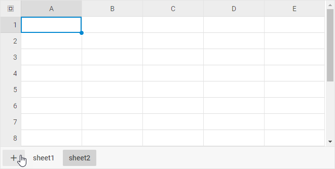

# Work with sheets

## Adding a new sheet

To add a new sheet, take the following steps:

1. Choose a sheet tab by clicking on it

2. Click the **Add sheet** button in the bottom toolbar

{{note Note, that a new sheet will be added after the currently active sheet.}}

## Removing a sheet

To remove a sheet from the spreadsheet, right-click the sheet tab and choose *Delete*.

{{note Note, that a sheet can't be removed if it is the only sheet in the spreadsheet.}}

## Changing the active sheet

To change the currently active sheet, just click a different sheet tab with the mouse pointer.

## Renaming a sheet

To rename a sheet, right-click the sheet tab, click *Rename*, and type the new name.

## Cross-references between Sheets

You can easily consolidate data from multiple sheets into a single one by using cross-referencing.   For that, take the following steps:

1\.  Type an equal sign (=) into a cell

2\.  Click the sheet tab you want to cross-reference and select the cell or range of cells

3\.  Finish typing the formula and press Enter

